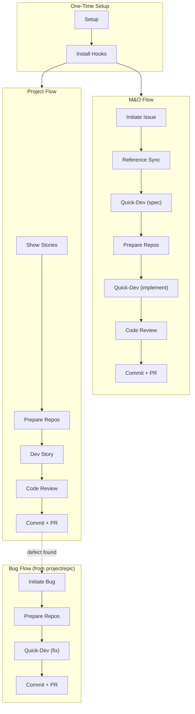

# Agentic Delivery Engineer Guide

Welcome to the AIDLC workflow guide for Agentic Delivery Engineers.

## Workflow at a Glance

| Flow | When | EM Provides | You Do |
|------|------|-------------|--------|
| **M&O** (feature/hotfix) | EM assigns issue ID + type | Issue ID, type | Entire workflow: spec → implement → PR |
| **Project** (Full BMAD) | EM completes planning | Branch name, story specs | Pick stories, implement, PR |
| **Bug** (project testing) | Defect found during testing | Bug issue ID, type `bug` | M&O-like fix from project/epic branch |

## Reading Path

Follow the sections below in order for your first workspace setup, then refer back to individual sections as needed.

### 1. [Setup and Prerequisites](setup.md) (~15 min, one-time)

One-time workspace setup: install prerequisites, clone repositories (including the docs repo from your EM), run `/tdgs-aidlc-setup-workspace ade`, install pre-commit hooks. Shared with EMs -- look for steps marked **(ADE Only)**.

### 2. [M&O Workflow](mo-workflow.md) -- Feature and Hotfix Development (~20 min, detailed step-by-step)

Complete workflow for `feature` and `hotfix` issues: initiate issue, reference sync, create spec (Quick-Dev), prepare repos, implement (Quick-Dev), code review, commit, pre-check PR, create PR.

### 3. [Project Implementation](project-implementation.md) -- Full BMAD Projects (~15 min, detailed step-by-step)

Implementation workflow for `project` type issues where the EM has completed planning: show available stories, prepare repos (3-tier branches), dev story, code review, commit, PR. Covers handling course corrections mid-sprint.

### 3a. [Bug Remediation](project-implementation.md#bug-remediation-process) -- Fixing Defects During Testing (~5 min, sub-flow)

When a defect is found during project testing: initiate bug, create fix spec, prepare repos (branch from project/epic), implement fix, PR. Includes a [simplified quick-fix path](project-implementation.md#simplified-quick-fix-path-trivial-bugs) for trivial bugs.

### 4. [Test Management](test-management.md) (~15 min, reference guide)

Test framework reference: functional tests (Playwright), unit tests, API tests -- setup prompts, generate prompts, coverage targets, HTML reports, and directory structure.

### 5. [Reference](reference.md) (~5 min, skim for troubleshooting)

BMAD skills reference, branch naming conventions (M&O 2-tier and Project 3-tier), troubleshooting, and quick reference card.

### 6. [Prompt & Skill Reference](prompt-reference.md) (lookup as needed)

Complete reference for all 33 prompts and 11 custom skills: syntax, inputs, outputs, examples, and next steps.

### Optional: [MCP Setup Guide](mcp-setup-guide.md) (~10 min, only if needed)

Configure optional MCP servers: Splunk token setup and database MCP for Oracle, MySQL, PostgreSQL, and MongoDB. Only needed for log investigation or database-related issues.

> **Note:** GitHub MCP is pre-configured automatically by `/tdgs-aidlc-setup-workspace` and is required for core workflows (`initiate-issue`, `reference-sync`, `show-available-stories`). Only Splunk and database MCP servers are optional.

---

## Quick Cheat Sheet

### One-Time Setup

| Command | Purpose |
|---------|---------|
| [`/tdgs-aidlc-setup-workspace ade`](prompt-reference.md#tdgs-aidlc-setup-workspace) | Workspace + BMAD config |
| [`/tdgs-aidlc-install-hooks`](prompt-reference.md#tdgs-aidlc-install-hooks) | Pre-commit + gitleaks |

### M&O Workflow (Feature / Hotfix)

| Command | Purpose |
|---------|---------|
| [`/tdgs-aidlc-initiate-issue {id} {type}`](prompt-reference.md#tdgs-aidlc-initiate-issue) | Branches + change brief |
| `/bmad-quick-dev` | Create spec (stops at checkpoint) |
| [`/tdgs-aidlc-commit`](prompt-reference.md#tdgs-aidlc-commit) | Commit spec |
| [`/tdgs-aidlc-prepare-repos`](prompt-reference.md#tdgs-aidlc-prepare-repos) | Branches in worker repos |
| `/bmad-quick-dev` | Implement (per worker repo) |
| `/bmad-code-review` | 3-layer adversarial review |
| [`/tdgs-aidlc-commit`](prompt-reference.md#tdgs-aidlc-commit) | Commit code |
| [`/tdgs-aidlc-pre-check-pull-request`](prompt-reference.md#tdgs-aidlc-pre-check-pull-request) | CI pipeline check |
| [`/tdgs-aidlc-create-pull-request`](prompt-reference.md#tdgs-aidlc-create-pull-request) | PR → integration branch |

### Project Workflow (Full BMAD)

| Command | Purpose |
|---------|---------|
| [`/tdgs-aidlc-show-available-stories`](prompt-reference.md#tdgs-aidlc-show-available-stories) | See what's free |
| [`/tdgs-aidlc-prepare-repos {spec}`](prompt-reference.md#tdgs-aidlc-prepare-repos) | Claim story + create branches |
| `/bmad-dev-story` | Implement story |
| `/bmad-code-review` | Review |
| [`/tdgs-aidlc-commit`](prompt-reference.md#tdgs-aidlc-commit) | Commit |
| [`/tdgs-aidlc-pre-check-pull-request`](prompt-reference.md#tdgs-aidlc-pre-check-pull-request) | CI check |
| [`/tdgs-aidlc-create-pull-request`](prompt-reference.md#tdgs-aidlc-create-pull-request) | PR → epic branch |
| *→ repeat for next story* | — |

### Bug Remediation (Project Workflow — Defects from Testing)

| Command | Purpose |
|---------|---------|
| [`/tdgs-aidlc-initiate-issue {bug_id} bug`](prompt-reference.md#tdgs-aidlc-initiate-issue) | Bug-brief (on project/* branch) |
| `/bmad-quick-dev` | Fix spec (root cause + plan) |
| [`/tdgs-aidlc-prepare-repos`](prompt-reference.md#tdgs-aidlc-prepare-repos) | Branch from project/epic |
| `/bmad-quick-dev` | Implement fix |
| `/bmad-code-review` | Review |
| [`/tdgs-aidlc-commit`](prompt-reference.md#tdgs-aidlc-commit) | Commit |
| [`/tdgs-aidlc-create-pull-request`](prompt-reference.md#tdgs-aidlc-create-pull-request) | PR → parent branch |

---

## Verify Your Setup

After completing the one-time setup (quick-setup + setup-workspace), confirm everything is working:

| Check | How to Verify | Expected |
|-------|---------------|----------|
| BMAD installed | `ls _bmad/` in workspace root | Directory exists with `bmm/config.yaml` |
| Prompts copied | `ls .github/prompts/tdgs-aidlc-*.prompt.md` | 31 files listed |
| Config populated | Open `.github/i2a-config.yml` | `worker_repos` has entries, `common_repos` if shared repos present, `issues.repository` is set |
| Hooks installed | `ls .git/hooks/pre-commit` in any worker repo | File exists |

If any check fails, re-run the corresponding setup step:
- Missing BMAD → `/tdgs-aidlc-quick-setup`
- Missing prompts → `/tdgs-aidlc-quick-setup`
- Empty config → `/tdgs-aidlc-setup-workspace ade`
- Missing hooks → `/tdgs-aidlc-install-hooks`
