# AIDLC Prompt, Skill & BMAD Dependency Catalog

Complete dependency map for all 33 AIDLC prompts, 11 custom skills, and their BMAD 6.3.0 skill dependencies. Use this catalog when adding, modifying, or upgrading components.

> **User-facing reference:** For full prompt details (syntax, inputs, examples, next steps), see [Prompt & Skill Reference](../prompt-reference.md). This catalog is a **ACE-only** dependency and upgrade reference.

---

## 1. AIDLC Prompts by Functional Group

### Setup / Infrastructure (3)

| Name | BMAD Skills Used | Reads i2a-config.yml |
|------|------------------|---------------------|
| `tdgs-aidlc-quick-setup` | — | Yes |
| `tdgs-aidlc-setup-workspace` | — | Yes |
| `tdgs-aidlc-install-hooks` | — | Yes |

### Issue / Project Initiation (3)

| Name | BMAD Skills Used | Reads i2a-config.yml |
|------|------------------|---------------------|
| `tdgs-aidlc-initiate-issue` | — | Yes |
| `tdgs-aidlc-initiate-project` | — | Yes |
| `tdgs-aidlc-show-available-stories` | — | Yes |

### Development Workflow (5)

| Name | BMAD Skills Used | Reads i2a-config.yml |
|------|------------------|---------------------|
| `tdgs-aidlc-prepare-repos` | — | Yes |
| `tdgs-aidlc-switch` | — | Yes |
| `tdgs-aidlc-commit` | — | Yes |
| `tdgs-aidlc-pre-check-pull-request` | — | Yes |
| `tdgs-aidlc-create-pull-request` | — | Yes |

### Test Management (8)

| Name | BMAD Skills Used | Reads i2a-config.yml |
|------|------------------|---------------------|
| `tdgs-aidlc-setup-unit-tests` | — | No |
| `tdgs-aidlc-setup-api-tests` | — | No |
| `tdgs-aidlc-setup-functional-tests` | — | No |
| `tdgs-aidlc-generate-unit-tests` | — | No |
| `tdgs-aidlc-generate-api-tests` | — | No |
| `tdgs-aidlc-generate-functional-tests` | — | No |
| `tdgs-aidlc-setup-testdata` | — | No |
| `tdgs-aidlc-run-tests` | — | No |

### Sprint Management (6)

| Name | BMAD Skills Used | Reads i2a-config.yml |
|------|------------------|---------------------|
| `tdgs-aidlc-generate-dashboard` | — | No |
| `tdgs-aidlc-update-metrics` | — | No |
| `tdgs-aidlc-manage-blockers` | — | No |
| `tdgs-aidlc-metrics-report` | — | No |
| `tdgs-aidlc-project-kanban-planning` | `/bmad-create-epics-and-stories`, `/bmad-sprint-planning` (via skill) | No |
| `tdgs-aidlc-project-course-correction` | `/bmad-correct-course` | Yes |

### Documentation (6)

| Name | BMAD Skills Used | Reads i2a-config.yml |
|------|------------------|---------------------|
| `tdgs-aidlc-generate-kb` | — | Yes |
| `tdgs-aidlc-update-context-docs` | — | Yes |
| `tdgs-aidlc-validate-runbook-context` | — | No |
| `tdgs-aidlc-validate-test-context` | — | No |
| `tdgs-aidlc-post-deployment-docs-sync` | — | Yes |
| `tdgs-aidlc-ops-runbook` | — | No |

### Help (1)

| Name | BMAD Skills Used | Reads i2a-config.yml |
|------|------------------|---------------------|
| `tdgs-aidlc-help` | — | No |

### Deprecated (1)

| Name | Status | Replacement |
|------|--------|-------------|
| `tdgs-aidlc-reference-sync` | ⚠️ Deprecated | Use Document Project with symlinked common repos. Add common repos to `common_repos` in `i2a-config.yml`. |

---

## 2. Custom AIDLC Skills

Custom skills live in `src/i2a-skills/` and are installed to `.github/i2a-skills/` in user workspaces (separate from BMAD skills in `.github/skills/`).

### tdgs-aidlc-project-kanban-planning

Orchestrate full sprint-ready planning with prerequisite detection, kanban plan, dashboard, and sprint metrics.

- **Prompt:** `src/prompts/tdgs-aidlc-project-kanban-planning.prompt.md`
- **BMAD Skills Used:** `/bmad-create-epics-and-stories`, `/bmad-sprint-planning`
- **Files:** `src/i2a-skills/tdgs-aidlc-project-kanban-planning/`
- Full details: [Prompt & Skill Reference](../prompt-reference.md#tdgs-aidlc-project-kanban-planning)

### tdgs-aidlc-sprint-dashboard

Generate a live HTML sprint dashboard with real-time KPIs, Harvey ball quality metrics, blocker tracking, and critical path visualization.

- **BMAD Skills Used:** —
- **Files:** `src/i2a-skills/tdgs-aidlc-sprint-dashboard/`
- Full details: [Prompt & Skill Reference](../prompt-reference.md#tdgs-aidlc-sprint-dashboard)

### tdgs-aidlc-setup-api-tests

Scaffold API test framework (Insomnia collections, test runner, environments) per auto-detected backend service.

- **Prompt:** `src/prompts/tdgs-aidlc-setup-api-tests.prompt.md`
- **BMAD Skills Used:** —
- **Files:** `src/i2a-skills/tdgs-aidlc-setup-api-tests/` — `SKILL.md`, `workflow.md`, `templates/` (test-runner, generate-report, lint-collection, audit-coverage, audit-config), `tools/runner-contract.md`, `tools/insomnia-unit-test-examples.md`
- Full details: [Prompt & Skill Reference](../prompt-reference.md#tdgs-aidlc-setup-api-tests)

### tdgs-aidlc-generate-api-tests

Generate and execute API test suites with two-phase discovery, chain wiring, and HTML/MD reports.

- **Prompt:** `src/prompts/tdgs-aidlc-generate-api-tests.prompt.md`
- **BMAD Skills Used:** —
- **Files:** `src/i2a-skills/tdgs-aidlc-generate-api-tests/` — `workflow.md` (orchestrator), `tools/` (guardrails, discovery, generation-rules, post-generation-checks, …), `templates/`, `scripts/post-generation-gate.mjs`
- Full details: [Prompt & Skill Reference](../prompt-reference.md#tdgs-aidlc-generate-api-tests)

### tdgs-aidlc-setup-unit-tests

Auto-detect project technology stacks (Java/Maven/Gradle, JavaScript/TypeScript with Jest/Vitest, Python/pytest, .NET/xUnit) and scaffold per-repository unit test infrastructure with coverage tooling, report stubs, and documentation.

- **Prompt:** `src/prompts/tdgs-aidlc-setup-unit-tests.prompt.md`
- **BMAD Skills Used:** —
- **Files:** `src/i2a-skills/tdgs-aidlc-setup-unit-tests/` — `SKILL.md`, `workflow.md`, `tools/` (java-scaffold, javascript-scaffold, guardrails, preflight-and-discovery, other-stacks, verification)
- Full details: [Prompt & Skill Reference](../prompt-reference.md#tdgs-aidlc-setup-unit-tests)

### tdgs-aidlc-generate-unit-tests

Generate hermetic unit tests per-module with coverage gates, pre-write contract, guardrails for hermeticity and exact assertions, and post-generation checks.

- **Prompt:** `src/prompts/tdgs-aidlc-generate-unit-tests.prompt.md`
- **BMAD Skills Used:** —
- **Files:** `src/i2a-skills/tdgs-aidlc-generate-unit-tests/` — `SKILL.md`, `workflow.md`, `tools/` (discovery, generation-rules, guardrails, pre-write-contract, post-generation-checks, constraints-and-augmentations, preflight-checks, execution-and-reports)
- **Prerequisite:** `tdgs-aidlc-setup-unit-tests`
- Full details: [Prompt & Skill Reference](../prompt-reference.md#tdgs-aidlc-generate-unit-tests)

### tdgs-aidlc-setup-functional-tests

Scaffold Playwright-based functional test infrastructure in UI repositories with page-object models, fixtures, component detection helpers, and flow descriptors.

- **Prompt:** `src/prompts/tdgs-aidlc-setup-functional-tests.prompt.md`
- **BMAD Skills Used:** —
- **Files:** `src/i2a-skills/tdgs-aidlc-setup-functional-tests/` — `SKILL.md`, `workflow.md`, `tools/` (scaffold-structure, component-detection, fixtures-and-helpers, flow-descriptors, preflight-and-discovery, verification-and-docs)
- Full details: [Prompt & Skill Reference](../prompt-reference.md#tdgs-aidlc-setup-functional-tests)

### tdgs-aidlc-generate-functional-tests

Generate Playwright functional tests through multi-phase discovery, pre-write contract, gap analysis, post-generation checks, and execution with mock/real modes.

- **Prompt:** `src/prompts/tdgs-aidlc-generate-functional-tests.prompt.md`
- **BMAD Skills Used:** —
- **Files:** `src/i2a-skills/tdgs-aidlc-generate-functional-tests/` — `SKILL.md`, `workflow.md`, `tools/` (discovery, gap-analysis, guardrails, pre-write-contract, post-generation-checks, preflight-checks, preflight-ground-truth, execution-and-reports, phase-4-augmentations)
- **Prerequisite:** `tdgs-aidlc-setup-functional-tests`; recommended: `tdgs-aidlc-setup-testdata`
- Full details: [Prompt & Skill Reference](../prompt-reference.md#tdgs-aidlc-generate-functional-tests)

### tdgs-aidlc-setup-testdata

Generate and refresh the application-agnostic test-data catalog (`test-data-catalog.yaml`), dashboard, ledger, and schemas. Discovers endpoints, API chains, UI screens, and identity pools from the workspace; enforces G1–G13 guardrails and P0–P6 field derivation.

- **Prompt:** `src/prompts/tdgs-aidlc-setup-testdata.prompt.md`
- **BMAD Skills Used:** —
- **Files:** `src/i2a-skills/tdgs-aidlc-setup-testdata/` — `SKILL.md`, `workflow.md`, `tools/` (guardrails, ground-truth-hierarchy, discovery, data-collection, catalog-generation, dashboard-generation, ledger-and-schemas, hard-rules)
- **Prerequisite:** One or more of `tdgs-aidlc-setup-api-tests`, `tdgs-aidlc-setup-functional-tests`, `tdgs-aidlc-setup-unit-tests`
- Full details: [Prompt & Skill Reference](../prompt-reference.md#tdgs-aidlc-setup-testdata)

### tdgs-aidlc-help

Show all AIDLC prompts, skills, and workflows with syntax, options, examples, prerequisites, and next steps. Supports four modes: full catalog, targeted prompt/skill detail, goal-based lookup, and workflow sequences.

- **Prompt:** `src/prompts/tdgs-aidlc-help.prompt.md`
- **BMAD Skills Used:** —
- **Files:** `src/i2a-skills/tdgs-aidlc-help/` — `SKILL.md`, `workflow.md`, `tools/` (catalog-data, workflow-sequences)
- Full details: [Prompt & Skill Reference](../prompt-reference.md#tdgs-aidlc-help)

### tdgs-aidlc-ops-runbook

Dual-mode operational runbook skill. **Update** surgically edits an existing `.docx` or `.md` runbook scoped to the implementation plan version matrix. **Create** generates a new `.md` runbook from the Texas.gov template with Mermaid diagrams and optional UI screenshots. Exhaustive KB + source scanning, evidence tables, format-preserving edits, and rollback safety.

- **Prompt:** `src/prompts/tdgs-aidlc-ops-runbook.prompt.md`
- **BMAD Skills Used:** —
- **Files:** `src/i2a-skills/tdgs-aidlc-ops-runbook/` — `SKILL.md`, `workflow.md`, `workflow-create.md`, `config/org-defaults.yaml`, `templates/`, `tools/` (guardrails-create, section-grounding, diagram-standards, post-generation-checks), `scripts/` (render-diagrams.sh, capture-screenshots.js)
- Full details: [Prompt & Skill Reference](../prompt-reference.md#tdgs-aidlc-ops-runbook)

---

## 3. BMAD 6.3.0 Skills Used by AIDLC

Only BMAD skills actively invoked or recommended by AIDLC prompts and skills are listed here (~11 of 41 total BMAD skills). **Invoked** = the AIDLC prompt reads and executes the skill during its own run. **Recommended** = the prompt lists the skill as a suggested next step in its output message but does not execute it.

| BMAD Skill | Invoked By | Recommended By (next steps) |
|------------|------------|---------------------------|
| `/bmad-correct-course` | `project-course-correction` (delegated impact analysis) | — |
| `/bmad-create-epics-and-stories` | `project-kanban-planning` skill | `initiate-project` (planning step 5), `generate-dashboard` (prerequisite check) |
| `/bmad-sprint-planning` | `project-kanban-planning` skill | `initiate-project` (planning step 6), `generate-dashboard` (prerequisite check) |
| `/bmad-quick-dev` | — | `initiate-issue`, `prepare-repos` |
| `/bmad-dev-story` | — | `initiate-issue`, `prepare-repos` |
| `/bmad-code-review` | — | `initiate-issue`, `prepare-repos`, `setup-workspace` (ADE workflow) |
| `/bmad-product-brief` | — | `initiate-project` (planning step 2) |
| `/bmad-create-prd` | — | `initiate-project` (planning step 3) |
| `/bmad-create-architecture` | — | `initiate-project` (planning step 4) |
| `/bmad-create-story` | — | `initiate-project` (planning step 7) |
| `/bmad-document-project` | `generate-kb` (after EM confirms assembled prompt) | EM guide / `post-deployment-docs-sync` workflows |
| `/bmad-generate-project-context` | — | EM guide (setup, adding repos), `setup-workspace` (post-setup guidance) |

---

## 4. Dependency Graph

```mermaid
graph TD
    subgraph "Setup / Infrastructure"
        QuickSetup[quick-setup]
        SW[setup-workspace]
        IH[install-hooks]
    end

    subgraph "Issue / Project Initiation"
        II[initiate-issue]
        IP[initiate-project]
        SAS[show-available-stories]
    end

    subgraph "Development Workflow"
        PR[prepare-repos]
        SI[switch]
        CM[commit]
        PCP[pre-check-pull-request]
        CPR[create-pull-request]
    end

    subgraph "Test Management"
        SUT[setup-unit-tests]
        SAT[setup-api-tests]
        SFT[setup-functional-tests]
        STD[setup-testdata]
        GUT[generate-unit-tests]
        GAT[generate-api-tests]
        GFT[generate-functional-tests]
        RT[run-tests]
    end

    subgraph "Sprint Management"
        GD[generate-dashboard]
        UM[update-metrics]
        MB[manage-blockers]
        MR[metrics-report]
        PKP[project-kanban-planning]
        PCC[project-course-correction]
    end

    subgraph "Documentation"
        GKB[generate-kb]
        UCD[update-context-docs]
        VRC[validate-runbook-context]
        VTC[validate-test-context]
        PDDS[post-deployment-docs-sync]
        OPS[ops-runbook]
    end

    subgraph "Help"
        HLP[help]
    end

    subgraph "Deprecated"
        RS[reference-sync]
    end

    subgraph "Custom Skills"
        KP[kanban-planning skill]
        SD[sprint-dashboard skill]
        SK_SAT[setup-api-tests skill]
        SK_GAT[generate-api-tests skill]
        SK_SUT[setup-unit-tests skill]
        SK_GUT[generate-unit-tests skill]
        SK_SFT[setup-functional-tests skill]
        SK_GFT[generate-functional-tests skill]
        SK_STD[setup-testdata skill]
        SK_OPS[ops-runbook skill]
        SK_HLP[help skill]
    end

    subgraph "BMAD 6.3.0 Skills"
        BQD[/bmad-quick-dev/]
        BDS[/bmad-dev-story/]
        BCR[/bmad-code-review/]
        BPB[/bmad-product-brief/]
        BPRD[/bmad-create-prd/]
        BARCH[/bmad-create-architecture/]
        BEPIC[/bmad-create-epics-and-stories/]
        BSP[/bmad-sprint-planning/]
        BCS[/bmad-create-story/]
        BCC[/bmad-correct-course/]
        BDP[/bmad-document-project/]
    end

    subgraph "Configuration"
        CFG[(i2a-config.yml)]
    end

    %% Setup chains
    QuickSetup --> SW
    SW --> IH
    SW --> II

    %% Issue/Project chains
    II --> RS
    II --> PR
    II --> CM
    II --> CPR
    IP --> RS
    IP --> CM
    IP --> CPR
    SAS --> PR

    %% Development chains
    PR --> CM
    PR --> CPR
    SI --> CM
    PCP --> CM

    %% Sprint management chains
    GD --> UM
    GD --> MB
    GD --> MR
    PCC --> SAS
    PCC --> CM

    %% Documentation chains
    UCD --> CM
    UCD --> CPR
    PDDS --> CPR
    OPS --> VRC
    GKB -.->|invokes after confirm| BDP

    %% BMAD skill invocations (actual delegation)
    PCC --> BCC
    KP --> BEPIC
    KP --> BSP

    %% BMAD skill recommendations (listed as next steps in output, not invoked)
    II -.->|recommends| BQD
    II -.->|recommends| BDS
    II -.->|recommends| BCR
    PR -.->|recommends| BQD
    PR -.->|recommends| BDS
    PR -.->|recommends| BCR
    IP -.->|recommends| BPB
    IP -.->|recommends| BPRD
    IP -.->|recommends| BARCH
    IP -.->|recommends| BEPIC
    IP -.->|recommends| BSP
    IP -.->|recommends| BCS

    %% Sprint Management chains
    PKP --> KP

    %% Test Management chains (prerequisite order)
    SUT -->|"prerequisite"| GUT
    SAT -->|"prerequisite"| GAT
    SFT -->|"prerequisite"| GFT
    STD -->|"prerequisite"| GAT
    STD -->|"prerequisite"| GFT

    %% Test prompt-to-skill delegation
    SUT -->|"delegates"| SK_SUT
    SAT -->|"delegates"| SK_SAT
    GUT -->|"delegates"| SK_GUT
    GAT -->|"delegates"| SK_GAT
    SFT -->|"delegates"| SK_SFT
    GFT -->|"delegates"| SK_GFT
    STD -->|"delegates"| SK_STD
    OPS -->|"delegates"| SK_OPS
    HLP -->|"delegates"| SK_HLP

    %% Skill prerequisite chains
    SK_SAT -->|"prerequisite"| SK_GAT
    SK_SUT -->|"prerequisite"| SK_GUT
    SK_SFT -->|"prerequisite"| SK_GFT

    %% Skill-to-prompt links
    SD --> GD
    SD --> UM
    SD --> MB
    SD --> MR
    KP --> GD
    PCC --> PKP

    %% Config consumers
    CFG --> QuickSetup
    CFG --> SW
    CFG --> IH
    CFG --> RS
    CFG --> II
    CFG --> IP
    CFG --> SAS
    CFG --> PR
    CFG --> SI
    CFG --> CM
    CFG --> CPR
    CFG --> GKB
    CFG --> UCD
    CFG --> PCC
    CFG --> PDDS
```

---

## 5. Upgrade Impact Matrix

When a BMAD skill changes, use this table to identify which AIDLC prompts and skills need review. **Invocations** require prompt/skill updates when the BMAD skill's interface changes. **Recommendations** only require updating the next-steps text in the prompt's output message if the skill is renamed or removed.

| BMAD Skill Changed | AIDLC Prompts to Review | AIDLC Skills to Review |
|--------------------|------------------------|----------------------|
| `/bmad-quick-dev` | `initiate-issue` _(recommends only)_, `prepare-repos` _(recommends only)_ | — |
| `/bmad-dev-story` | `initiate-issue` _(recommends only)_, `prepare-repos` _(recommends only)_ | — |
| `/bmad-code-review` | `initiate-issue` _(recommends only)_, `prepare-repos` _(recommends only)_, `setup-workspace` _(recommends only)_ | — |
| `/bmad-product-brief` | `initiate-project` _(recommends only)_ | — |
| `/bmad-create-prd` | `initiate-project` _(recommends only)_ | — |
| `/bmad-create-architecture` | `initiate-project` _(recommends only)_ | — |
| `/bmad-create-epics-and-stories` | `initiate-project` _(recommends only)_, `generate-dashboard` _(prerequisite check)_ | `project-kanban-planning` **(invokes)** |
| `/bmad-sprint-planning` | `initiate-project` _(recommends only)_, `generate-dashboard` _(prerequisite check)_ | `project-kanban-planning` **(invokes)** |
| `/bmad-create-story` | `initiate-project` _(recommends only)_ | — |
| `/bmad-correct-course` | `project-course-correction` **(invokes)** | — |
| `/bmad-document-project` | `generate-kb` **(invokes after EM confirm)**; `post-deployment-docs-sync` (EM guide workflow) | — |
| `/bmad-generate-project-context` | EM guide _(recommends only)_, `setup-workspace` _(recommends only)_ | — |
| BMAD installer (`npx bmad-method@X`) | `quick-setup`, `setup-workspace` | — |
| BMAD `config.yaml` schema | `setup-workspace` | — |

### i2a-config.yml Consumers

15 of 33 prompts read `i2a-config.yml`. Changes to config schema affect:

| Config Key | Consuming Prompts |
|------------|-------------------|
| `versions.bmad` | `quick-setup`, `setup-workspace` |
| `issues.repository` | `initiate-issue`, `initiate-project`, `commit`, `create-pull-request`, `project-course-correction` |
| `worker_repos` | `initiate-issue`, `initiate-project`, `install-hooks`, `prepare-repos`, `switch`, `show-available-stories`, `update-context-docs`, `generate-kb` |
| `common_repos` | `setup-workspace`, `quick-setup`, `initiate-issue`, `initiate-project`, `prepare-repos`, `create-pull-request`, `install-hooks`, `switch`, `show-available-stories`, `update-context-docs`, `generate-kb` |
| `common_services` | `reference-sync` (deprecated fallback when symlinks are not possible) |
| `kb_generation` | `generate-kb` |
