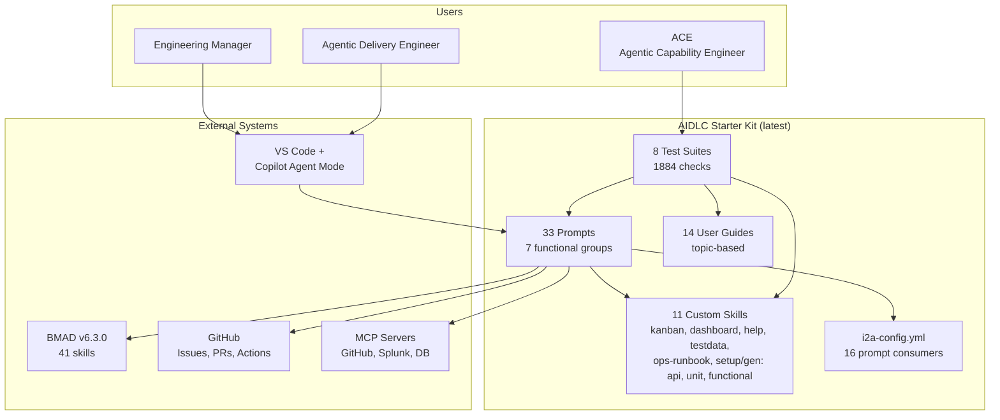
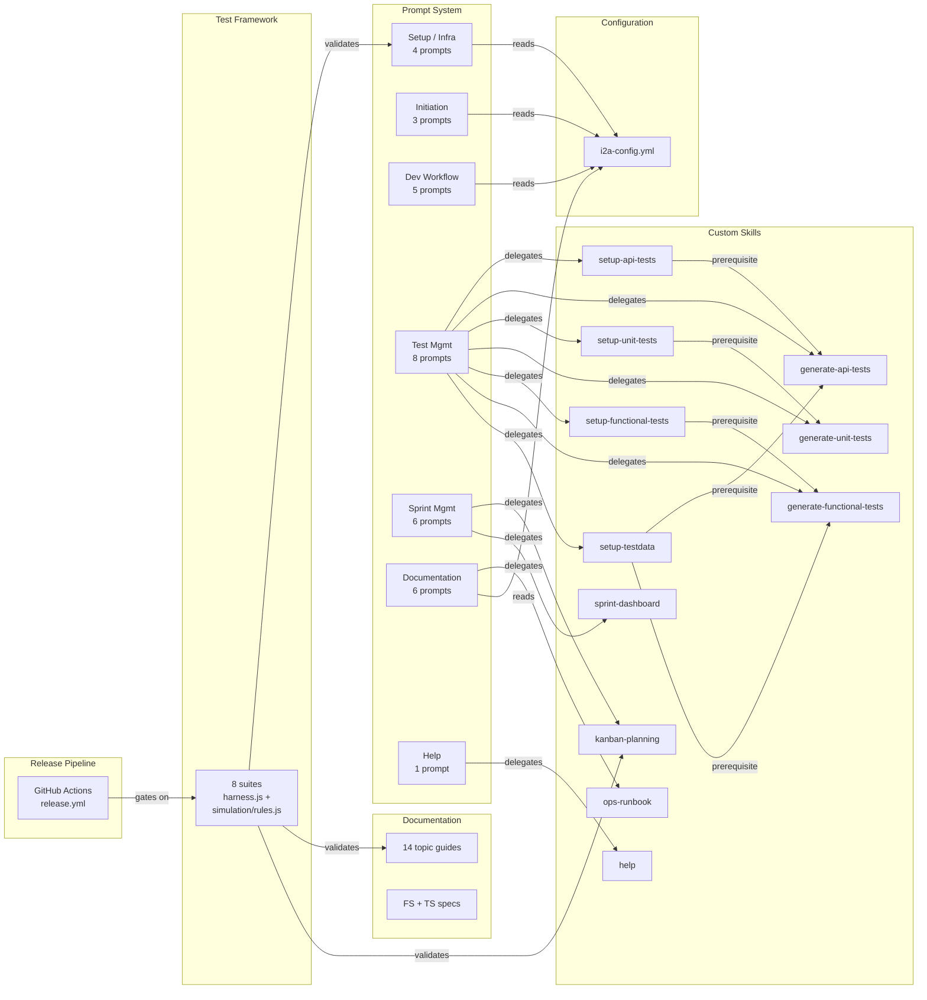
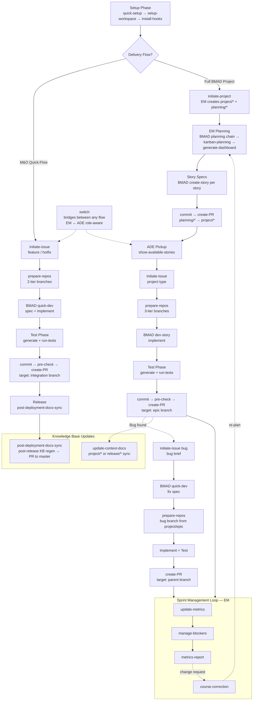
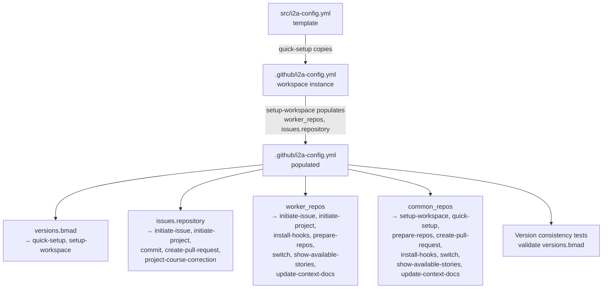
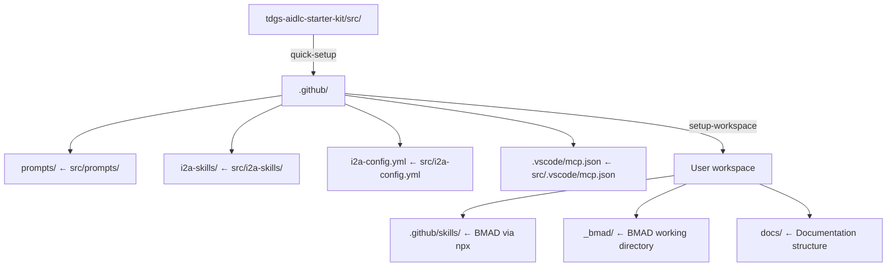
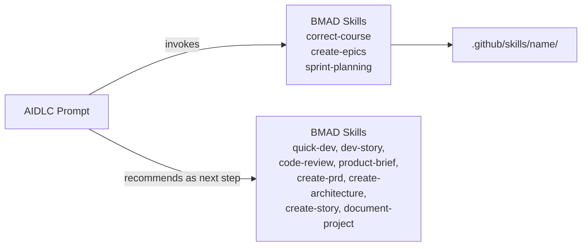

# AIDLC Starter Kit — Technical Specification

| Field        | Value |
|--------------|-------|
| Spec Version | 1.7.1 |
| Date         | 2026-07-20 |
| Status       | Current |
| BMAD         | 6.3.0 |

> Architecture contract — defines HOW the AIDLC Starter Kit is built, structured, and extended. For WHAT the kit does, see [functional-specification.md](functional-specification.md). For ACE procedures, see [README.md](README.md).

---

## Table of Contents

- [Project Context](#project-context)
- [Technology Stack](#technology-stack)
- [Repository Structure](#repository-structure)
- [Prompt System](#prompt-system)
- [Custom Skills System](#custom-skills-system)
- [Configuration System](#configuration-system)
- [Test Framework](#test-framework)
- [Documentation System](#documentation-system)
- [Release Pipeline](#release-pipeline)
- [Data Flow](#data-flow)
- [Implementation Patterns](#implementation-patterns)
- [Extension Guides](#extension-guides)
- [Boundaries and Constraints](#boundaries-and-constraints)

---

## Project Context

The AIDLC Starter Kit is a **prompt-and-guide distribution package**, not a runtime application. It ships markdown prompts, YAML configuration, and HTML templates that are copied into user workspaces. The only executable code is the test suite, which validates structural correctness of the distributed content.

**System classification:** Static content distribution with automated validation.

**Target environment:** VS Code with GitHub Copilot Agent mode. Prompts are invoked as `/tdgs-aidlc-{name}` slash commands. MCP servers (GitHub, Splunk, optional database) provide runtime context to the AI agent at invocation time.

**BMAD relationship:** The starter kit extends the BMAD v6.3.0 framework. BMAD is installed into user workspaces via `npx bmad-method@6.3.0`. AIDLC prompts reference approximately 11 of BMAD's 41 skills — some are invoked directly (delegated execution), others are recommended as next steps in prompt output. The two systems occupy separate installation paths: BMAD at `.github/skills/`, AIDLC at `.github/i2a-skills/`. For the complete dependency map, see [catalog.md](catalog.md).

---

## Technology Stack

| Layer | Technology | Purpose |
|-------|-----------|---------|
| Content | Markdown, YAML, HTML | Prompts, guides, config, dashboard templates |
| Test suite | Node.js v20+ | Structural validation (zero npm dependencies) |
| CI/CD | GitHub Actions | Automated versioning and release |
| IDE | VS Code + GitHub Copilot Agent mode | Prompt invocation environment |
| MCP servers | GitHub MCP, Splunk MCP, database MCPs (optional) | Runtime context for AI agent |
| Dependency | BMAD v6.3.0 (`npx bmad-method@6.3.0`) | Planning and development skills |

**Zero-dependency constraint:** The test suite uses only Node.js built-in modules (`node:fs`, `node:path`). No `npm install` is required. This is a deliberate design choice — the starter kit must be immediately testable in any environment with Node.js v20+.

---

## Repository Structure

```
tdgs-aidlc-starter-kit/
├── README.md                           # Product overview, prerequisites, badge
├── CONTRIBUTING.md                     # Pointer → doc/contributing/README.md
├── CHANGELOG.md                        # Auto-generated release history
├── VERSION                             # Single-line semver (source of truth)
├── NEXT_VERSION                        # Optional: user-specified next release version
├── package.json                        # Version mirror + npm test scripts
│
├── .github/
│   ├── workflows/
│   │   └── release.yml                 # Automated version bump, tag, release
│   └── pull_request_template.md        # PR checklist template
│
├── src/                                # ── Distributable starter files ──
│   ├── prompts/                        # 33 prompt files (tdgs-aidlc-*.prompt.md)
│   │   ├── tdgs-aidlc-quick-setup.prompt.md
│   │   ├── tdgs-aidlc-setup-workspace.prompt.md
│   │   ├── tdgs-aidlc-initiate-issue.prompt.md
│   │   ├── tdgs-aidlc-initiate-project.prompt.md
│   │   ├── tdgs-aidlc-commit.prompt.md
│   │   ├── tdgs-aidlc-create-pull-request.prompt.md
│   │   └── ... (23 more — full list in test/test-inventory.js)
│   │
│   ├── i2a-skills/                     # Custom AIDLC skills
│   │   ├── tdgs-aidlc-project-kanban-planning/
│   │   │   ├── SKILL.md               # Skill descriptor (triggers, delegation)
│   │   │   └── workflow.md            # Execution steps
│   │   ├── tdgs-aidlc-sprint-dashboard/
│   │   │   ├── SKILL.md               # Skill descriptor
│   │   │   ├── workflow.md            # Main workflow
│   │   │   ├── templates/
│   │   │   │   └── dashboard-template.html   # Standalone HTML with CSS/JS
│   │   │   ├── data/
│   │   │   │   ├── color-schemes/     # default.yaml, deloitte.yaml, custom-template.yaml
│   │   │   │   └── metric-definitions.csv
│   │   │   ├── tools/
│   │   │   │   ├── metrics-calculator.md     # Harvey ball calculation logic
│   │   │   │   └── yaml-format-spec.md       # sprint-status.yaml schema
│   │   │   └── workflows/             # Sub-workflow instructions
│   │   │       ├── update-sprint-metrics/    # /tdgs-aidlc-update-metrics
│   │   │       ├── manage-blockers/          # /tdgs-aidlc-manage-blockers
│   │   │       └── sprint-metrics-report/    # /tdgs-aidlc-metrics-report
│   │   ├── tdgs-aidlc-setup-api-tests/
│   │   │   ├── SKILL.md               # Skill descriptor
│   │   │   ├── workflow.md            # Scaffold orchestrator
│   │   │   ├── templates/             # 5 .template files (runner, report, linter, auditor, config)
│   │   │   └── tools/                 # runner-contract.md, insomnia-unit-test-examples.md
│   │   ├── tdgs-aidlc-generate-api-tests/
│   │   │   ├── SKILL.md               # Skill descriptor
│   │   │   ├── workflow.md            # Generation orchestrator
│   │   │   ├── templates/             # results-json-shape, insomnia-unit-test-resources
│   │   │   ├── tools/                 # 11 tool docs (guardrails, contracts, discovery, etc.)
│   │   │   └── scripts/               # post-generation-gate.mjs
│   │   ├── tdgs-aidlc-setup-unit-tests/
│   │   │   ├── SKILL.md               # Skill descriptor
│   │   │   ├── workflow.md            # Stack-detection router
│   │   │   └── tools/                 # 6 tool docs (java, javascript, other stacks, preflight, guardrails, verification)
│   │   ├── tdgs-aidlc-generate-unit-tests/
│   │   │   ├── SKILL.md               # Skill descriptor
│   │   │   ├── workflow.md            # Generation orchestrator
│   │   │   └── tools/                 # 8 tool docs (discovery, generation-rules, guardrails, pre/post-write, etc.)
│   │   ├── tdgs-aidlc-setup-functional-tests/
│   │   │   ├── SKILL.md               # Skill descriptor
│   │   │   ├── workflow.md            # Playwright scaffold orchestrator
│   │   │   └── tools/                 # 8 tool docs (scaffold, fixtures, flow descriptors, components, etc.)
│   │   ├── tdgs-aidlc-generate-functional-tests/
│   │   │   ├── SKILL.md               # Skill descriptor
│   │   │   ├── workflow.md            # Generation orchestrator
│   │   │   └── tools/                 # 10 tool docs (discovery, gap analysis, guardrails, pre/post-write, etc.)
│   │   ├── tdgs-aidlc-setup-testdata/
│   │   │   ├── SKILL.md               # Skill descriptor
│   │   │   ├── workflow.md            # 5-step pipeline orchestrator
│   │   │   └── tools/                 # 8 tool docs (guardrails, ground-truth, discovery, data-collection, etc.)
│   │   ├── tdgs-aidlc-ops-runbook/
│   │   │   ├── SKILL.md               # Skill descriptor (Update / Create dispatch)
│   │   │   ├── workflow.md            # Update-mode orchestrator
│   │   │   ├── workflow-create.md     # Create-mode orchestrator
│   │   │   ├── config/                # org-defaults.yaml
│   │   │   ├── templates/             # runbook-md.template.md
│   │   │   ├── tools/                 # guardrails-create, section-grounding, diagram-standards, post-generation-checks
│   │   │   └── scripts/               # render-diagrams.sh, capture-screenshots.js
│   │   └── tdgs-aidlc-help/
│   │       ├── SKILL.md               # Skill descriptor
│   │       ├── workflow.md            # Query parsing + response logic
│   │       └── tools/                 # catalog-data.md, workflow-sequences.md
│   │
│   ├── i2a-config.yml                  # Workspace configuration template
│   └── .vscode/
│       └── mcp.json                    # MCP server configuration template
│
├── doc/                                # ── User-facing documentation ──
│   ├── em-guide.md                     # EM role entry point (reading map)
│   ├── ade-guide.md                    # ADE role entry point (reading map)
│   ├── setup.md                        # Shared setup instructions
│   ├── mcp-setup-guide.md             # MCP server configuration
│   ├── knowledge-base-generation.md   # KB generation workflow
│   ├── mo-assignment.md               # M&O assignment process
│   ├── mo-workflow.md                 # M&O execution workflow
│   ├── project-planning.md            # Planning phase guide
│   ├── project-implementation.md      # Implementation phase guide
│   ├── post-deployment.md             # Post-deployment procedures
│   ├── ops-runbook-update.md          # Operational runbook update/create guide
│   ├── test-management.md             # Test management guide
│   ├── reference.md                   # Configuration and concept reference
│   ├── prompt-reference.md            # Full command reference (all 33 prompts + 11 skills)
│   ├── plan/                          # Planning artifacts (test-excluded)
│   └── contributing/                  # ── ACE (Agentic Capability Engineer) documentation ──
│       ├── README.md                  # Development workflow and procedures
│       ├── catalog.md                 # Dependency map and upgrade impact matrix
│       ├── project-context.md         # AI agent context file
│       ├── technical-specification.md # This file
│       └── skills/                    # ACE-only skills (not distributed)
│           ├── i2a-manage-spec/       # Specification generation
│           ├── i2a-manage-test/       # Test suite management
│           └── i2a-manage-review/     # Review management
│
└── test/                               # ── Zero-dependency validation suite ──
    ├── harness.js                      # Shared test harness (pass/fail/skip/section)
    ├── test-all.js                     # Suite orchestrator (SUITES registry)
    ├── test-inventory.js               # EXPECTED_PROMPTS, EXPECTED_GUIDES, EXPECTED_SKILLS
    ├── test-cross-references.js        # Anchor links, file links, prompt/BMAD refs
    ├── test-prompt-structure.js         # Per-prompt PROMPT_RULES structural checks
    ├── test-guide-structure.js          # Per-guide GUIDE_RULES structural checks
    ├── test-version-consistency.js      # VERSION ↔ package.json ↔ README ↔ config
    ├── test-workflow-completeness.js    # Workflow chains, branch conventions
    ├── test-content-quality.js          # Forbidden patterns, terminology, tables
    ├── test-simulation.js               # 3110 lines — behavioral decision tests
    └── simulation/
        └── rules.js                     # 1987 lines — deterministic decision functions
```

---

## Prompt System

### File Conventions

All prompts live in `src/prompts/` and follow strict naming and structural rules.

**Naming pattern:** `tdgs-aidlc-{name}.prompt.md`

The `{name}` segment is a kebab-case verb-noun or verb phrase that becomes the Copilot slash command. For example, `tdgs-aidlc-commit.prompt.md` is invoked as `/tdgs-aidlc-commit`.

**Mode declaration:** All 33 prompts include YAML frontmatter with `mode: agent` and a `description` field. The frontmatter serves as the agent mode indicator and provides trigger-phrase metadata for GitHub Copilot. The `.prompt.md` file extension is the secondary mode signal.

**Required sections:** Every prompt file must contain these structural elements:

| Section | Purpose | Detection |
|---------|---------|-----------|
| Context | Situational awareness — what the agent needs to know before acting | H2 heading |
| Steps | Ordered execution instructions | H2 heading |
| Output | Expected deliverables and success message format | H2 heading |

**Error handling patterns:**

- **Pre-flight checks** — Validation conditions that must pass before the prompt begins its main work. Typically check for required files, branch state, or configuration values.
- **BAIL conditions** — Hard stops that terminate prompt execution with an explanatory message. Used when the environment cannot support the requested operation (e.g., committing on a protected branch, missing prerequisites).

**Agent output iconography (canonical):**

| Prefix | Meaning | Blocks workflow? |
|--------|---------|------------------|
| `⛔` | BAIL — hard stop; fix environment or input before retry | Yes |
| `❌` | Validation failure — prerequisite or check failed | Yes (when in BAIL context) |
| `⚠️` | Warning — non-blocking caution or degraded path | No |
| `ℹ️` | Informational — status or next-step hint | No |

New prompts should follow this table. Legacy prompts may still mix icons; normalize when editing those files.

### Configuration Consumers

16 of the 33 prompts read `.github/i2a-config.yml` at invocation time. The config keys they consume are:

| Config Key | Consuming Prompts |
|------------|-------------------|
| `versions.bmad` | quick-setup, setup-workspace |
| `issues.repository` | initiate-issue, initiate-project, commit, create-pull-request, project-course-correction |
| `worker_repos` | initiate-issue, initiate-project, install-hooks, prepare-repos, switch, show-available-stories, update-context-docs, commit, pre-check-pull-request |
| `common_repos` | setup-workspace, quick-setup, prepare-repos, create-pull-request, install-hooks, switch, show-available-stories, update-context-docs, commit, pre-check-pull-request |

For the full dependency map and BMAD skill relationships, see [catalog.md](catalog.md) sections 1–3.

### Functional Groups

The 33 prompts organize into seven functional groups:

| Group | Count | Examples |
|-------|-------|---------|
| Setup / Infrastructure | 4 | quick-setup, setup-workspace, install-hooks, reference-sync (deprecated) |
| Issue / Project Initiation | 3 | initiate-issue, initiate-project, show-available-stories |
| Development Workflow | 5 | prepare-repos, switch, commit, pre-check-pull-request, create-pull-request |
| Test Management | 8 | setup-unit-tests, generate-unit-tests, run-tests, setup-testdata, ... |
| Sprint Management | 6 | generate-dashboard, update-metrics, manage-blockers, metrics-report, project-kanban-planning, project-course-correction |
| Documentation | 6 | generate-kb, update-context-docs, validate-runbook-context, validate-test-context, post-deployment-docs-sync, ops-runbook |
| Help | 1 | help |

The authoritative prompt list is the `EXPECTED_PROMPTS` array in `test/test-inventory.js`.

### BMAD Skill Integration

AIDLC prompts interact with BMAD skills in two modes:

- **Invocation** — The prompt delegates execution to a BMAD skill during its own run. Changes to the BMAD skill's interface require prompt updates.
- **Recommendation** — The prompt lists a BMAD skill as a suggested next step in its output message. Only the recommendation text needs updating if the skill is renamed or removed.

Three BMAD skills are actively invoked: `/bmad-correct-course` (by project-course-correction), `/bmad-create-epics-and-stories` and `/bmad-sprint-planning` (by the project-kanban-planning custom skill). See [catalog.md](catalog.md) section 3 for the complete mapping.

---

## Custom Skills System

### Skill Structure

Custom skills live in `src/i2a-skills/tdgs-aidlc-{name}/` and are installed to `.github/i2a-skills/` in user workspaces — separate from BMAD skills at `.github/skills/`.

**Minimum required files:**

| File | Purpose |
|------|---------|
| `SKILL.md` | Skill descriptor with YAML frontmatter (name, description, trigger phrases) |
| `workflow.md` | Execution steps the AI agent follows |

The `SKILL.md` frontmatter follows this structure:

```yaml
---
name: tdgs-aidlc-{name}
description: 'Trigger phrase description...'
---
```

The body of `SKILL.md` is a pointer: `Follow the instructions in ./workflow.md.`

### Official Skills

**tdgs-aidlc-project-kanban-planning** — Orchestrates sprint-ready planning. Detects missing prerequisites (epics, sprint-status), delegates to BMAD skills (`/bmad-create-epics-and-stories`, `/bmad-sprint-planning`) to fill gaps, then generates kanban plan, dashboard, and sprint metrics. Has an associated prompt (`src/prompts/tdgs-aidlc-project-kanban-planning.prompt.md`) that validates hard prerequisites and delegates to this skill.

- Files: `SKILL.md`, `workflow.md`
- Prompt: `tdgs-aidlc-project-kanban-planning.prompt.md`
- BMAD dependencies: `/bmad-create-epics-and-stories`, `/bmad-sprint-planning`

**tdgs-aidlc-sprint-dashboard** — Generates standalone HTML dashboards with real-time KPIs, Harvey ball quality metrics, blocker tracking, and critical path visualization. Reads `sprint-status.yaml` and `sprint-metrics.md`.

Extended file structure:

```
tdgs-aidlc-sprint-dashboard/
├── SKILL.md
├── workflow.md
├── templates/
│   └── dashboard-template.html         # Self-contained HTML (CSS + JS inline)
├── data/
│   ├── color-schemes/
│   │   ├── default.yaml                # Default color scheme
│   │   ├── deloitte.yaml               # Deloitte brand colors
│   │   └── custom-template.yaml        # User customization template
│   └── metric-definitions.csv          # Canonical metric dimension definitions
├── tools/
│   ├── metrics-calculator.md           # Harvey ball calculation logic
│   └── yaml-format-spec.md            # sprint-status.yaml format specification
└── workflows/
    ├── update-sprint-metrics/          # 3-step workflow (load → calculate → update)
    │   ├── instructions.md
    │   └── steps/
    ├── manage-blockers/
    │   └── instructions.md
    └── sprint-metrics-report/
        ├── instructions.md
        └── template.md
```

**tdgs-aidlc-setup-api-tests** — Scaffolds per-service `api-tests/` (Insomnia collections, test-runner, lint/audit scripts, environments). Thin prompt delegates here; agents copy `templates/*.template` and read `tools/runner-contract.md` (do not regenerate embedded JS from prose).

- Files: `SKILL.md`, `workflow.md`, `templates/`, `tools/`
- Prompt: `tdgs-aidlc-setup-api-tests.prompt.md`

**tdgs-aidlc-generate-api-tests** — Two-phase discovery, collection generation, post-generation gate, execution, and reports. Orchestrator `workflow.md` plus on-demand `tools/` (guardrails, discovery, generation-rules, post-generation-checks, etc.) and `scripts/post-generation-gate.mjs`.

- Files: `SKILL.md`, `workflow.md`, `tools/`, `templates/`, `scripts/`
- Prompt: `tdgs-aidlc-generate-api-tests.prompt.md`
- Prerequisite: `tdgs-aidlc-setup-api-tests`; recommended: `tdgs-aidlc-setup-testdata`

**tdgs-aidlc-setup-unit-tests** — Auto-detects project technology stacks (Java/Maven/Gradle, JavaScript/TypeScript with Jest/Vitest, Python/pytest, Angular, Vue, Lambda, .NET/xUnit) and scaffolds per-repository unit test infrastructure with coverage tooling, `generate-report.js` stubs, `coverage.json`, and `TESTING.md`. Router-style skill that applies the appropriate scaffold per stack. Has an associated prompt (`src/prompts/tdgs-aidlc-setup-unit-tests.prompt.md`) that validates prerequisites and delegates to this skill.

- Files: `SKILL.md`, `workflow.md`, `tools/` (6 tool docs)
- Prompt: `tdgs-aidlc-setup-unit-tests.prompt.md`

**tdgs-aidlc-generate-unit-tests** — Knowledge-base and source-code discovery, hermetic unit test generation per-module with coverage gates, pre-write contract (U1–U3), 8 guardrails (hermeticity, exception paths, exact assertions), 8 post-generation checks, and workspace summary. Supports JaCoCo, Jest, Vitest, pytest, and Coverlet stacks.

- Files: `SKILL.md`, `workflow.md`, `tools/` (8 tool docs)
- Prompt: `tdgs-aidlc-generate-unit-tests.prompt.md`
- Prerequisite: `tdgs-aidlc-setup-unit-tests`

**tdgs-aidlc-setup-functional-tests** — Scaffolds Playwright-based functional test infrastructure in UI repositories. Includes `playwright.config.js`, page-object models, fixtures (`api-mock.js`, catalog fixture, flow-runner), component detection helpers (react-select, datepicker, wizard), flow descriptors, and `generate-report.js`. Idempotent and safe to re-run.

- Files: `SKILL.md`, `workflow.md`, `tools/` (8 tool docs)
- Prompt: `tdgs-aidlc-setup-functional-tests.prompt.md`

**tdgs-aidlc-generate-functional-tests** — Multi-phase discovery (flow descriptors, KB, source code), Playwright spec generation with pre-write contract (F1–F6), gap analysis, 14+ post-generation checks plus Standards Audit Script, and execution with HTML/markdown/ledger reports. Supports mock and real execution modes.

- Files: `SKILL.md`, `workflow.md`, `tools/` (10 tool docs)
- Prompt: `tdgs-aidlc-generate-functional-tests.prompt.md`
- Prerequisite: `tdgs-aidlc-setup-functional-tests`; recommended: `tdgs-aidlc-setup-testdata`

**tdgs-aidlc-setup-testdata** — Orchestrates test-data catalog generation through a 5-step pipeline: project-context validation, multi-phase discovery (endpoint scanning, API chain detection, UI screen mapping, identity pool classification), interactive data collection with workbook import, catalog YAML generation with idempotent merge semantics, and dashboard script generation with JSON Schema contracts. Enforces 13 guardrails (G1–G13) and a field derivation hierarchy (P0–P6 provenance tiers). Sits in the pipeline after framework setup skills and before generation skills (API and functional tests consume the catalog; unit tests do not).

- Files: `SKILL.md`, `workflow.md`, `tools/` (8 tool docs: guardrails, ground-truth-hierarchy, discovery, data-collection, catalog-generation, dashboard-generation, ledger-and-schemas, hard-rules)
- Prompt: `tdgs-aidlc-setup-testdata.prompt.md`
- Prerequisite: One or more of `tdgs-aidlc-setup-api-tests`, `tdgs-aidlc-setup-functional-tests`, `tdgs-aidlc-setup-unit-tests`

**tdgs-aidlc-help** — Read-only reference skill that backs the `/tdgs-aidlc-help` prompt. Provides four response modes: full catalog, targeted prompt/skill detail, goal-based command lookup, and workflow sequences. Two tool documents supply the reference data: `tools/catalog-data.md` (per-prompt syntax, inputs, examples, prerequisites, next steps) and `tools/workflow-sequences.md` (end-to-end sequences for 7 common scenarios). The skill never modifies files.

- Files: `SKILL.md`, `workflow.md`, `tools/` (2 tool docs: catalog-data.md, workflow-sequences.md)
- Prompt: `tdgs-aidlc-help.prompt.md`

**tdgs-aidlc-ops-runbook** — Dual-mode workflow skill that backs the `/tdgs-aidlc-ops-runbook` prompt. **Update mode** (`workflow.md`) surgically edits existing `.docx` or `.md` runbooks scoped to the implementation plan version matrix: document comprehension, exhaustive KB + code scanning, evidence table construction, edit planning, format-preserving execution (python-docx for `.docx` with backup/rollback), and post-save validation. **Create mode** (`workflow-create.md`) generates a new `.md` runbook from the Texas.gov template with Mermaid diagrams (architecture, sequence, integration) and optional UI screenshots. Enforces shared and mode-specific guardrails, organization defaults (`config/org-defaults.yaml`), diagram standards, and post-generation checks. Scripts: `render-diagrams.sh`, `capture-screenshots.js`.

- Files: `SKILL.md`, `workflow.md`, `workflow-create.md`, `config/`, `templates/`, `tools/`, `scripts/`
- Prompt: `tdgs-aidlc-ops-runbook.prompt.md`

---

## Configuration System

### Schema

The template at `src/i2a-config.yml` defines four top-level keys:

```yaml
versions:
  bmad: "6.3.0"           # BMAD framework version for npx installation

issues:
  repository: ""           # GitHub issue tracker (owner/repo format)

worker_repos:              # Service repositories (populated by setup-workspace)
  # service-key: "org/repo"

# Common/shared repos — used by multiple applications
# Same format as worker_repos. Merged with worker_repos at runtime.
common_repos:
  # service-key: "org/repo"
```

### Lifecycle

1. **Template** — `src/i2a-config.yml` ships as a template with documented defaults and instructive comments.
2. **Installation** — `/tdgs-aidlc-quick-setup` copies the template to `.github/i2a-config.yml` in the user workspace.
3. **Population** — `/tdgs-aidlc-setup-workspace` detects workspace repositories and populates `worker_repos` and `issues.repository`.
4. **Consumption** — 15 prompts read `.github/i2a-config.yml` at invocation time. They parse specific keys relevant to their function.

### Validation

- The inventory test suite validates that the template has all four required top-level keys and that `versions.bmad` contains a valid semver string.
- The config schema is validated for proper YAML nesting (`versions.bmad` under `versions:`, `issues.repository` under `issues:`).
- The template must contain at least 5 comment lines (documentation quality check).
- The version consistency suite confirms `versions.bmad` aligns with BMAD references in guides.

---

## Test Framework

### Architecture

The test suite is a zero-dependency Node.js validation framework. All 8 suites share a common harness and are orchestrated by a central runner.

```
test-all.js (orchestrator)
    ├── SUITES registry (8 entries)
    ├── CLI argument parsing (suite names + --verbose)
    └── Exit codes: 0 = pass, 1 = failures, 2 = unknown suite
         │
         ├── test-inventory.js         [INV-*]
         ├── test-cross-references.js  [XREF-*]
         ├── test-prompt-structure.js  [PS-*]
         ├── test-guide-structure.js   [GS-*]
         ├── test-version-consistency.js [VER-*]
         ├── test-workflow-completeness.js [WF-*]
         ├── test-content-quality.js   [CQ-*]
         └── test-simulation.js        [SIM-*]
                  └── simulation/rules.js (decision functions)
```

### Harness API

The shared harness (`test/harness.js`) provides:

| Export | Type | Purpose |
|--------|------|---------|
| `pass(id, msg)` | Function | Record a passing check |
| `fail(id, msg, detail?)` | Function | Record a failing check (detail can be string or array) |
| `skip(id, msg)` | Function | Record a skipped check |
| `section(name)` | Function | Print a section header to stdout |
| `assertEqual(testId, actual, expected, msg?)` | Function | Assert strict equality; pass or fail with detail |
| `assertMatch(testId, value, pattern, msg?)` | Function | Assert value matches regex pattern |
| `assertTrue(testId, condition, msg, details?)` | Function | Assert condition is truthy; fail with detail array |
| `collectFiles(dirs, opts?)` | Function | Recursively scan directories; returns `{fullPath, relPath}[]` |
| `searchFiles(files, regex)` | Function | Search files for pattern; returns `{file, line, lineNum, match}[]` |
| `formatHits(hits, max?)` | Function | Format search hits for failure detail output (default max: 10) |
| `readContent(filePath)` | Function | Read file as UTF-8 string |
| `printSummary(label)` | Function | Print pass/fail/skip summary; returns failure count |
| `ROOT` | String | Absolute path to starter kit root |
| `VERBOSE` | Boolean | Whether `--verbose` was passed |
| `FG` | Object | ANSI color code constants (green, red, yellow, cyan, dim, bold, reset) |

**File scanning defaults:** `collectFiles` scans for `.md`, `.yml`, `.yaml` extensions and excludes `plan/`, `adr/`, `CHANGELOG.md`, and `node_modules/`.

### Test ID Convention

Each check has a unique test ID with the pattern `PREFIX-CHECK:detail`:

| Prefix | Suite | Examples |
|--------|-------|---------|
| `INV` | Inventory | `INV-P:tdgs-aidlc-commit.prompt.md`, `INV-CFG:versions` |
| `XREF` | Cross-References | `XREF-ANCHOR:guide-name#section` |
| `PS` | Prompt Structure | `PS-SECT:commit:steps` |
| `GS` | Guide Structure | `GS-H2:em-guide:prerequisites` |
| `VER` | Version Consistency | `VER-PKG`, `VER-BADGE` |
| `WF` | Workflow Completeness | `WF-CHAIN:issue-flow` |
| `CQ` | Content Quality | `CQ-STALE:bmad-init` |
| `SIM` | Simulation | `SIM-BRANCH:commit-bail:master`, `SIM-CFG:missing-key` |

### Suite Details

**Inventory** (`test-inventory.js`) — Verifies all 33 prompt files exist, follow `tdgs-aidlc-*` naming, have frontmatter/heading and non-trivial content (50+ lines). Detects unexpected prompt files not in the expected list. Checks all 14 guides exist. Validates config schema (required keys, nesting, comments). Checks supporting files (VERSION, CHANGELOG, README, etc.). Verifies custom skill directories contain required files. Validates release workflow structure (triggers, version bump options, required steps).

**Cross-References** (`test-cross-references.js`) — Validates internal anchor links resolve to actual headings. Verifies relative file links point to existing files. Checks prompt invocation references (`/tdgs-aidlc-*`) match real prompts. Validates BMAD skill references (`/bmad-*`); unknown skills are skipped for explicit triage rather than silently passed. Validates skill internal file references (SKILL.md → workflow.md, tools/*.md) within and across sibling skill directories. Code-block-aware scanning prevents false positives from examples.

**Prompt Structure** (`test-prompt-structure.js`) — Contains a `PROMPT_RULES` object with per-prompt structural requirements. Checks required sections (Mode, Context, Steps, Output). Validates behavioral content specific to each prompt (coverage targets, two-phase discovery, MCP prereqs, sensitivity lists, branch protection patterns). Enforces global conventions: no TODO/FIXME markers, pre-flight checks present, no empty code blocks.

**Guide Structure** (`test-guide-structure.js`) — Contains a `GUIDE_RULES` object with per-guide requirements. Each guide specifies: required H2 sections, mandatory prompt references (`mustContainPrompts`), required cross-guide references. Enforces heading hierarchy (no 3+ level jumps: H2→H4 is fine, H1→H4 is not). Checks for Mermaid diagrams where required. Code-block-aware heading detection.

**Version Consistency** (`test-version-consistency.js`) — Ensures the following all contain the same version string: `VERSION` file (source of truth), `package.json` `version` field, `README.md` badge URL (`img.shields.io/badge/version-X.Y.Z-blue`), `CHANGELOG.md` latest entry. Validates `i2a-config.yml` `versions.bmad` against guide references. Validates `NEXT_VERSION` raw file format (no BOM, no extra whitespace, no trailing content beyond semver).

**Workflow Completeness** (`test-workflow-completeness.js`) — Verifies ADE and TMG step sequences are fully documented. Checks prompt workflow chains are complete (no broken chains). Validates branch naming conventions documented in guides match the patterns enforced by prompts.

**Content Quality** (`test-content-quality.js`) — Scans for forbidden patterns including stale BMAD terminology, removed-skill names, outdated BMAD version references, TODO/FIXME markers, template placeholders, and hardcoded absolute paths (`/Users/`, `C:\Users\`, `/home/`). Validates consistent abbreviation usage. Checks for empty sections (code-block-aware: a heading followed by another same-or-higher heading with no content). Verifies table formatting. Validates package.json script names. Checks CONTRIBUTING.md accuracy.

**Simulation** (`test-simulation.js` + `simulation/rules.js`) — The largest suite at 3668 + 2184 lines. Tests deterministic decision logic extracted from all 32 AIDLC prompts. The `rules.js` module exports pure functions that mirror specific decision branches from prompts. Test cases exercise these functions with known inputs and assert expected outcomes (BAIL/PROCEED/specific values). Categories:

| Rule Category | SIM Prefix | What It Tests |
|---------------|------------|---------------|
| API test generation | `SIM-API` | Result classification, security payloads |
| Blocker management | `SIM-BLOCK` | Command parsing, blocker CRUD operations |
| Branch validation | `SIM-BRANCH` | Protected branch detection, dev/* patterns, PR source/target, name building |
| Change brief | `SIM-BRIEF` | Brief metadata extraction and formatting |
| Course correction | `SIM-CC` | Source parsing, CR sequence, brief metadata, planning branch, story action |
| Config validation | `SIM-CFG` | Missing keys, invalid values, empty repos, BMAD version |
| CI integration | `SIM-CI` | Failure classification, polling delays |
| Commit rules | `SIM-COMMIT` | Conventional commit type/scope validation, refs footer |
| Coverage targets | `SIM-COV` | Coverage target resolution per test type, JaCoCo ratio |
| Dashboard | `SIM-DASH` | Generate dashboard prerequisites |
| Deletion detection | `SIM-DEL` | File deletion detection in diffs |
| Post-deployment | `SIM-DEPLOY` | Docs sync, issue ID extraction |
| Scan exclusions | `SIM-EXCL` | Scan exclusion pattern matching |
| Test generation | `SIM-GEN` | Test title, skip completed, auto-scaffold, KB paths |
| Hook installation | `SIM-HOOKS` | Worker repo skip conditions, sibling path resolution |
| Input parsing | `SIM-INPUT` | Issue number extraction, story ID parsing, persona, release version |
| KB synchronization | `SIM-KBSYNC` | Mode determination, planning branch, project context update |
| Legacy cleanup | `SIM-LEGACY` | Legacy prompt detection and removal |
| File mapping | `SIM-MAP` | File-to-context-doc mapping |
| Metrics | `SIM-METRICS` | Harvey ball calculation, update validation |
| Multi-repo detection | `SIM-MULTI` | Multi-repo workspace detection, PR multi-repo selection |
| OS detection | `SIM-OS` | OS identification, package manager, install commands, Gitleaks fallback |
| PR formatting | `SIM-PR` | PR target branch, title format, label assignment, draft status, copilot reviewer |
| Repository preparation | `SIM-PREPARE` | Spec file glob, branch conflict choice |
| Prerequisite checks | `SIM-PREREQ` | Required files, BMAD artifacts, sprint-status, tool versions |
| Project initiation | `SIM-PROJECT` | Branch naming, KB validation, change brief metadata |
| Reference sync | `SIM-REFSYNC` | MCP availability, service filter, file categories |
| Runbook validation | `SIM-RUNBOOK` | Status classification, rollup, discrepancy IDs, env ordering, output paths |
| Test execution | `SIM-RUNTESTS` | Scope, type, environment, mode, pass rate calculation |
| Sensitivity detection | `SIM-SENS` | File sensitivity classification (.env, credentials) |
| Workspace setup | `SIM-SETUP` | Project name, docs folder, common services, BMAD config, exclusions |
| Stack detection | `SIM-STACK` | Technology stack, framework ID, UI repo, React testing lib, default ports |
| Story management | `SIM-STORIES` | Status classification, dependency resolution, dev branch parsing |
| Issue switching | `SIM-SWITCH` | Clean tree checks, branch resolution, role switching |
| Test data setup | `SIM-TESTDATA` | Pool record status, quarantine, placeholder, catalog merge |
| Test validation | `SIM-TESTVAL` | Severity classification, calculation model, rule matching |
| URL parsing | `SIM-URL` | Worker repo URL construction, service key derivation |
| Validation classification | `SIM-VALID` | Validation report severity |
| Workflow chains | `SIM-WF` | Workflow prerequisite detection, branch prerequisites |

### npm Scripts

| Script | Command | Suites |
|--------|---------|--------|
| `test` | `node test/test-all.js` | All 8 |
| `test:verbose` | `node test/test-all.js --verbose` | All 8 (with passing checks) |
| `test:inventory` | `node test/test-all.js inventory` | Inventory only |
| `test:cross-refs` | `node test/test-all.js cross-refs` | Cross-References only |
| `test:prompts` | `node test/test-all.js prompts` | Prompt Structure only |
| `test:guides` | `node test/test-all.js guides` | Guide Structure only |
| `test:versions` | `node test/test-all.js versions` | Version Consistency only |
| `test:workflow` | `node test/test-all.js workflow` | Workflow Completeness only |
| `test:quality` | `node test/test-all.js quality` | Content Quality only |
| `test:simulation` | `node test/test-all.js simulation` | Simulation only |
| `test:simulation:verbose` | `node test/test-all.js simulation --verbose` | Simulation (verbose) |

---

## Documentation System

### Guide Architecture

The 14 user-facing guides in `doc/` follow a topic-based architecture with role-based entry points. Content lives in topic files; entry points provide reading maps.

**Entry points (reading maps, not content):**

| File | Role | Purpose |
|------|------|---------|
| `em-guide.md` | Engineering Manager | Links to guides in EM-relevant order |
| `ade-guide.md` | Agentic Delivery Engineer | Links to guides in ADE-relevant order |

**Topic guides:**

| File | Topic |
|------|-------|
| `setup.md` | Initial setup (shared across roles) |
| `mcp-setup-guide.md` | MCP server configuration |
| `knowledge-base-generation.md` | Knowledge base generation workflow |
| `mo-assignment.md` | M&O (Maintenance and Operations) assignment |
| `mo-workflow.md` | M&O execution workflow |
| `project-planning.md` | Planning phase |
| `project-implementation.md` | Implementation phase |
| `post-deployment.md` | Post-deployment procedures |
| `ops-runbook-update.md` | Operational runbook update and create |
| `test-management.md` | Test management |
| `reference.md` | Configuration and concept reference |
| `prompt-reference.md` | Full command reference (all prompts + skills) |

### Structural Rules

Guide structure is enforced by the `GUIDE_RULES` object in `test-guide-structure.js`. Each guide specifies:

- **Required H2 sections** — Headings that must appear in the guide.
- **Heading hierarchy** — No jumps of 3+ levels. H2→H4 is permitted; H1→H4 is not.
- **Required prompt references** (`mustContainPrompts`) — Specific `/tdgs-aidlc-*` invocations the guide must reference.
- **Cross-guide references** — Links to other guides that must be present.
- **Mermaid diagrams** — Required in specific guides for workflow visualization.
- **Prerequisite tables** — Guides that describe workflows must include prerequisite information.

### Code-Block-Aware Scanning

When tests scan markdown for headings, links, or forbidden patterns, they track fenced code blocks (triple backticks). Content inside code blocks is excluded from validation. This prevents false positives from example commands, sample output, and code snippets that legitimately contain patterns that would otherwise fail checks.

### Content Quality Rules

All guides must satisfy these rules (enforced by the content quality test suite):

- No TODO/FIXME markers
- No stale BMAD terminology (outside code blocks)
- No empty sections (heading with no content before the next same-or-higher heading)
- No template placeholders
- No hardcoded absolute paths
- Valid markdown table formatting
- Consistent abbreviation usage

---

## Release Pipeline

### Workflow Configuration

The release pipeline is defined in `.github/workflows/release.yml`. It uses the `softprops/action-gh-release@v2` action for GitHub Release creation.

**Triggers:**

| Trigger | Behavior |
|---------|----------|
| Push to `master` | Auto-detects bump type from conventional commit prefixes |
| `workflow_dispatch` | Manual selection of `patch`, `minor`, or `major` |

**Push trigger exclusions:** Changes to `VERSION`, `NEXT_VERSION`, `CHANGELOG.md`, `README.md`, `package.json`, or the workflow file itself are excluded from triggering (prevents release loops).

**Concurrency:** The `release` concurrency group with `cancel-in-progress: true` ensures only one release runs at a time.

### Version Bump Logic

For push-triggered releases, the workflow scans commit messages since the last tag:

| Commit Pattern | Bump Type |
|---------------|-----------|
| `BREAKING CHANGE` or `!:` in message | Major |
| `feat(...):` or `feat:` | Minor |
| Everything else | Patch |

### NEXT_VERSION Override

The workflow supports an optional version override via the `NEXT_VERSION` file in the repository root. This allows users to control version jumps (e.g., skipping from 1.6.0 to 2.0.0) without relying on commit message conventions.

**Resolution order:**

1. The workflow always computes the auto-incremented version based on the bump type.
2. If `NEXT_VERSION` contains a non-empty value, the workflow validates it:
   - Must match `X.Y.Z` format (leading `v` prefix is stripped automatically).
   - Must be strictly greater than the auto-incremented version.
3. If valid and greater, the `NEXT_VERSION` value is used; otherwise the auto-incremented value is used (with a warning annotation on the workflow run).
4. After the release commit, `NEXT_VERSION` is cleared (emptied) and included in the commit, ensuring the override is consumed exactly once.

| NEXT_VERSION Content | Outcome | Version Source |
|---------------------|---------|---------------|
| Empty or missing | Auto-increment used | `auto` |
| Valid and > auto-increment | NEXT_VERSION used | `NEXT_VERSION` |
| Valid but <= auto-increment | Auto-increment used (warning) | `auto` |
| Invalid format | Workflow fails with error | N/A |

### Release Steps

1. **Validate** — Confirm `RELEASE_PAT` secret is configured.
2. **Checkout** — Full history (`fetch-depth: 0`) with PAT for push access.
3. **Read VERSION** — Parse current semver; validate X.Y.Z format.
4. **Determine bump** — Auto-detect from commits or use manual input.
5. **Calculate version** — Compute auto-incremented version, then check `NEXT_VERSION` for an override. Output both `suggested` (auto) and `version` (final) values plus `source` (`auto` or `NEXT_VERSION`).
6. **Generate notes** — Categorize commits into Added, Changed, Fixed, Documentation, Other sections.
7. **Update files** — Write new version to `VERSION`, update `package.json` version field, update `README.md` badge URL, prepend release section to `CHANGELOG.md`.
8. **Clear NEXT_VERSION** — Empty the file so the override is not re-used.
9. **Commit** — `chore(release): bump version to X.Y.Z` (includes `VERSION`, `NEXT_VERSION`, `CHANGELOG.md`, `README.md`, `package.json`).
10. **Tag** — Annotated tag `vX.Y.Z`.
11. **Push** — Commit and tag to `master`.
12. **Release** — Create GitHub Release with generated notes.

### Secrets

| Secret | Scope | Purpose |
|--------|-------|---------|
| `RELEASE_PAT` | `repo` | Personal access token from a user in the branch protection bypass list; used for pushing to `master` and creating releases |

---

## Data Flow

### System Context

How the AIDLC Starter Kit relates to its users, runtime environment, and external systems.



### Component Interaction

How the kit's internal subsystems relate to each other.



### Delivery Lifecycle

End-to-end delivery flows showing M&O Quick-Flow, Full BMAD Project, Bug Remediation, KB updates, and sprint management.



### Configuration Flow



### Workspace Installation Flow



### BMAD Integration Flow



The complete dependency graph with all prompt-to-prompt and prompt-to-skill edges is documented as a Mermaid diagram in [catalog.md](catalog.md) section 4.

### MCP Server Configuration

The template at `src/.vscode/mcp.json` defines three server categories:

| Server | Type | Status |
|--------|------|--------|
| `github-mcp` | HTTP (api.githubcopilot.com) | Required — provides GitHub issue/PR/project context |
| `splunk-mcp-server` | stdio via npx mcp-remote | Required — provides Splunk observability context |
| Database MCPs (sqlcl, mysql, pg, mongodb) | stdio | Optional — uncommented and configured per project |

---

## Implementation Patterns

### Naming Conventions

| Artifact | Pattern | Example |
|----------|---------|---------|
| Prompt file | `tdgs-aidlc-{name}.prompt.md` | `tdgs-aidlc-commit.prompt.md` |
| Prompt invocation | `/tdgs-aidlc-{name}` | `/tdgs-aidlc-commit` |
| Custom skill directory | `tdgs-aidlc-{name}/` | `tdgs-aidlc-sprint-dashboard/` |
| BMAD skill reference | `/bmad-{name}` | `/bmad-quick-dev` |
| Test ID | `PREFIX-CHECK:detail` | `SIM-BRANCH:commit-bail:master` |
| Guide file | `{topic}.md` | `project-implementation.md` |
| Dev branch | `dev/{issue-number}-{description}` or `dev/{description}` | `dev/ghi-123-fix-dashboard` |
| Planning branch | `planning/{issue-number}-{description}` | `planning/ghi-42-tabc-app` |
| Project branch | `project/{issue-number}-{description}` | `project/ghi-42-tabc-app` |
| Release commit | `chore(release): bump version to X.Y.Z` | `chore(release): bump version to 1.6.0` |

### Prompt File Structure

```markdown
# tdgs-aidlc-{name}

## Context

{Situational awareness for the agent}

## Pre-flight Checks

1. Check condition A
2. Check condition B → BAIL if failed

## Steps

### Step 1: {Action}
{Instructions}

### Step 2: {Action}
{Instructions}

## Output

{Expected deliverables and success message format}
```

### Cross-Reference Patterns

| Reference Type | Pattern | Validated By |
|---------------|---------|-------------|
| Prompt invocation | `/tdgs-aidlc-{name}` | cross-refs suite |
| BMAD skill | `/bmad-{name}` | cross-refs suite |
| Internal anchor | `[text]` + `(#heading-slug)` | cross-refs suite |
| File link | `[text]` + `(relative/path.md)` | cross-refs suite |
| Guide cross-reference | `[text]` + `(../guide.md)` | guide-structure suite |

### Version Synchronization

Five locations must stay synchronized:

| Location | Content | Role |
|----------|---------|------|
| `VERSION` | `2.0.0` | Source of truth |
| `package.json` | `"version": "2.0.0"` | npm metadata mirror |
| `README.md` | Badge URL with `version-2.0.0-blue` | User-visible badge |
| `CHANGELOG.md` | `## [2.0.0]` entry | Release history |
| `src/i2a-config.yml` | `bmad: "6.3.0"` | BMAD version (separate cadence) |

The release workflow updates the first four automatically. The BMAD version is updated manually when upgrading BMAD and follows its own cadence.

**`NEXT_VERSION` file:** An optional override that, when populated with a valid semver greater than the auto-incremented version, directs the release workflow to use that value. The file is cleared (emptied) as part of the release commit. It is not a version synchronization target — it is an input consumed once per release.

### Test Module Pattern

Every test suite follows a consistent module pattern:

```javascript
'use strict';

const h = require('./harness');

function run() {
  h.section('Section Name');

  // Validation logic
  if (condition) {
    h.pass('PREFIX-CHECK', 'Description of what passed');
  } else {
    h.fail('PREFIX-CHECK', 'Description of what failed', 'optional detail');
  }
}

module.exports = { run };
```

Suites are registered in the `SUITES` object in `test-all.js`:

```javascript
const SUITES = {
  'suite-name': { mod: './test-{name}', label: 'Human-Readable Label' },
};
```

### Simulation Rule Pattern

Decision rules in `simulation/rules.js` are pure functions that return action objects:

```javascript
function validateSomething(input) {
  if (!input) return { action: 'BAIL', reason: 'No input provided' };
  if (isInvalid(input)) return { action: 'BAIL', reason: 'Specific failure reason' };
  return { action: 'PROCEED', result: computedValue };
}
```

Test cases in `test-simulation.js` call these functions with known inputs and assert on the returned action:

```javascript
const r = rules.validateSomething('test-input');
r.action === 'PROCEED'
  ? h.pass('SIM-SOMETHING:ok', 'Description')
  : h.fail('SIM-SOMETHING:ok', 'Expected PROCEED, got ' + r.action);
```

---

## Extension Guides

### Adding a New Prompt

1. Create `src/prompts/tdgs-aidlc-{name}.prompt.md` with Pre-flight Checks, Process/Steps (workflow instructions), and Output sections. Optionally include YAML frontmatter (`mode: agent`, `description:`). See the `PROMPT_RULES` object in `test/test-prompt-structure.js` for the authoritative structural contract.
2. Add the filename to the `EXPECTED_PROMPTS` array in `test/test-inventory.js`.
3. If the prompt has specific structural requirements, add per-prompt rules to the `PROMPT_RULES` object in `test/test-prompt-structure.js`.
4. If the prompt participates in a workflow chain, add references in `test/test-workflow-completeness.js`.
5. If the prompt has deterministic decision logic (branch validation, config checks, etc.), extract rules to `test/simulation/rules.js` and add test cases to `test/test-simulation.js`.
6. Reference the prompt from the appropriate guide(s) in `doc/`.
7. Update [catalog.md](catalog.md) with the prompt's functional group, BMAD skill dependencies, and config consumption.
8. Run `npm test` to validate all cross-references and structural rules.

### Adding a New Custom Skill

1. Create directory `src/i2a-skills/tdgs-aidlc-{name}/` with at minimum `SKILL.md` and `workflow.md`.
2. Write `SKILL.md` with YAML frontmatter (name, description with trigger phrases) and body pointing to `workflow.md`.
3. Mirror the skill directory to `.github/i2a-skills/tdgs-aidlc-{name}/` — this is the install target path in user workspaces. Both locations must stay in sync (source in `src/`, installed copy in `.github/`).
4. Add the skill to the `EXPECTED_SKILLS` array in `test/test-inventory.js` with its required files.
5. If the skill has sub-workflows, add corresponding prompt files in `src/prompts/`.
6. Document the skill in `doc/prompt-reference.md`.
7. Add BMAD skill dependencies to [catalog.md](catalog.md).
8. Run `npm test`.

### Adding a New User Guide

1. Create the guide file in `doc/{topic}.md`.
2. Add the filename to the `EXPECTED_GUIDES` array in `test/test-inventory.js`.
3. Add per-guide rules (required H2 sections, prompt references, cross-guide refs) to the `GUIDE_RULES` object in `test/test-guide-structure.js`.
4. Link the guide from the appropriate entry point (`doc/em-guide.md` or `doc/ade-guide.md`).
5. Add cross-references from related guides.
6. Run `npm test`.

### Adding a New Test Suite

1. Create `test/test-{name}.js` exporting `{ run }` that uses the harness API.
2. Choose a unique test ID prefix (2-4 uppercase letters) for the suite.
3. Register the suite in the `SUITES` object in `test/test-all.js`.
4. Add an npm script in `package.json`: `"test:{name}": "node test/test-all.js {suite-key}"`.
5. Run the full suite to confirm integration: `npm test`.

### Adding Simulation Rules

1. Identify the deterministic decision logic in the prompt (branch checks, config validation, prerequisite detection, etc.).
2. Extract the logic as a pure function in `test/simulation/rules.js` that returns `{ action, reason?, result? }`.
3. Add test cases in `test/test-simulation.js` under an appropriate section with the `SIM-{CATEGORY}` prefix.
4. Cover edge cases: empty inputs, invalid formats, boundary conditions, all possible branches.
5. Run `npm run test:simulation:verbose` to verify.

---

## Boundaries and Constraints

### What the Starter Kit Is NOT

- **Not a runtime application** — No servers, no APIs, no databases. The only executable code is the test suite.
- **Not a BMAD fork** — BMAD is a dependency, not embedded. It is installed separately via npx.
- **Not a Copilot extension** — Prompts are standard markdown files consumed by Copilot's built-in prompt system.
- **Not prescriptive about project technology** — The prompts detect and adapt to whatever technology stack the user's project uses.

### Hard Constraints

| Constraint | Rationale |
|-----------|-----------|
| Zero npm dependencies | Immediate testability in any Node.js v20+ environment |
| Node.js v20+ minimum | Required for `node:fs` and `node:path` module prefixes |
| Conventional Commits | Required by release workflow for automated version bumping |
| `npm test` must pass before push | Gate for all structural integrity checks |
| BMAD version pinned in config | Prevents accidental BMAD version drift across workspaces |
| Separate skill paths (`.github/i2a-skills/` vs `.github/skills/`) | Avoids collision between AIDLC and BMAD skills |

### Security Boundaries

- The `RELEASE_PAT` secret must have `repo` scope and belong to a user in the branch protection bypass list.
- Prompt files must not contain hardcoded absolute paths (enforced by content quality tests).
- The MCP configuration template uses placeholder tokens (e.g., `<SPLUNK_MCP_ENCRYPTED_TOKEN>`) that users replace with actual credentials — credentials are never stored in the repository.
- Database MCP servers are commented out by default and require explicit opt-in configuration.

### File Ownership

| Path | Owner | Distributed? |
|------|-------|-------------|
| `src/prompts/` | ACEs | Yes — copied to user workspaces |
| `src/i2a-skills/` | ACEs | Yes — copied to user workspaces |
| `src/i2a-config.yml` | ACEs (template); users (instance) | Yes |
| `doc/` | ACEs | No — read from the repository |
| `doc/contributing/` | ACEs | No — ACE-only |
| `doc/contributing/skills/` | ACEs | No — ACE-only |
| `test/` | ACEs | No — development only |
| `.github/workflows/` | ACEs | No — CI/CD only |

---

> **Generator:** This document is produced and maintained by the [`i2a-manage-spec`](skills/i2a-manage-spec/SKILL.md) ACE skill. Run `/i2a-manage-spec generate` to regenerate from current codebase state, or `/i2a-manage-spec validate` to check for drift.
