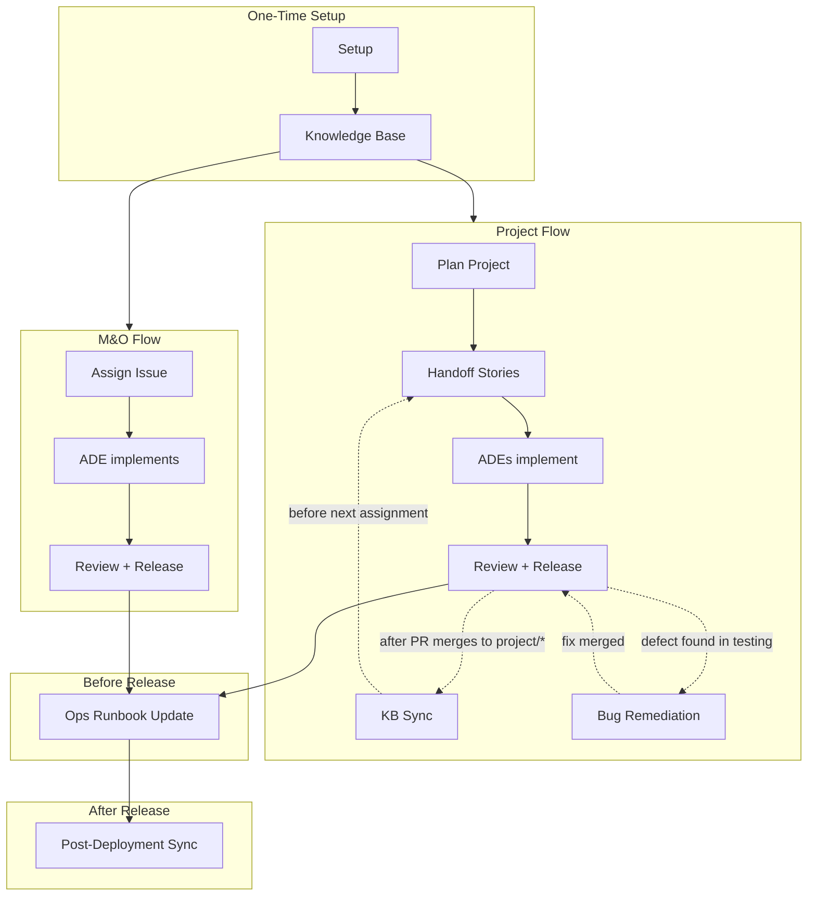

# Engineering Manager Guide

Welcome to the AIDLC workflow guide for Engineering Managers.

## Workflow at a Glance

| Flow | When | EM Does | ADE Does |
|------|------|---------|----------|
| **M&O** (feature/hotfix) | Single-sprint enhancements, critical fixes | Create issue, assign to ADE | Everything else |
| **Project** (Full BMAD) | Multi-sprint initiatives, new modules | Full planning (brief → stories), handoff, KB sync | Implement stories |
| **Bug** (project testing) | Defects found during project testing | Log bug issue, link to project, assign to ADE | M&O-like fix flow from project/epic |

## Reading Path

Follow the sections below in order for your first project setup, then refer back to individual sections as needed.

### 1. [Setup and Prerequisites](setup.md)

One-time workspace setup: install prerequisites, clone repositories, run `/tdgs-aidlc-setup-workspace em`, configure BMAD. Shared with ADEs -- look for steps marked **(EM Only)**.

### 2. [Knowledge Base Generation](knowledge-base-generation.md)

First-time knowledge base creation using BMAD Document Project: generate API specs, business docs, shared architecture docs, project context with testing rules, sync reference docs, validate, commit, and create PR.

### 2a. [Adding Repositories to Workspace After KB Creation](setup.md#adding-repositories-to-workspace-after-kb-creation)

Adding new repos to the workspace after initial setup is complete: clone repos, create branch in docs repo, update config, generate KB for new repos, PR to master or project branch. See also [Incremental KB Generation](knowledge-base-generation.md#adding-kb-for-new-repositories-incremental).

### 2b. [Syncing Project Branch After M&O Production Release](project-implementation.md#syncing-project-branch-after-mo-production-release)

When an M&O release merges to master while a project is in-flight: scan the delta, regenerate affected KB sections from worker repo source, update project branch via planning/* PR. Avoids merge conflicts in generated content. (Not for project-internal PR merges — use Post-Merge KB Sync for those.)

### 3. [M&O Assignment](mo-assignment.md)

Assigning feature/hotfix (M&O) work to ADEs: issue types, assignment workflow, example messages, ADE workflow summary, and EM release responsibilities.

### 4. [Project Planning](project-planning.md)

Full BMAD project planning workflow for `project` type issues: initiate project, reference sync, product brief, PRD, architecture, epics and stories, sprint planning, kanban planning, story specs, dashboard generation, and handoff to ADEs.

### 5. [Ops Runbook Update](ops-runbook-update.md)

Before merging release to master: update the operational runbook (`.docx` or `.md`) so documentation is current when code reaches production. Scans workspace source code and existing knowledge base directly from the release branch, then applies evidence-based edits with formatting preservation.

### 6. [Post-Deployment Documentation Sync](post-deployment.md)

After a production release: update Apigee sources (pull Git repos OR refresh `apigee-exports/`), run post-deployment docs sync, update knowledge base via BMAD Document Project, review and create PR.

### 7. [Test Management](test-management.md)

Test framework reference: functional tests (Playwright), unit tests, API tests -- setup prompts, generate prompts, coverage targets, HTML reports, and directory structure.

### 8. [Reference](reference.md)

BMAD skills reference, branch naming conventions, troubleshooting, setup checklist, and post-deployment checklist.

### 9. [Prompt & Skill Reference](prompt-reference.md)

Complete reference for all 33 prompts and 11 custom skills: syntax, inputs, outputs, examples, and next steps.

### Optional: [MCP Setup Guide](mcp-setup-guide.md)

Configure optional MCP servers: Splunk token setup and database MCP for Oracle, MySQL, PostgreSQL, and MongoDB. EMs may use database MCP for issue triage; direct ADEs to this guide when they are assigned database-related issues.

> **Note:** GitHub MCP is pre-configured automatically by `/tdgs-aidlc-setup-workspace` and is required for core workflows (`initiate-issue`, `initiate-project`, `reference-sync`, `show-available-stories`). Only Splunk and database MCP servers are optional.

---

## Quick Cheat Sheet

### One-Time Setup

| Command | Purpose |
|---------|---------|
| [`/tdgs-aidlc-setup-workspace em`](prompt-reference.md#tdgs-aidlc-setup-workspace) | Workspace + BMAD + docs repo |
| `/bmad-generate-project-context` | AI agent rules for the project |

### M&O Assignment

| Command | Purpose |
|---------|---------|
| Create GitHub Issue | Tell ADE: issue ID + type (feature/hotfix) |
| ADE runs: [`/tdgs-aidlc-initiate-issue {id} {type}`](prompt-reference.md#tdgs-aidlc-initiate-issue) | Branches + change brief |

### Bug Assignment (Project Workflow)

| Command | Purpose |
|---------|---------|
| Create bug Issue (link to project, add `bug` label) | — |
| Tell ADE: bug issue ID + type `bug` | — |
| ADE runs: [`/tdgs-aidlc-initiate-issue {bug_id} bug`](prompt-reference.md#tdgs-aidlc-initiate-issue) | Branches + change brief |

### Project Planning

| Command | Purpose |
|---------|---------|
| [`/tdgs-aidlc-initiate-project {id}`](prompt-reference.md#tdgs-aidlc-initiate-project) | Branches + change brief |
| `/bmad-product-brief` | Product brief |
| `/bmad-create-prd` | PRD |
| `/bmad-create-architecture` | Solution design |
| `/bmad-create-epics-and-stories` | Epics + stories |
| `/bmad-sprint-planning` | Sprint plan |
| [`/tdgs-aidlc-project-kanban-planning`](prompt-reference.md#tdgs-aidlc-project-kanban-planning) | Kanban + dashboard |
| `/bmad-create-story` | Story spec (repeat per story) |
| [`/tdgs-aidlc-commit`](prompt-reference.md#tdgs-aidlc-commit) | Commit artifacts |
| [`/tdgs-aidlc-create-pull-request`](prompt-reference.md#tdgs-aidlc-create-pull-request) | PR: planning → project |

### Post-Merge KB Sync (Project Workflow, Optional)

| Command | Purpose |
|---------|---------|
| [`/tdgs-aidlc-update-context-docs {id}`](prompt-reference.md#tdgs-aidlc-update-context-docs) | Regenerate KB on planning/* |

### Adding Repos After KB Creation

> Anytime; requires branch + PR.

| Command | Purpose |
|---------|---------|
| Clone new repo(s) into workspace | Add code repos to local workspace |
| M&O: create `feature/*` from master · Project: checkout `planning/*` | Create branch for the config change |
| Update `.github/i2a-config.yml` → `worker_repos` / `common_repos` | Register new repos in config |
| Run BMAD Document Project (scoped to new repos) | Generate KB for new repos |
| `/bmad-generate-project-context` (if tech stack changed) | Refresh AI agent rules |
| [`/tdgs-aidlc-commit`](prompt-reference.md#tdgs-aidlc-commit) + [`/tdgs-aidlc-create-pull-request`](prompt-reference.md#tdgs-aidlc-create-pull-request) | Commit and PR the changes |
| PR target: `master` (M&O) or `project/*` (Project) | Merge target for the PR |

### Sync Project Branch

> After M&O prod release — not for project PR merges.
>
> **Why manual (roadmap: sync-project-branch prompt):** Requires EM judgment — selective merge from `master` into long-lived `project/*`, per-service `git merge-base` analysis, and targeted KB regeneration. Automating this safely needs repo-specific diff rules. See [project-implementation.md](project-implementation.md) for full steps.

| Command | Purpose |
|---------|---------|
| In docs repo: `git fetch origin` | Fetch latest from remote |
| `git log project/ghi-{id}-{slug}..origin/master --oneline` | Review delta |
| Checkout `planning/ghi-{id}-kb-sync` (or create from `project/*`) | Create planning branch for sync |
| Update `.github/i2a-config.yml` (add missing entries from master) | Merge any new config entries |
| Scan worker repos for code delta (use `git merge-base`) | Identify changed repos |
| Regenerate affected KB sections (exhaustive scan) | Update knowledge base docs |
| Update `project-context.md` if patterns changed | Refresh AI agent rules |
| [`/tdgs-aidlc-commit`](prompt-reference.md#tdgs-aidlc-commit) + [`/tdgs-aidlc-create-pull-request`](prompt-reference.md#tdgs-aidlc-create-pull-request) | Commit and PR the sync |
| PR: `planning/*` → `project/*` · Notify ADEs to pull latest | Merge and notify team |

### Release Branch Management

> Manual — roadmap for future automation. Integration → release merges are outside AIDLC automation.

| Command | Purpose |
|---------|---------|
| 1. Verify integration branch (`feature/*`, `hotfix/*`) is green | CI passing, reviews approved |
| 2. Create release branch: `git checkout -b release/{version} origin/{integration-branch}` | — |
| 3. Update version references (`package.json`, CHANGELOG, etc.) | — |
| 4. Smoke-test the release branch in staging environment | — |
| 5. Open PR: `release/{version}` → `master` | Requires EM approval |
| 6. After merge to master: tag the release (`git tag v{version}`) | — |
| 7. Trigger production deployment per org process | — |
| 8. Delete the integration branch after successful release | — |

> **Note:** Run Pre-Deployment Documentation (below) before step 5 — update the runbook while still on the release branch.

### Pre-Deployment Documentation

| Command | Purpose |
|---------|--------|
| [`/tdgs-aidlc-ops-runbook {runbook_path}`](prompt-reference.md#tdgs-aidlc-ops-runbook) | Update runbook (`.docx` or `.md`) from KB + code |
| [`/tdgs-aidlc-validate-runbook-context`](prompt-reference.md#tdgs-aidlc-validate-runbook-context) | Validate runbook against KB context |

### Post-Deployment

| Command | Purpose |
|---------|--------|
| [`/tdgs-aidlc-post-deployment-docs-sync {release}`](prompt-reference.md#tdgs-aidlc-post-deployment-docs-sync) | Regenerate KB from deployed code |

---

## Verify Your Setup

After completing the one-time setup (quick-setup + setup-workspace), confirm everything is working:

| Check | How to Verify | Expected |
|-------|---------------|----------|
| BMAD installed | `ls _bmad/` in workspace root | Directory exists with `bmm/config.yaml` |
| Prompts copied | `ls .github/prompts/tdgs-aidlc-*.prompt.md` | 31 files listed |
| Config populated | Open `.github/i2a-config.yml` | `worker_repos` has entries, `common_repos` if shared repos present, `issues.repository` is set |
| Docs repo created | `ls {project}-docs/knowledge-base/` | Directory exists (after KB generation) |

If any check fails, re-run the corresponding setup step:
- Missing BMAD → `/tdgs-aidlc-quick-setup`
- Missing prompts → `/tdgs-aidlc-quick-setup`
- Empty config → `/tdgs-aidlc-setup-workspace em`
- Missing docs repo → See [Knowledge Base Generation](knowledge-base-generation.md)

