# M&O Workflow (Feature/Hotfix)

> **Role:** Agentic Delivery Engineer | **Reading path:** [ADE Guide](ade-guide.md) | **Previous:** [Setup](setup.md) | **Next:** [Project Implementation](project-implementation.md)

> **Note:** This file is large (~1200 lines) covering 9 detailed workflow steps. It may be split into sub-files in a future release.

This guide covers the complete development workflow for feature and hotfix issues using the BMAD Quick-Flow approach.

> 💡 **Bug fixes within an active project** follow a similar M&O-like flow but branch from `project/*` or `feature/epic-*` instead of master. See [Bug Remediation Process](project-implementation.md#bug-remediation-process) for that workflow.

## On this page

| Section | Jump |
|---------|------|
| Flow diagram | [M&O Quick-Flow](#mo-quick-flow-featurehotfix) |
| Pre-work | [Pre-Work Requirements](#pre-work-requirements) |
| Step 1 | [Initiate Issue](#step-1-initiate-issue-docs-repo) |
| Step 2 | [Create Spec](#step-2-create-spec-via-quick-dev-docs-repo) |
| Step 3 | [Prepare Repos](#step-3-prepare-repos) |
| Step 4 | [Quick-Dev](#step-4-quick-dev-worker-repos) |
| Step 5 | [Code Review](#step-5-code-review) |
| Step 6 | [Commit](#step-6-commit-changes) |
| Step 7 | [Pre-Check PR](#step-7-pre-check-pull-request) |
| Step 8 | [Create PR](#step-8-create-pull-request) |

---

## M&O Quick-Flow (feature/hotfix)

```mermaid
flowchart TB
    subgraph INTEGRATION["🌿 INTEGRATION BRANCH (feature/ghi-* or hotfix/ghi-*)"]
        direction TB
        
        subgraph DOCS["📚 DOCS REPOSITORY"]
            A["🎫 GitHub Issue"] --> B["📋 Initiate Issue<br/>/tdgs-aidlc-initiate-issue {id} {type}<br/>Creates integration + dev branches"]
            B --> Z["📦 Reference Sync<br/>/tdgs-aidlc-reference-sync"]
            Z --> C["📄 change-brief-{id}.md"]
            C --> D["🏗️ /bmad-quick-dev<br/>Create spec (stops at planning checkpoint)"]
            D --> E["📄 spec-{slug}.md"]
            E --> E1["💾 /tdgs-aidlc-commit + 🔀 /tdgs-aidlc-create-pull-request<br/>(draft PR → integration branch)"]
            E1 --> F["🔀 Prepare Repos<br/>/tdgs-aidlc-prepare-repos<br/>Creates branches in worker repos"]
        end
        
        subgraph WORKER["⚙️ WORKER REPOSITORIES"]
            G["💻 /bmad-quick-dev<br/>Implement stories"]
            G --> H["🔍 /bmad-code-review<br/>Comprehensive review"]
            H --> I["💾 Commit<br/>/tdgs-aidlc-commit"]
            I --> I2["✅ Pre-Check PR<br/>/tdgs-aidlc-pre-check-pull-request"]
            I2 --> J["🔀 Create PR<br/>/tdgs-aidlc-create-pull-request<br/>(PR → integration branch)"]
        end
        
        subgraph HANDOFF["🤝 HANDOFF TO EM"]
            K["📤 Notify EM<br/>PR ready for review"] --> L["EM handles release<br/>(manual, outside AIDLC)"]
        end
    end
    
    F --> G
    J --> K
    
    style INTEGRATION fill:#e8f5e9,stroke:#2e7d32
    style DOCS fill:#e1f5fe,stroke:#0288d1
    style WORKER fill:#f3e5f5,stroke:#7b1fa2
    style HANDOFF fill:#fff3e0,stroke:#f57c00
```



| Step | Repository | Command | Description |
|------|------------|---------|-------------|
| 1 | Docs | `/tdgs-aidlc-initiate-issue {id} {type}` | Create integration branch from master, then dev branch from integration |
| 2 | Docs | `/tdgs-aidlc-reference-sync` | Sync reference docs from shared services repo and analyze gaps |
| 3 | Docs | `/bmad-quick-dev` | Create spec (stops at planning checkpoint) |
| 4 | Docs | `/tdgs-aidlc-prepare-repos` | Create integration + dev branches in worker repos (from master) |
| 5 | Worker | `/bmad-quick-dev` | Implement the story specs |
| 6 | Worker | `/bmad-code-review` | Comprehensive code review |
| 7 | Worker | `/tdgs-aidlc-commit` | Stage and commit changes (on dev branch) |
| 8 | Worker | `/tdgs-aidlc-pre-check-pull-request` | Run CI pipeline on dev branch before PR |
| 9 | Worker | `/tdgs-aidlc-create-pull-request` | Create GitHub PR (targets integration branch) |
| 10 | - | Notify EM | Hand off to EM for Test Env, release, and production (manual) |

---

## M&O Workflow Steps (feature/hotfix)

### Pre-Work Requirements

> ⚠️ **MANDATORY**: Complete these steps before starting work on any `feature` or `hotfix` issue.

Before beginning any workflow step, ADEs must:

| Step | Action | Details |
|------|--------|--------|
| 1 | **Receive Assignment from Engineering Manager** | Obtain the following from your Engineering Manager:<br/>• **Issue ID** (GitHub Issue number)<br/>• **Issue Type** (`feature` or `hotfix`) |
| 2 | **Sync Docs Repository** | Fetch remote and ensure you're on master:<br/>`git fetch origin`<br/>`git checkout master && git pull` |

#### Example: Syncing Docs Repo to Master

**Windows:**
```powershell
cd c:\Development\projects\tx-ovra\tx-ovra-docs
```

**macOS / Linux:**
```bash
cd ~/Development/projects/tx-ovra/tx-ovra-docs
```

Then run (all platforms):
```bash
git fetch origin
git checkout master
git pull origin master
git branch --show-current
```

> 💡 **Note**: The `/tdgs-aidlc-initiate-issue` command will create integration and dev branches from master. Release branches are created manually by EM after Test Env validation (outside AIDLC automation).

---

### Step 1: Initiate Issue (Docs Repo)

> [Step 2 →](#step-2-create-spec-via-quick-dev-docs-repo)

> ⚠️ **Project type?** If your EM assigned this as a `project` type, skip this section and go to [Project Implementation Steps](project-implementation.md) instead. The EM has already completed planning and branch creation.

#### Purpose
Creates integration and dev branches, plus a change brief document from a GitHub Issue. This is the **first step** before any planning or implementation begins.

#### Prerequisites
- Be on **master branch** in the docs repository (up-to-date with origin)
- Have a clean working tree (no uncommitted changes)
- GitHub Issue exists with sufficient detail (requirements, acceptance criteria)
- `shared/` directory exists in the knowledge-base
- `.github/i2a-config.yml` configured with `issues.repository` and `worker_repos`

#### Command
```
/tdgs-aidlc-initiate-issue {issue_id} {type}
```

- `{issue_id}` — GitHub Issue number (e.g., `123` or `#123`)
- `{type}` — Issue type: `feature` or `hotfix`

#### Examples
```
/tdgs-aidlc-initiate-issue 2 feature
```
```
/tdgs-aidlc-initiate-issue #45 hotfix
```

#### What Happens
1. ✅ **Load Configuration**: Reads `.github/i2a-config.yml` for issues repository and worker repos
2. ✅ **Pre-flight Checks**: Verifies master branch, clean tree, required docs exist
3. 🌿 **Create Integration Branch**: `{type}/ghi-{issue_id}-{slug}` from master
4. 🌿 **Create Dev Branch**: `dev/ghi-{issue_id}-{slug}-{username}` from integration
5. 🎫 **Fetch GitHub Issue**: Gets issue body, comments, and metadata
6. 📎 **Fetch Attachments**: Downloads any user-uploaded files to `planning-artifacts/attachments/`
7. 📄 **Generate Change Brief**: Creates `planning-artifacts/change-brief-{issue_id}.md`

#### Output Artifacts
- Integration branch: `{type}/ghi-{issue_id}-{slug}` (created from master)
- Dev branch: `dev/ghi-{issue_id}-{slug}-{username}` (created from integration)
- Change brief: `{docs}/planning-artifacts/change-brief-{issue_id}.md`
- Attachments: `{docs}/planning-artifacts/attachments/` (if any)

#### Change Brief Structure
```markdown
---
source: github-issue
issue_id: {issue_id}
issue_url: {full GitHub issue URL}
repository: {repository}
issue_type: {type}  # feature or hotfix
integration_branch: {type}/ghi-{issue_id}-{slug}
dev_branch: dev/ghi-{issue_id}-{slug}-{username}
created: {current datetime}
---

# {issue_title}

## Change Type
**Issue Type:** {type} (feature/hotfix)
**Integration Branch:** {integration_branch}
**Dev Branch:** {dev_branch}

## Issue Description
{full issue body}

## Comments
{all comments in chronological order}

## Attachments
{table of downloaded attachments}

## Labels
{comma-separated list}

## Metadata
- Author, Created, Status, Milestone, Assignees
```

#### Edge Cases & Errors

| Error | Cause | Solution |
|-------|-------|----------|
| `Issues repository not configured` | Missing `issues.repository` in config | Update `.github/i2a-config.yml` |
| `Worker repositories not configured` | Missing `worker_repos` in config | Update `.github/i2a-config.yml` |
| `Issue not found` | Invalid issue ID or no access | Verify issue ID and repository |
| `Invalid issue type` | Type not `feature` or `hotfix` | Use valid type: `/tdgs-aidlc-initiate-issue 123 feature` |
| `Not on master branch` | Not on master | Switch to master: `git checkout master && git pull` |
| `Dirty tree` | Uncommitted changes | Commit or stash changes first |
| `Missing context docs` | `shared/` directory missing | Run documentation generation first |
| `Insufficient context` | Issue lacks detail | Update GitHub Issue with requirements |
| `Attachment collision` | Duplicate filenames | Rename attachments in GitHub Issue |
| `Download failed` | Attachment download error | Manually download to attachments folder |

#### Example Output
```
✓ Pre-flight checks passed (on master, up-to-date)
✓ Created integration branch: feature/ghi-2-zip-code-enhancement
✓ Created dev branch: dev/ghi-2-zip-code-enhancement-johndoe
✓ Fetched GitHub Issue #2
✓ Downloaded attachments (0 files)
✓ Created change brief: planning-artifacts/change-brief-2.md

GitHub Issue: #2 - Feature: ZIP Code Field Size Enhancement - OVRA
Issue Type: feature
Integration Branch: feature/ghi-2-zip-code-enhancement
Dev Branch: dev/ghi-2-zip-code-enhancement-johndoe

⚠️  Changes prepared but NOT committed
```

#### Next Step

Proceed to **Step 2: Create Spec via Quick-Dev** to create the technical specification.

---

### Step 2: Create Spec via Quick-Dev (Docs Repo)

> [← Step 1](#step-1-initiate-issue-docs-repo) | [Step 3 →](#step-3-prepare-repos)

> 🔄 **FRESH CHAT RECOMMENDED**: Start this step in a new Agent chat session for best results.

#### Purpose
Creates an implementation-ready technical specification with stories through conversational discovery and code investigation. In BMAD 6.3.0, spec creation is handled by `/bmad-quick-dev`'s planning step (step-02). The workflow stops at the planning checkpoint with `status: ready-for-dev`, allowing you to review and approve before implementation begins.

> **Two-Phase Workflow:** In BMAD 6.3.0, `/bmad-quick-dev` handles both spec creation and implementation. For the tdgs-aidlc workflow, we use it in two phases:
> 1. **Docs repo** (this step): Run `/bmad-quick-dev` to create the spec. Stop after the step-02 checkpoint when status is `ready-for-dev`.
> 2. **Worker repo** (Step 5): After Prepare-Repos copies the spec to worker repos, run `/bmad-quick-dev` again. It detects the `ready-for-dev` spec and skips directly to implementation (step-03).

#### Prerequisites
- Be on **dev branch** in the docs repository (from Step 1: `/tdgs-aidlc-initiate-issue`)
- Reference sync completed (from Step 2: `/tdgs-aidlc-reference-sync`)
- Change brief exists at `planning-artifacts/change-brief-{issue_id}.md`
- **Fresh Agent chat session recommended** (for clean context)

#### Chat Setup
Before creating the spec, configure your Agent chat:

1. **Select Model**: Ensure the Model is set to **Claude Opus 4.6**
2. **Mode**: Use **Agent** mode (not Ask mode)

#### Command

```
/bmad-quick-dev After spec approval confirmation, mark the status as Ready for Dev and do not implement
Create technical spec with stories
     Input: tx-ovra-docs/planning-artifacts/change-brief-{issue_id}.md
```

> 📝 The instruction `After spec approval confirmation, mark the status as Ready for Dev and do not implement` tells the agent to **stop after creating and approving the spec** — it will not proceed to implementation.

#### Providing Additional Instructions

You can provide custom instructions to guide the Quick-Dev agent for project-specific requirements. This is useful when your project has specific conventions, documentation needs, or cross-team dependencies.

**Syntax:**
```
/bmad-quick-dev
Input: planning-artifacts/change-brief-{issue_id}.md

Additional Instructions:
1. [Your custom instruction 1]
2. [Your custom instruction 2]
...
```

**Example with Custom Instructions:**
```
/bmad-quick-dev
Input: planning-artifacts/change-brief-42.md

Additional Instructions:
1. Include performance benchmarks for the new endpoint
2. Add caching strategy for frequently accessed data
```

> 📋 **Note**: Since your EM has generated `project-context.md` (see [Step 2 in Knowledge Base Generation](knowledge-base-generation.md#step-2-generate-project-context)), the following common instructions are applied by Quick-Dev via `project-context.md` — you do NOT need to type them as Additional Instructions:
> - Database migration + rollback scripts (Oracle 19c Database-as-Code naming: `V<semver>_<seq>_<desc>.sql` / `U<semver>_<seq>_<desc>.sql`)
> - Idempotency wrappers, `master_deploy.sql` manifest updates, baseline sync
> - Knowledge-base directory scanning (including `common-services/`)
> - Common Services impact flagging
> - Functional and API test generation rules (enforcement table, scenario discovery, self-review gate)
>
> ⚠️ **However:** Quick-Dev's planning step (step-02) does not re-read `project-context.md` during generation — it relies on rules surviving in the LLM's context window from earlier phases. Always perform the [Post-Spec Verification](#post-spec-verification-mandatory-before-exiting) before approving the spec to ensure all required test types are present.
>
> You only need Additional Instructions for **application and issue specific overrides** or **one-off requirements** not covered by `project-context.md`.

**Common Additional Instructions:**

| Use Case | Example Instruction | Auto via project-context.md? |
|----------|---------------------|-----------------------------|
| **Database Changes** | "Include forward migration (`V<semver>_<seq>_<desc>.sql`) and rollback (`U<semver>_<seq>_<desc>.sql`) scripts with idempotency wrappers, update `master_deploy.sql` manifest, and sync baseline" | ✅ Yes |
| **Common Services** | "Review `knowledge-base/common-services/` and highlight any required changes to shared services" | ✅ Yes |
| **Cross-Team Dependencies** | "Flag any changes requiring coordination with external teams (Common Services, Platform, etc.)" | ✅ Yes |
| **Test Coverage** | "Include Functional Tests (Playwright) and API Tests in the Testing Strategy, with specific file paths in `files_to_create`" | ✅ Yes (verify via [Post-Spec check](#post-spec-verification-mandatory-before-exiting)) |
| **Security Review** | "Include security considerations for any PII handling or authentication changes" | ❌ Manual |
| **Performance** | "Document expected performance impact and include load testing recommendations" | ❌ Manual |

> 💡 **Tip**: Save frequently-used additional instructions in a team wiki or README so developers can copy-paste them consistently across features.

#### What Happens

The Quick-Dev spec-creation workflow follows a **4-step process** (steps 1-2 of the full 5-step Quick-Dev workflow):

##### Step 01: Clarify & Route
1. **Smart Intent Cascade**: Detects mode automatically — checks explicit arguments first, then recent conversation context, then scans artifacts
2. **Planning Artifact Awareness**: Loads planning docs (PRD, architecture, UX, epics) — for epic stories, compiles into cached `epic-{N}-context.md`
3. **Previous Story Continuity**: Loads completed specs from the same epic as context
4. **Multi-Goal Check**: If multiple goals detected, offers to split into separate specs
5. **Routes to Plan**: Since no `ready-for-dev` spec exists, routes to step-02 for spec creation

##### Step 02 (Plan) — Understand Phase
1. **Greets you** and asks what you're building
2. **Quick Orient Scan**: Rapidly scans the codebase to understand the landscape
   - Checks knowledge-base docs (`knowledge-base/shared/`, `knowledge-base/api/`, etc.)
   - Searches for relevant files/classes/functions related to your feature
   - Notes tech stack, patterns, file locations
3. **Asks Informed Questions**: Based on code scan, asks specific technical questions (not generic)
4. **Captures Core Understanding**: Extracts title, slug, problem statement, solution, in/out of scope
5. **Creates Spec File**: Writes directly to `spec-{slug}.md` with `status: draft`

**Checkpoint Menu**: `[A] Advanced Elicitation [P] Party Mode [C] Continue Deep Investigation`

##### Step 02 (Plan) — Investigate Phase
1. **Deep Code Analysis**: Reads complete files, identifies patterns and conventions
2. **Documents Technical Context**:
   - Tech Stack: Languages, frameworks, libraries
   - Code Patterns: Architecture patterns, naming conventions, file structure
   - Files to Modify/Create: Specific files that need changes
   - Test Patterns: How tests are structured
3. **Updates Spec File**: Adds detailed context for development section

**Checkpoint Menu**: `[A] Advanced Elicitation [P] Party Mode [C] Continue`

##### Step 02 (Plan) — Generate Phase
1. **Creates Implementation Plan**: Breaks down into Stories and Tasks
   - Each task has specific file path and action
   - Tasks ordered by dependency
   - Includes code samples where helpful
2. **Generates Acceptance Criteria**: Given/When/Then format covering:
   - Happy path functionality
   - Error handling
   - Edge cases
3. **Completes Additional Context**: Dependencies, testing strategy, notes

**Checkpoint Menu**: `[A] Advanced Elicitation [P] Party Mode [C] Continue`

##### Step 02 (Plan) — Review & Finalize (CHECKPOINT)
1. **Presents Complete Spec**: Shows full spec for review
2. **Review Menu**:
   - `[E] Edit` — Request changes
   - `[Q] Questions` — Ask about the spec
   - `[A] Advanced Elicitation` — Deep-dive refinement
   - `[P] Party Mode` — Multi-perspective feedback
   - `[C] Continue` — Finalize the spec
3. **Updates Status**: Sets spec `status` field from `draft` to `ready-for-dev`

**Final Menu**: 
- `[R] Adversarial Review` — **Highly recommended!** Critiques the spec to find gaps
- `[A] Advanced Elicitation` — Further refinement
- `[D] Done` — Exit workflow
- `[P] Party Mode` — Multi-perspective feedback

#### Adversarial Review (Recommended!)

When you select `[R]`, the agent becomes a "cynical, jaded reviewer" and:
1. **Finds at least 10 issues** in your spec (missing files, edge cases, scope gaps, etc.)
2. **Rates findings** by severity (Critical, High, Medium, Low)
3. **Presents findings table** with ID, Severity, Validity, and Description
4. **Offers to fix**: `[F] Fix findings` applies recommended fixes

> 💡 **Pro Tip**: Run Adversarial Review 2-3 times. Each round catches different issues as the spec evolves.

#### Ready for Development Standard
A specification is considered ready ONLY if it meets:
- **Actionable**: Every task has a clear file path and specific action
- **Logical**: Tasks are ordered by dependency (lowest level first)
- **Testable**: All ACs follow Given/When/Then and cover happy path + edge cases
- **Complete**: All investigation results inlined; no placeholders or "TBD"
- **Self-Contained**: A fresh agent can implement without reading workflow history

#### Output Artifacts
- Spec: `{docs}/implementation-artifacts/spec-{slug}.md`

#### Spec Structure
```markdown
---
title: '{feature title}'
slug: '{url-safe-slug}'
issue_id: '{issue_id}'
issue_type: '{type}'  # feature or hotfix
integration_branch: '{integration_branch}'  # e.g., feature/ghi-123-add-login
dev_branch: '{dev_branch}'  # e.g., dev/ghi-123-add-login-johndoe
created: '{date}'
status: 'draft' # draft | ready-for-dev | in-progress | in-review | done
stepsCompleted: [1, 2, 3, 4]
tech_stack: [...]
files_to_modify: [...]
code_patterns: [...]
test_patterns: [...]
---

# Spec: {title}

## Overview
### Problem Statement
### Solution
### Scope (In/Out)

## Context for Development
### Codebase Patterns
### Files to Modify (table)
### Files to Reference (table)
### Technical Decisions

## Implementation Plan
### Tasks (by Story)
- [ ] Task N.M: Description
  - File: `path/to/file`
  - Action: Specific change
  - Notes: Implementation details

### Acceptance Criteria
| AC | Description | Test (Given/When/Then) |

## Additional Context
### Dependencies
### Testing Strategy
### Notes
```

#### Edge Cases & Errors

| Error | Cause | Solution |
|-------|-------|----------|
| `Spec file already exists` | Previous session incomplete | Choose to continue or archive |
| `No relevant code found` | Clean slate scenario | Agent asks about intended architecture |
| `Zero findings in review` | Suspicious — spec may be incomplete | Re-analyze or check manually |

#### 🔴 Post-Spec Verification (MANDATORY before exiting)

Before choosing `[D] Done`, verify the generated spec includes all required test types. Quick-Dev's planning step does **not** re-read `project-context.md` during generation — it relies on testing rules surviving in the LLM's context window from earlier phases. If rules were forgotten, required test types will be silently omitted.

**Quick check — open the generated spec and verify:**

1. **Testing Strategy section** lists ALL applicable test types per the enforcement table in `project-context.md`:

   | Layers Touched | Must Include |
   |---|---|
   | Frontend changes | Unit (Jest) + Functional (Playwright) |
   | Backend changes | Unit (JUnit) + API tests |
   | Full-stack changes | Unit (both) + Functional + API |

2. **Implementation Plan Tasks section** contains a numbered task for EACH required test type — not just a mention in Testing Strategy. Test tasks ARE implementation tasks.

3. Each test task has: **full file path** + **Given/When/Then scenarios** + **CREATE or UPDATE**.

**Automated pre-commit validation (run before `/tdgs-aidlc-commit`):**

After the spec is generated and before committing, ask the agent to validate the spec:
```
Validate the spec at implementation-artifacts/spec-{slug}.md:
1. Confirm "Testing Strategy" section exists and lists test types
2. Confirm numbered tasks exist for each required test type
3. Confirm each test task has a file path and Given/When/Then scenarios
4. If this issue modifies frontend files → confirm Functional (Playwright) task exists
5. If this issue modifies backend files → confirm API test task exists
Report PASS/FAIL for each check.
```

**If any required test type is missing:**
- Do NOT exit with `[D] Done`
- Tell the agent: _"The enforcement table in project-context.md requires [Functional/API/Unit] tests for this issue because [frontend/backend] files are being modified. Add the missing test tasks with file paths and Given/When/Then scenarios."_
- Verify the agent adds the missing tasks, then approve with `[A]` or exit with `[D] Done`

> This validation catches the most common failure mode: functional or API tests silently omitted from the spec, which means Quick-Dev will never generate them. Running it as an explicit agent instruction after spec generation makes it reproducible rather than relying on human visual inspection.

#### After Approval

After selecting `[A]` Approve, the agent will confirm the spec is locked and stop:

```
Setting status to ready-for-dev:

Spec is now ready-for-dev. The <frozen-after-approval> block is locked.

Spec: spec-{slug}.md — status: ready-for-dev

Stopping here as requested — no implementation will be performed.
When you're ready to implement, you can resume this spec with the
bmad-quick-dev or bmad-dev-story skill.
```

**Step-by-step:**

| #   | Action                    | How                                                                                                                                     |
| --- | ------------------------- | --------------------------------------------------------------------------------------------------------------------------------------- |
| 1   | **Approve the spec**      | Select `[A]` at the checkpoint                                                                                                          |
| 2   | **Close the chat**        | Once you see the `ready-for-dev` confirmation above, close the Agent chat                                                               |
| 3   | **Verify**                | Open `implementation-artifacts/spec-{slug}.md`, confirm `status: ready-for-dev`                                                         |
| 4   | **Commit**                | Fresh Agent chat → `/tdgs-aidlc-commit`                                                                                                |
| 5   | **Create draft PR**       | Same chat → `/tdgs-aidlc-create-pull-request` → select "Create as draft"                                                               |
| 6   | **Prepare worker repos**  | Fresh Agent chat → `/tdgs-aidlc-prepare-repos` (Step 4) — copies spec to worker repos                                                |
| 7   | **Resume implementation** | Fresh Agent chat per worker repo → `/bmad-quick-dev` (Step 5) — detects the `ready-for-dev` spec and skips straight to implementation |

> When you run `/bmad-quick-dev` in a worker repo that has a `ready-for-dev` spec, it **skips planning entirely** and goes straight to step-03 (Implement). No special flags needed — the spec status is the trigger.

#### Output

- Spec file: `implementation-artifacts/spec-{slug}.md` with `status: ready-for-dev`

#### Next Step

Proceed to **Step 3: Prepare Repos**.
---

### Step 3: Prepare Repos

> [← Step 2](#step-2-create-spec-via-quick-dev-docs-repo) | [Step 4 →](#step-4-quick-dev-worker-repos)

> 🔄 **FRESH CHAT RECOMMENDED**: Start this step in a new Agent chat session for best results.

#### Purpose
Creates integration and dev branches in all worker repositories affected by the spec.

#### Prerequisites
- Spec exists at `implementation-artifacts/spec-*.md`
- Worker repos configured in `.github/i2a-config.yml`
- **Fresh Agent chat session recommended** (for clean context)

#### Command
```
/tdgs-aidlc-prepare-repos
```

#### What Happens
1. ✅ **Pre-flight Checks**: Confirms spec exists and reads metadata
2. 📖 **Parse Spec**: Identifies affected repositories from stories
3. 🔍 **Detect Integration Branch**: Reads `integration_branch` from change-brief or spec metadata
4. 📋 **Display Affected Repos**: Shows list and asks for confirmation
5. 🌿 **Create Branches**: For each affected repo:
   - Fetches latest from origin
   - Checks out master and pulls latest
   - Creates matching integration branch (feature/ghi-* or hotfix/ghi-*)
   - Creates dev branch (dev/ghi-*-{username})
   - Pushes both branches to origin

> ⚠️ **Important**: Worker repo branches are created from **master**. Integration branches are named to match the docs repo, and each ADE gets their own dev branch.

#### Affected Repository Detection
The command maps semantic names in the spec to repository keys:

| Semantic Name | Config Key |
|---------------|------------|
| OrderDetails Service | `orderdetails-service` |
| Receipt Service | `receipt-service` |
| VerificationLetter Service | `verificationletter-service` |
| OVRA UI | `ui` |
| Database | `database` |

#### Output
```
══════════════════════════════════════════════════════════════
REPOSITORY PREPARATION COMPLETE
══════════════════════════════════════════════════════════════

Integration Branch: feature/ghi-{issue_id}-{slug}
Dev Branch: dev/ghi-{issue_id}-{slug}-{username}

Repository Status:
  ✓ tx-ovra-database — integration branch created, dev branch created and pushed
  ✓ tx-ovra-ui — integration branch created, dev branch created and pushed
```

> 💡 **Note**: All branches are created from master. Multiple ADEs working on the same issue will each have their own dev branch targeting the shared integration branch.

#### Edge Cases

| Error | Cause | Solution |
|-------|-------|----------|
| `Spec Not Found` | No spec-*.md in implementation-artifacts | Run Quick-Dev first to create the spec |
| `Repository Not in Workspace` | Repo folder not found | Clone repo or update config path |
| `Branch Already Exists` | Integration or dev branch already created | Choose: Skip, Reset, or Abort |
| `No Repositories Affected` | Spec missing repo designations | Review and update spec |

#### Next Step
Proceed to **Step 4: Quick-Dev** for each affected worker repository.

---

### Step 4: Quick-Dev (Worker Repos)

> [← Step 3](#step-3-prepare-repos) | [Step 5 →](#step-5-code-review)

> 🔄 **FRESH CHAT RECOMMENDED**: Start this step in a new Agent chat session for each worker repository.

#### Purpose
Implements story specs from the specification. This is the core implementation phase using the BMAD `/bmad-quick-dev` skill. When invoked in a worker repo containing a `ready-for-dev` spec (copied by Prepare-Repos), Quick-Dev detects the spec and skips directly to implementation.

#### Prerequisites
- Dev branch exists in the worker repository (from Step 4: `/tdgs-aidlc-prepare-repos`)
- Spec available with `status: ready-for-dev` and implementation-ready stories
- **Fresh Agent chat session recommended** per worker repository

> 💡 **Note**: All repositories (docs and worker repos) are in the same VS Code workspace. No need to open separate VS Code instances.

#### Chat Setup
Before running Quick-Dev, configure your Agent chat:

1. **Select Model**: Ensure the Model is set to **Claude Opus 4.6**
2. **Mode**: Use **Agent** mode (not Ask mode)

#### Command
Invoke the BMAD Quick-Dev skill directly in Agent chat:
```
/bmad-quick-dev
```

#### What Happens

Quick-Dev executes a **5-step workflow**. When resuming from a `ready-for-dev` spec (the normal flow after Step 3 + Prepare-Repos), step-01 detects the spec and routes directly to step-03 (Implement), skipping step-02 (Plan) since the spec was already created.

##### Step 01: Clarify & Route
- **Smart Intent Cascade**: Detects mode automatically — checks explicit arguments first, then recent conversation context, then scans artifacts for existing specs
- When a `ready-for-dev` spec is found (copied by Prepare-Repos), routes directly to step-03 (Implement)
- Sets `baseline_commit` to current HEAD for tracking changes
- **Planning Artifact Awareness**: For epic stories, compiles planning docs (PRD, architecture, UX, epics) into a cached `epic-{N}-context.md` file for implementation context
- **Previous Story Continuity**: Loads completed specs from the same epic as implementation context
- **Multi-Goal Splitting**: If multiple goals detected, offers to split into separate implementations

##### Step 02: Plan (Skipped When Resuming)
- **Skipped** when resuming from a `ready-for-dev` spec (the spec was already created in Step 3)
- Only runs if starting fresh in the worker repo without an existing spec

##### Step 03: Implement
For each task in the spec:
1. **Read Task**: Load task details from spec
2. **Implement**: Create/modify files following existing patterns
3. **Check Off**: Mark task as complete `- [x]`
4. **Repeat**: Continue until all tasks complete

- **Clickable Spec Links**: Generates spec-file-relative markdown format links for traceability

Example implementation actions:
- Add utility functions with JSDoc documentation
- Update validation schemas (Yup, regex patterns)
- Modify locale files for i18n error messages
- Wire new logic into existing components
- Create unit tests co-located with source files

##### Step 04: Review (3-Layer Adversarial)
Performs a **3-layer parallel adversarial review** — the same architecture as the standalone `/bmad-code-review` skill:

1. **Blind Hunter** — Reviews code for issues **without knowing the original intent** (uses `bmad-review-adversarial-general` skill)
2. **Edge Case Hunter** — Exhaustively traces **branching paths and boundary conditions** (uses `bmad-review-edge-case-hunter` skill)
3. **Acceptance Auditor** — Validates **acceptance criteria compliance** against the spec

**Interactive Triage**: After all layers complete, findings are presented with cascading classification:
- `intent_gap` → loop back to step-02 for spec revision
- `bad_spec` → loop back to step-03 with KEEP instructions
- `patch` → auto-fix the issue
- `defer` → add to deferred-work.md
- `reject` → drop the finding

Max 5 loop iterations before requiring human decision.

##### Step 05: Present
Presents results and generates a **review trail** with clickable `path:line` stops appended to the spec file for traceability. This creates an auditable record linking review findings back to spec requirements.

- Updates spec status to "implemented" and marks `stepsCompleted`
- Offers commit with conventional commit message

#### Interactive Menu
Throughout execution, agent presents menu options:

```
[1] Menu     — Show all available commands
[2] Status   — Show current progress
[3] Continue — Resume from current step
[4] Redo     — Re-run a specific task
[5] Done     — Mark workflow complete
```

#### Post-Implementation Commands

After Quick-Dev completes, you can invoke additional commands:

| Command | Purpose |
|---------|---------|
| `run tests` | Re-run test suite to verify |
| `deep dive [topic]` | Detailed analysis (e.g., "deep dive test coverage and security") |
| `update spec status` | Set status to "implemented" if not already done |
| `/tdgs-aidlc-commit` | Stage and commit changes (see Step 7) |
| `/tdgs-aidlc-pre-check-pull-request` | Run CI pipeline before PR (see Step 8) |
| `/tdgs-aidlc-create-pull-request` | Create GitHub PR (see Step 9) |

#### Issue-Scoped Test Execution (Post-Quick-Dev)

After Quick-Dev completes, run **only the issue-scoped test files** — not the full suite. The spec's **Verification** section includes the exact commands with file paths. You can run all test types or selectively run specific types.

##### Run Issue-Scoped Tests

Run the selective commands from the spec's Verification section. Execute them in sequence for all types, or pick only the types relevant to your change:

| Test Type | Command | Setup Required |
|-----------|---------|----------------|
| **Backend Unit Tests** | `cd {service-repo} && mvn test -Dtest={TestClassName} -Plocal` | None — runs with mocks |
| **Frontend Unit Tests** | `cd {ui-repo} && npx react-scripts test --watchAll=false --coverage --testPathPattern="{path/to/File.test.js}"` | None |
| **Functional Tests (Playwright)** | `cd {ui-repo} && npx playwright test {path/to/spec.js}` | None — `webServer` auto-starts UI dev server (`ENV=local`), `mockAllAPIs` fixture intercepts all backend calls |
| **API Tests** | `cd {service-repo}/api-tests && npm test -- --collection={collection-file}` | Backend service **MUST** be running: `cd {service-repo} && mvn spring-boot:run -Plocal` |

##### Test Report Locations (Issue-Scoped)

| Test Type | Report Output |
|-----------|---------------|
| Backend Unit Tests | JaCoCo HTML in `{service-repo}/target/site/jacoco/` |
| Frontend Unit Tests | LCOV in `{ui-repo}/coverage/` |
| Playwright | HTML + JSON in `{ui-repo}/functional-tests/test-results/` |
| API | Results in `{service-repo}/api-tests/test-results/` |

> **Tip:** Run selective tests first to validate the issue changes, then optionally run the full suite (`mvn test`, `npm test`, `npx playwright test`) as a regression check before creating a PR.

> 📖 For comprehensive test management details (coverage targets, HTML reports, full workspace scan prompts), see the [Test Management User Guide](test-management.md).

#### Example Session Flow

```
User: /bmad-quick-dev

Agent: 🚀 Quick-Dev activated
       → Step 01: Clarify & Route
       → Spec detected: spec-zip-code-field-size-enhancement.md
       → Status: ready-for-dev — skipping to implementation

Agent: → Step 03: Implement
       → Task 1.1: Create parseZipCode helper function ✅
       → Task 2.1: Update EN locale messages ✅
       → Task 2.2: Update EN verify identity messages ✅
       ... (continues for all tasks)

Agent: → Step 04: Review (3-Layer Adversarial)
       → Blind Hunter: 4 findings
       → Edge Case Hunter: 3 findings
       → Acceptance Auditor: 3 findings
       → Deduplication: 10 unique findings
       | # | Severity | Finding |
       | F2 | 🟠 Major | previousZip validation missing in VerifyIdentityOutOfState |
       | F7 | 🟡 Minor | parseZipCode should trim whitespace |
       ...
       → Triage: [W] Walk through | [P] Patch all | [S] Skip

User: P

Agent: → Patching F2: Added previousZip validation ✅
       → Patching F7: Added .trim() to parseZipCode ✅
       → Re-running tests: 7/7 passing ✅

Agent: → Step 05: Present
       → Review trail appended to spec file
       → ✅ Quick-Dev Complete!
       [1] Menu | [2] Status | [3] Continue | [4] Redo | [5] Done

User: run tests

Agent: ✅ 7 tests passing

User: /tdgs-aidlc-commit

Agent: (follows commit workflow)

User: /tdgs-aidlc-create-pull-request

Agent: (follows PR creation workflow)
```

#### Key Features
- **Autonomous Execution**: Implements tasks without constant user input
- **Pattern Following**: Matches existing codebase conventions
- **Test Integration**: Writes and runs tests as part of implementation
- **Self-Healing**: Adversarial review catches issues before PR
- **Interactive Control**: User can pause, check status, or redo tasks

#### Next Step
After implementing all stories, proceed to **Step 6: Code Review** for additional external review, or directly to **Step 7: Commit Changes** if adversarial review resolved all issues.

---

### Step 5: Code Review

> [← Step 4](#step-4-quick-dev-worker-repos) | [Step 6 →](#step-6-commit-changes)

> 🔄 **FRESH CHAT RECOMMENDED**: Start this step in a new Agent chat session. For best results, use a different quality LLM if available.

#### Purpose
Performs an adversarial senior developer code review that challenges code quality, test coverage, architecture compliance, security, and performance.

#### Prerequisites
- Implementation complete (from Step 5)
- All tests passing
- **Fresh Agent chat session recommended** (for unbiased review)

#### Command
Invoke the BMAD Code Review skill directly in Agent chat:
```
/bmad-code-review
```

#### When to Use Standalone Code Review

The `/bmad-code-review` skill is useful for:
- **Ad-hoc reviews** outside the quick-dev workflow (e.g., reviewing someone else's PR)
- **Re-reviewing** after manual changes post-quick-dev
- **Focused reviews** of specific files or changes without full quick-dev context

When using the full quick-dev workflow (Step 5), code review runs automatically as step-04. You do NOT need to invoke `/bmad-code-review` separately.

#### What Happens
Code review uses a **3-layer parallel review architecture**. Each layer runs independently, then results are triaged interactively:

##### Layer 1: Blind Hunter
- Reviews code for issues **without knowing the original intent**
- Focuses on code quality, readability, maintainability, and common defect patterns
- Catches problems that intent-aware reviewers tend to overlook

##### Layer 2: Edge Case Hunter
- Exhaustively traces **branching paths and boundary conditions**
- Validates null/undefined handling, off-by-one errors, concurrency issues
- Checks error propagation and resource cleanup

##### Layer 3: Acceptance Auditor
- Validates **acceptance criteria compliance** against the spec
- Ensures every AC has corresponding implementation and test coverage
- Flags missing or incomplete acceptance criteria

##### Interactive Triage
After all layers complete, the review enters a **structured walkthrough** of all findings:
- Each finding is presented with file, line, severity, and layer source
- You categorize each as: **fix** (address now), **defer** (track for later), or **dismiss** (not applicable)
- Only "fix" items are applied

##### Review Trail
Code review generates a **review trail** with clickable `path:line` stops in the spec file for traceability. This creates an auditable record linking review findings back to spec requirements.

#### Review Categories
- **Blind Defects**: Code quality, readability, maintainability, common patterns
- **Edge Cases**: Boundary conditions, null handling, error propagation, concurrency
- **AC Compliance**: Acceptance criteria coverage, spec alignment, test completeness
- **Security**: Input validation, authentication, sensitive data handling
- **Performance**: Efficiency, potential bottlenecks, resource usage

> 💡 **Tip**: For best results, use a fresh context and a different quality LLM if available.

#### Next Step
After addressing review findings, proceed to **Step 7: Commit Changes**.

---

### Step 6: Commit Changes

> [← Step 5](#step-5-code-review) | [Step 7 →](#step-7-pre-check-pull-request)

#### Purpose
Stages appropriate files and creates high-quality commits following Conventional Commits format.

#### Prerequisites
- Implementation complete
- Code review issues addressed
- Tests passing
- On a `dev/*` branch (not `master`, `release/*`, `feature/*`, or `hotfix/*`)

#### Command
```
/tdgs-aidlc-commit
```

#### What Happens
1. ✅ **Validate Branch**: Confirms on dev/* branch (blocks commits to master/release/integration branches)
2. 📋 **Check Status**: Reviews `git status` for uncommitted changes
3. 🔍 **Security Check**: Scans for sensitive files that should NOT be committed
4. ⚠️ **Deletion Check**: **CRITICAL** - Identifies deleted files and requires explicit confirmation
4. 📦 **Categorize**: Groups related changes for atomic commits
5. ✍️ **Draft Message**: Creates commit message following conventions
6. ✅ **Confirm**: Asks for approval before executing

#### Commit Message Format
```
<type>(<scope>): <subject>

[optional body]

Refs: <issue_reference>
```

#### Commit Types
| Type | Description |
|------|-------------|
| `feat` | New feature |
| `fix` | Bug fix |
| `docs` | Documentation only |
| `style` | Formatting, no code change |
| `refactor` | Code change, no new feature/fix |
| `perf` | Performance improvement |
| `test` | Adding/updating tests |
| `build` | Build system changes |
| `ci` | CI/CD changes |
| `chore` | Other maintenance |

#### Security Checks
The commit command automatically checks for:
- Environment files (`.env`, `.env.*`)
- Credentials/secrets
- API keys or tokens
- Large binary files

#### GitHub Issue Reference
- **REQUIRED**: Every commit MUST include `Refs:` footer linking to the issue
- Issue ID is extracted from branch name: `dev/ghi-{issue_id}-{slug}-{username}`
- The command reads `.github/i2a-config.yml` to determine the reference format:
  - **If `issues.repository` is configured**: Uses `Refs: owner/repo#<issue_id>` (cross-repo format)
  - **If `issues.repository` is empty**: Uses `Refs: #<issue_id>` (same repo)

> ⚠️ **WARNING**: Using `#<issue_id>` alone links to the current repository. For external issues repos, the full path is required.

#### Example

**With external issues repository (e.g., `issues.repository: "org/issues-repo"`):**
```
feat(address): add ZIP+4 support for all address types

Implement extended ZIP code format validation and storage
for Previous, Current, and Shipping addresses.

Refs: org/issues-repo#2
```

#### Next Step
After committing, proceed to **Step 7: Pre-Check Pull Request** to validate changes before creating a PR.

---

### Step 7: Pre-Check Pull Request

> [← Step 6](#step-6-commit-changes) | [Step 8 →](#step-8-create-pull-request)

#### Purpose
Triggers the CI pipeline on your current dev branch to validate changes before creating a Pull Request. This catches build failures, test issues, and security vulnerabilities early. Results are displayed directly in the IDE.

#### Prerequisites
- Must be on a **dev/** branch (not `master`, `main`, `release/*`, `feature/*`, or `hotfix/*`)
- Repository must have `.github/workflows/ci-feature.yml` workflow
- GitHub CLI (`gh`) authenticated with repository access
- Changes committed (uncommitted changes will be flagged)
- MCP GitHub Actions tools configured (`.vscode/mcp.json`)

#### Command
```
/tdgs-aidlc-pre-check-pull-request
```

#### What Happens

| Phase | Step | Action |
|-------|------|--------|
| **Setup** | 1 | Extract `owner` and `repo` from git remote |
| **Validation** | 2 | Verify on `dev/*` branch (STOP if on master/main/feature/hotfix) |
| **Validation** | 3 | Check for uncommitted changes (warn user) |
| **Push** | 4 | Push branch to remote if needed |
| **Baseline** | 4a | Fetch default branch refs and verify merge-base for Gitleaks |
| **Trigger** | 5 | Trigger `ci-feature.yml` workflow via MCP GitHub Actions |
| **Monitor** | 6 | Poll workflow status with exponential backoff |
| **Results** | 7 | Display job results and failure analysis |
| **Security** | 8 | Report Gitleaks and Veracode scan results |

#### Polling Strategy

The command monitors workflow progress with exponential backoff (max 10 minutes):

| Poll # | Delay | Cumulative Time |
|--------|-------|------------------|
| 1 | 30s | 30s |
| 2 | 45s | 1m 15s |
| 3 | 60s | 2m 15s |
| 4+ | 90s | Up to 10 minutes max |

#### Error Handling

| Situation | Response | Resolution |
|-----------|----------|------------|
| On `master` or integration branch | ⚠️ ERROR - Execution stops | Switch to dev branch: `git checkout dev/ghi-*-{username}` |
| Uncommitted changes | ⚠️ WARNING - Asks to continue | Commit changes first: `/tdgs-aidlc-commit` |
| Push fails | ⚠️ ERROR - Shows cause | Resolve git conflicts or permissions |
| No merge-base with default branch | ⚠️ WARNING - Asks to continue | Fetch and rebase: `git fetch origin master && git rebase origin/master` |
| Workflow not found | ⚠️ ERROR | Ensure `ci-feature.yml` exists in `.github/workflows/` |
| Pipeline fails | ❌ Shows failure details | Follow suggested actions |
| Gitleaks baseline error | ⚠️ WARNING - Identifies trigger issue | Push directly or rebase onto default branch |

#### Failure Analysis

When the pipeline fails, the command provides detailed analysis:

| Failed Job | Likely Cause | Suggested Action |
|------------|--------------|-------------------|
| `build` | Compilation error | Check syntax, missing imports, dependency issues |
| `test` | Test assertion failed | Run tests locally: `mvn test` |
| `gitleaks` | Secrets detected | Remove hardcoded secrets, use environment variables |
| `gitleaks` | Baseline error (IDE trigger) | Push directly: `git push origin <branch>` (see [Troubleshooting](reference.md#pipeline-fails-with-gitleaks-baseline-error-on-ide-trigger)) |
| `veracode` | Security vulnerability | Review Veracode dashboard, update dependencies |
| `checkout` | Git/permission issue | Verify branch exists, check credentials |
| `setup` | Runner/infra issue | Re-run pipeline (may be transient) |

#### Security Scan Results

**Gitleaks failures:**

**Type A - Secrets Detected (actual finding):**
- Hardcoded API keys or tokens detected
- Passwords in configuration files
- AWS/Azure credentials committed

**Resolution:**
1. Review Gitleaks job logs for file paths and line numbers
2. Remove or rotate exposed secrets
3. Add secrets to `.gitignore` or use environment variables
4. Consider using `git-filter-repo` to remove from history

**Type B - Baseline Error (workflow_dispatch trigger issue):**

If the error log contains `fatal: bad revision`, `no commits to scan`, or similar git history errors, this is NOT a secrets issue. It's caused by the IDE-triggered pipeline (`workflow_dispatch`) lacking proper commit context.

**Resolution:**
1. Push your changes directly: `git push origin <branch-name>`
2. If the pipeline passes on direct push, you can safely proceed with your PR
3. See [Troubleshooting: Pipeline fails with Gitleaks (baseline error)](reference.md#pipeline-fails-with-gitleaks-baseline-error-on-ide-trigger) for details

**Veracode failures:**
- Security vulnerabilities detected in code or dependencies
- Fix CRITICAL and HIGH severity issues before merging

#### Example Output

**Successful run:**
```
🚀 Pipeline Triggered Successfully
Branch: dev/ghi-2-zip-code-enhancement-johndoe
Workflow: ci-feature.yml

📋 Job Results:
  - setup: ✅ success (15s)
  - build: ✅ success (2m 15s)
  - test: ✅ success (1m 45s)
  - gitleaks: ✅ success (30s)
  - veracode: ✅ success (3m 20s)

✅ Pipeline PASSED - Ready for PR!
```

**Failed run:**
```
❌ Pipeline FAILED

📋 Job Results:
  - setup: ✅ success (15s)
  - build: ❌ FAILED (1m 45s)
  - test: ⏭️ skipped
  - gitleaks: ⏭️ skipped

🔴 FAILURE DETAILS: build
━━━━━━━━━━━━━━━━━━━━━━━━━━━━━━━━━━━━━━━━━━━
[ERROR] COMPILATION ERROR :
[ERROR] /src/main/java/com/example/Service.java:[45,23] cannot find symbol

💡 SUGGESTED ACTIONS:
- Check syntax and missing imports
- Run build locally: `mvn compile`
- Fix errors and re-run: `/tdgs-aidlc-pre-check-pull-request`
```

#### MCP Tool Dependency

This command uses MCP GitHub Actions tools for triggering and monitoring workflows. The MCP configuration is set up during initial setup via `.vscode/mcp.json`:

```json
{
  "servers": {
    "github-mcp": {
      "type": "http",
      "url": "https://api.githubcopilot.com/mcp/",
      "headers": {
        "X-MCP-Toolsets": "default,projects,actions"
      }
    }
  }
}
```

> 💡 **Note**: If MCP tools are unavailable, the command falls back to the GitHub CLI (`gh`) for log retrieval and status checks.

#### Next Step
After pipeline passes, proceed to **Step 8: Create Pull Request**.

---

### Step 8: Create Pull Request

> [← Step 7](#step-7-pre-check-pull-request)

#### Purpose
Creates a GitHub Pull Request with auto-generated title and description from commit history. PRs from dev branches are targeted to the **integration branch** (feature/* or hotfix/*).

#### Prerequisites
- Changes committed
- On a `dev/*` branch (not `master`, `release/*`, `feature/*`, or `hotfix/*`)
- Commits ahead of target integration branch

#### Command
```
/tdgs-aidlc-create-pull-request
```

#### Optional Parameters
```
/tdgs-aidlc-create-pull-request target:feature/ghi-123-add-login draft:ready
```

| Parameter | Options | Default |
|-----------|---------|---------|
| `target` | Integration branch (e.g., `feature/ghi-123-add-login`) | Auto-detect from dev branch name |
| `draft` | `draft`, `ready` | Prompt user |

> ⚠️ **Important**: PRs from dev branches target the **integration branch** (feature/ghi-* or hotfix/ghi-*), never master or release. The command auto-detects the integration branch from the dev branch name.

#### What Happens
1. ✅ **Validate**: Confirms on dev/* branch
2. 🌿 **Detect Target**: Identifies integration branch from dev branch name
3. 📜 **Gather Commits**: Collects commit history for description
4. ✍️ **Generate Title**: Creates PR title from commits and branch
5. 📝 **Generate Description**: Creates structured PR description
6. 📤 **Push Branch**: Pushes to remote if needed
7. 🔀 **Create PR**: Opens Pull Request on GitHub targeting integration branch
8. 🤖 **Request Review**: Requests GitHub Copilot review

#### PR Description Structure
```markdown
## Summary
[High-level overview]

## Changes
- Change 1
- Change 2

## Commits
- hash: commit message

## Testing
[Test-related notes]

## Notes
[Additional context]
```

#### Output
- Pull Request created on GitHub
- Link to PR provided
- Copilot review requested

---
