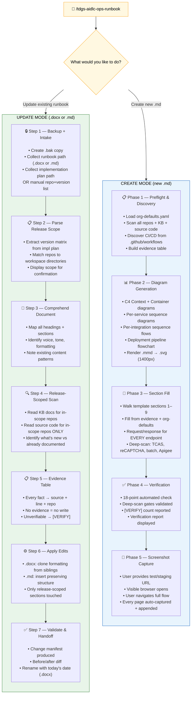
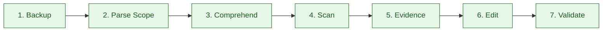
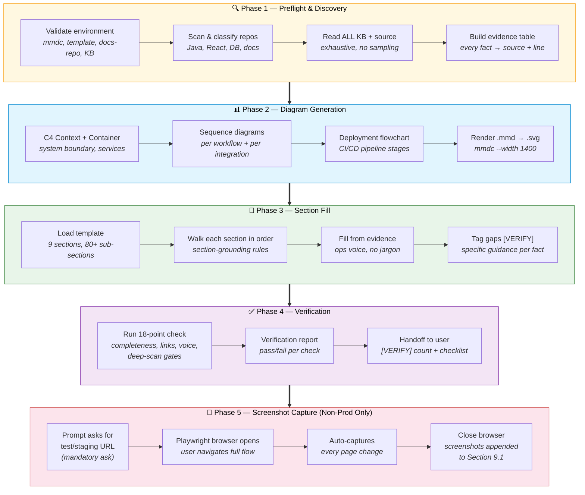
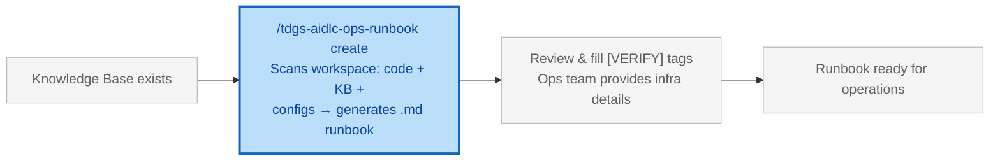
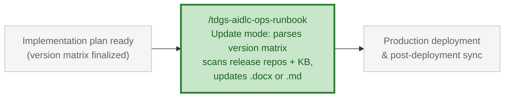

# Ops Runbook — Update & Create

> **Role:** Engineering Manager | **Reading path:** [EM Guide](em-guide.md) | **Previous:** [Project Planning](project-planning.md) | **Next:** [Post-Deployment](post-deployment.md)

## Overview

Manage operational runbooks for any Texas.gov application. Two modes: **Update** surgically edits an existing runbook (`.docx` or `.md`) scoped to a specific release using the implementation plan version matrix. **Create** generates a complete `.md` runbook from the Texas.gov Run Book Template, grounded entirely in workspace source code, knowledge base, and professional Mermaid diagrams.

---

## Sections at a Glance

| Section | Description |
|---------|-------------|
| [Step 1: Identify Change Scope](#step-1-identify-change-scope) | Trigger conditions for each mode |
| [Workflow at a Glance](#workflow-at-a-glance) | Visual pipeline for both modes |
| [Prerequisites](#prerequisites) | Requirements per mode |
| [Update Mode](#update-mode) | Full update workflow: quick start, steps, examples |
| [Create Mode](#create-mode) | Full create workflow: phases, outputs, diagrams |
| [Key Principles](#key-principles) | Guardrails that apply to both modes |
| [Pipeline Position](#pipeline-position) | Where this fits in the release lifecycle |
| [Common Scenarios](#common-scenarios) | Real-world usage patterns |
| [Troubleshooting](#troubleshooting) | Common issues and fixes |

---

## Step 1: Identify Change Scope

| Mode | Trigger | Timing |
|------|---------|--------|
| **Update** | Release-scoped changes to an existing runbook (`.docx` or `.md`) — new endpoints, new integrations, config changes | **Before** production deployment — update the runbook to reflect what production WILL look like after the release. Uses the implementation plan version matrix as scope. |
| **Create** | New application needs a `.md` runbook, or migrating from `.docx` to `.md` format | **Before** first production deployment — requires knowledge base from `/bmad-document-project` |

> ⚠️ **Update mode** edits an existing file (`.docx` or `.md`) using the implementation plan to determine scope. It does NOT create new documents. Use Create mode for that.

> 💡 **Create mode** generates a complete `.md` runbook from the Texas.gov template + workspace code scan. No existing document needed.

---

## Workflow at a Glance



---

## Prerequisites

### Prerequisites — Update Mode

| Requirement | Version | How to Verify | Install |
|-------------|---------|---------------|---------|
| **python-docx** (`.docx` only) | 0.8+ | `python3 -c "import docx; print(docx.__version__)"` | `pip3 install python-docx` |
| **Knowledge base** | — | `ls *-docs*/knowledge-base/` | Run `/bmad-document-project` |
| **Existing runbook** | — | `.docx` or `.md` file exists at path you provide | Obtained from your team |
| **Implementation plan** | — | `.md` file with `Release and Rollback Version Matrix` table | From CAB/change management process |
| **VS Code + Copilot** | Latest | Extensions panel | Required for prompt execution |

### Prerequisites — Create Mode

| Requirement | Version | How to Verify | Install |
|-------------|---------|---------------|---------|
| **mmdc (Mermaid CLI)** | 10.x+ | `mmdc --version` | `npm install -g @mermaid-js/mermaid-cli` |
| **Knowledge base** | — | `ls *-docs*/knowledge-base/` | Run `/bmad-document-project` first |
| **Backend service repo(s)** | — | At least one service repo in workspace | Required for meaningful content |
| **Node.js** | v18+ | `node --version` | Required by mmdc |
| **Playwright** | Latest | `node -e "require('playwright')"` | `npm install playwright` — Phase 5 screenshot capture (non-prod only: test/staging/UAT/dev) |
| **VS Code + Copilot** | Latest | Extensions panel | Required for prompt execution |

> ℹ️ **Note:** Update mode scans ONLY repos listed in the implementation plan version matrix. Create mode scans the entire workspace — all repos, all KB docs, all source code. Ensure your workspace contains all relevant repos for the application.

---

## Update Mode

> [← Sections](#sections-at-a-glance) | [Create Mode →](#create-mode)

Surgically edit an existing runbook (`.docx` or `.md`) scoped to a specific release. Uses the **implementation plan version matrix** as the single source of truth for which repos changed. For `.docx`: format-preserving edits via `python-docx`. For `.md`: markdown text insertion preserving structure. Never pandoc.

### Quick Start (Update)

```bash
# With implementation plan (recommended):
/tdgs-aidlc-ops-runbook ~/runbooks/MyApp_Runbook_06082026.docx ~/impl-plans/CHG2496342_ImplementationPlan.md

# With manual repo+version list:
/tdgs-aidlc-ops-runbook ~/runbooks/MyApp_Runbook_06082026.docx "tdgs-vic-ui=1.14.0, tdgs-vic-login-service=2.2.0"

# Update an existing .md runbook:
/tdgs-aidlc-ops-runbook ~/docs/knowledge-base/runbook/OVRA_06232026_V1.md ~/impl-plans/CHG2496342_ImplementationPlan.md
```

| Parameter | Required | Description |
|-----------|----------|-------------|
| `runbook_path` | Yes | Full path to the existing `.docx` or `.md` runbook |
| `release_source` | Yes | Path to implementation plan `.md` file, OR `repo=version` pairs |

### Release Source Options

| Option | When to use | What Happens |
|--------|-------------|--------------|
| **Implementation plan path** | You have a CAB/change plan with a version matrix | Parses the `Release and Rollback Version Matrix` table for repo names and versions |
| **Manual repo+version list** | No formal plan, or quick hotfix | You specify which repos changed: `"repo1=2.2.0, repo2=1.14.0"` |

> ⚠️ **No change briefs needed.** The implementation plan version matrix IS the scope. Change briefs may be stale from previous releases.

### What Happens (Step by Step)

> [← Quick Start](#quick-start-update) | [Review →](#review-update)



| Step | What Happens | Detail |
|------|-------------|--------|
| **1. Backup** | Creates `{filename}.bak` copy | If anything fails, restores from backup automatically |
| **2. Parse Scope** | Extracts version matrix from implementation plan | Identifies which repos + versions are in this release |
| **3. Comprehend** | Reads the entire runbook structure | Maps all headings, identifies voice/tone, notes formatting patterns |
| **4. Scan** | Release-scoped workspace scan | Reads KB docs + source code ONLY for repos in the version matrix. No sampling — reads every file for those repos |
| **5. Evidence** | Builds evidence table | Every fact gets a source file, line number, and repo. Unverifiable facts get `[VERIFY]` — never fabricated |
| **6. Edit** | Applies release-scoped edits | `.docx`: deep-copies formatting from siblings. `.md`: inserts preserving structure. Only sections for release repos are touched |
| **7. Validate** | Produces change manifest | Lists every edit made (section, content, source evidence). Generates diff for review |

> ⚠️ **Preserves existing descriptive content.** Update mode ADDS new sections, APPENDS to existing ones, and UPDATES version numbers/URLs/dates in-place. It never deletes, renames, or reorders existing paragraphs or prose.

> ⚠️ **Release-scoped ONLY.** Only sections relevant to repos in the version matrix are edited. Everything else is untouched.

> 💡 **Tip:** If the prompt finds the edit is already present (idempotency check), it skips silently. Safe to re-run.

### Review (Update)

> [← What Happens](#what-happens-step-by-step) | [Create Mode →](#create-mode)

#### For `.docx` — Compare in Word

1. Open the updated `.docx` in Microsoft Word
2. Go to **Review** → **Compare**
3. Select the `.bak` file as "Original" and the updated file as "Revised"
4. Word highlights all insertions in redline

#### For `.md` — Compare with diff

```bash
diff runbook.md.bak runbook.md
# or use VS Code: right-click .bak → Select for Compare → right-click .md → Compare with Selected
```

#### Post-Update Checklist

- [ ] New sections placed under the correct parent heading (by service/component)
- [ ] Only repos from the version matrix have corresponding edits — nothing else touched
- [ ] Content is factual — grounded in actual code behavior, not assumptions
- [ ] Language is plain — on-call at 2am can understand without reading code
- [ ] No internal class names in description text (check "Source Files:" sections only)
- [ ] Formatting matches neighboring paragraphs exactly (font, indent, spacing for `.docx`; heading level, list style for `.md`)
- [ ] Section numbers are sequential (no gaps, no duplicates) — `.docx` only
- [ ] Filename has today's date suffix: `*_MMDDYYYY.docx` — `.docx` only
- [ ] No content was deleted or displaced (only additions)

#### Update Table of Contents (`.docx` only)

If new Heading-styled sections were added:

> Right-click Table of Contents → **Update Field** → **Update Entire Table**

> ⚠️ **Important:** The prompt does NOT auto-update the TOC (this requires Word's field engine). You must manually refresh it after reviewing.

---

## Create Mode

> [← Update Mode](#update-mode) | [Key Principles →](#key-principles)

Generate a complete `.md` runbook from the Texas.gov Run Book Template. The workflow exhaustively scans the workspace — all repos, knowledge base, source code, and configs — then fills every template section with evidence-grounded content and professional Mermaid diagrams.

### Quick Start (Create)

```bash
# Direct invocation:
/tdgs-aidlc-ops-runbook create

# Or invoke without args and select "Create" at the intake question:
/tdgs-aidlc-ops-runbook
```

> 💡 **Tip:** Create mode requires NO existing document. It generates everything from scratch using workspace evidence.

### What Create Mode Produces

| Output | Description |
|--------|-------------|
| **`{ACRONYM}_{MMDDYYYY}_V1.md`** | Complete runbook (e.g., `OVRA_06232026_V1.md`) following the Texas.gov template |
| **`diagrams/v1/c4-context.mmd` + `.svg`** | System context diagram (actors, system boundary, external systems) |
| **`diagrams/v1/c4-container.mmd` + `.svg`** | Container view (all services, frontend, database, gateway) |
| **`diagrams/v1/seq-{integration}.mmd` + `.svg`** | Per-integration flow diagrams (TCAS, E-Wallet, PACS, etc.) |
| **`diagrams/v1/deploy-flow.mmd` + `.svg`** | Deployment pipeline flowchart |
| **`diagrams/v1/screenshots/*.png`** | Application UI screenshots (Phase 5 — if test/staging URL provided) |
| **`diagrams/v1/diagram-manifest.md`** | Registry of all diagrams with evidence sources |

All output goes to `{docs-repo}/knowledge-base/runbook/` (created automatically if it doesn't exist):

```
{docs-repo}/knowledge-base/runbook/
├── OVRA_06232026_V1.md            ← Generated runbook (versioned: V1, V2...)
└── diagrams/v1/                   ← Versioned diagram directory
    ├── c4-context.mmd / .svg       ← System context diagram
    ├── c4-container.mmd / .svg     ← Container view
    ├── seq-{workflow}.mmd / .svg   ← Sequence diagrams
    ├── seq-{integration}.mmd / .svg ← Per-integration flow diagrams
    ├── deploy-flow.mmd / .svg      ← Deployment pipeline
    └── diagram-manifest.md         ← Diagram registry
```

> 📌 **Version Management:** Runbooks are versioned (V1, V2...). Diagrams are stored in matching versioned subdirectories (`diagrams/v1/`, `diagrams/v2/`). Previous versions are NEVER deleted — they serve as audit history.

### Create Workflow Phases



#### Phase 1: Preflight & Workspace Discovery

| Step | Action | Halt Condition |
|------|--------|----------------|
| 0 | Validate `mmdc` installed | HALT if missing |
| 1 | Locate template in `templates/runbook-md.template.md` | HALT if not found |
| 2 | Find docs-repo (`*-docs*/` pattern) | HALT if no docs-repo found |
| 3 | Find knowledge-base in docs-repo | HALT if no KB |
| 4 | Scan workspace — classify all repos (Java backend, React frontend, DB, docs) | HALT if no backend repos or empty workspace |
| 5 | Read ALL KB documents — `master-index.md` first, then all subdirectories | No sampling |
| 5b | Read `common-services/` exhaustively (TCAS, PACS, E-Wallet, ENE) | HARD GATE — lockout/retry/error policies live here |
| 6 | Read ALL source code — controllers, services, DTOs, configs, exceptions | No shortcuts |
| 6b | Locate devsecops-hub (`*devsecops-hub*/` or `.github/workflows/ci-common.yml`) | Used for CI/CD section — reusable workflow from `Texas-gov-Application-Services/txgov-devsecops-hub` |
| 7 | Build master evidence table | HARD GATE — no writing until complete |
| 8 | Load organization defaults (`config/org-defaults.yaml`) | Contacts, CI/CD platform, monitoring tools — auto-populates, NEVER `[VERIFY]` |

> ⚠️ **Evidence Gate:** The workflow CANNOT proceed to Phase 2 until the evidence table is fully built. Every fact in the runbook must trace to a row in this table.

#### Phase 2: Diagram Generation

| Diagram | Source Evidence | Standards |
|---------|----------------|-----------|
| C4 Context | KB + source scan (integrations, actors) | Professional color palette, base theme |
| C4 Container | Repo scan (services, ports, tech stacks) | One container per discovered service repo |
| Sequence (×N) | KB business flows + controller chain | One per major user workflow |
| Deployment | CI configs + KB deployment docs | Left-to-right pipeline with subgraphs |

> 💡 **Diagram standards:** All diagrams use a professional color palette (`#2D5F8A` dark blue for internal services, `#7F7F7F` gray for external systems, `#BDD7EE` light blue for databases). Rendered at 1400px width via `mmdc --width 1400` (theme embedded in `.mmd` files via `%%{init:}%%` directive — no `-t` flag). Mermaid source (`.mmd`) is committed alongside SVGs for future editing.

#### Phase 3: Section Fill

The orchestrator walks the template section-by-section (Sections 1–9) applying section-grounding rules:

| Template Section | Primary Source | Typical Fill Rate |
|------------------|----------------|-------------------|
| 1. Introduction | `project-context.md` | HIGH — usually fully populated |
| 2. Contact List | `org-defaults.yaml` (auto) + KB | HIGH — org contacts auto-populated from `config/org-defaults.yaml` |
| 3. Application Overview | KB business + UI routes | HIGH — good evidence |
| 4. Environment Overview | Config files + KB shared | MEDIUM — URLs may need `[VERIFY]` |
| 5. Deployment | CI configs + KB | MEDIUM — varies by workspace |
| 6. Integrations | Source HTTP clients + KB | HIGH — code evidence |
| 7. Operations | KB ops docs + batch configs | MEDIUM — operational procedures |
| 8. Monitor | KB + health endpoints | MEDIUM — Splunk indices need `[VERIFY]` |
| 9. Appendix | Error handlers + session config | LOW — mostly supplementary |

> ℹ️ **`[VERIFY]` tags:** When the workflow cannot find evidence for a fact, it inserts `[VERIFY: specific guidance]` — never fabricates. The tag tells you exactly what's missing and where to find it.

#### Phase 4: Post-Generation Verification

18-point automated check before handoff:

| # | Check | Pass Criteria |
|---|-------|---------------|
| 1 | Template completeness | Every template section heading present |
| 2 | `[VERIFY]` audit | All tags have specific guidance |
| 3 | Diagram link integrity | Every `` resolves |
| 4 | App-agnostic compliance | Zero hardcoded app names |
| 5 | Operational voice | No class names in prose |
| 6 | Evidence coverage | Every assertion traced to source |
| 7 | Endpoint validity | All listed endpoints exist in code |
| 8 | Error code validity | All codes exist in source |
| 9 | Diagram node coverage | All nodes trace to real components |
| 10 | Diagram manifest | All `.mmd` files registered |
| 11 | Microservices req/res | Every non-`/ping` endpoint has request + response sample (HARD GATE) |
| 12 | Identity verification | All code paths documented (In-State + Out-of-State) |
| 13 | reCAPTCHA detail | Version + mode specified from code |
| 14 | Batch processing | Documented if extract tables exist in DB |
| 15 | Apigee security | Security layers documented from KB |
| 16 | Common services | Cross-referenced per integration |
| 17 | JSON format | All request/response blocks beautified |
| 18 | Author field | System username, not auto-generated |

### Review (Create Mode)

After generation, review and finalize:

- [ ] Search for `[VERIFY` — provide missing info or mark section as N/A
- [ ] Open `.svg` diagrams — verify they render correctly and are accurate
- [ ] Check `diagram-manifest.md` — all diagrams listed with evidence sources
- [ ] Remove `IF APPLICABLE` sections that don't apply to your application
- [ ] Verify operational voice — descriptions readable by non-developer on-call
- [ ] Run screenshot capture (Phase 5 — prompt will ask; provide test/staging URL, never production)
- [ ] Submit for team review and approval

### Phase 5: Screenshot Capture (Mandatory Ask — Non-Prod Only)

After Phase 4 completes, the prompt **always asks** for a test/staging URL to capture screenshots. This is a mandatory prompt step — the user can provide a URL or explicitly skip.

> "Provide a test/staging URL to capture screenshots, or say skip."

If you provide a URL, a **visible Playwright browser** opens. You navigate the full app flow with test data (identity → order → payment → receipt). Every page change is auto-captured. When you close the browser, screenshots are saved and appended to Section 9.1.

**Environment safety:**
- ⛔ **HARD BLOCK on production** — rejects any URL containing `prod` or `prd`
- ✅ **Allowed environments only:** `test`, `stage`, `stg`, `uat`, `dev`, `nonprod`, `localhost`

**What you do:** Navigate normally, fill forms, place a test order, close the browser.  
**What the script does:** Watches every page/route change and auto-captures full-page screenshots (Playwright, animations disabled).

**How it captures (SPA-aware, application-agnostic):**
- Hooks `history.pushState` / `replaceState` (catches React Router, Vue Router, Next.js navigation)
- MutationObserver on `document.body` (catches DOM-driven route changes)
- `framenavigated` event (catches full page loads and iframe transitions)
- Auto-waits for `networkidle` + iframe load before capture
- Screenshots numbered sequentially: `01-page-name.png`, `02-page-name.png`, etc.

```bash
# If running manually outside the prompt (Playwright-based):
node scripts/capture-screenshots.js <test_url> <output_dir>/screenshots <runbook_path>
```

**Prerequisites:**
- `npm install playwright` (installs Chromium browser automatically)
- Test/staging environment deployed and accessible
- Never run against production URLs

**Example (manual run):**
```bash
node scripts/capture-screenshots.js \
  https://myapp.testtxapps.texas.gov \
  ./diagrams/v1/screenshots \
  ./MYAPP_06242026_V1.md
```

---

## Key Principles

> [← Create Mode](#create-mode) | [Pipeline Position →](#pipeline-position)

| # | Principle | What it means | Applies To |
|---|-----------|---------------|------------|
| 1 | **Release-scoped** | Update mode scans ONLY repos in the implementation plan version matrix. Edits ONLY sections for those repos. | Update |
| 2 | **Implementation plan is source of truth** | The version matrix defines scope. No change briefs needed — they may be stale from prior releases. | Update |
| 3 | **Evidence-based** | Every sentence traces to source code or KB doc. Unverifiable → `[VERIFY: ...]`. Never fabricate. | Both |
| 4 | **Write for ops** | On-call at 2am. No developer jargon in descriptions. Class names in Source Files sections only. | Both |
| 5 | **Read-only workspace** | ONLY the runbook file is modified. Source code, KB, configs, git — strictly read-only. | Both |
| 6 | **Anti-redundancy** | Grep document for existing mentions before inserting. Never duplicate content. | Both |
| 7 | **Clone formatting** | `.docx`: new paragraphs inherit font, indent, spacing from nearest sibling. `.md`: match heading level, list style. | Update |
| 8 | **Preserve descriptive content** | Never delete, rename, or displace prose/paragraphs. Version numbers, URLs, and dates may be updated in-place. | Update |
| 9 | **Template fidelity** | Never remove, reorder, or rename template sections. Unfilled → `[VERIFY]`, not deleted. | Create |
| 10 | **Diagrams from evidence** | Every C4/sequence node traces to a discovered source file. No speculative components. | Create |
| 11 | **Backup & rollback** | `.bak` copy created before any edit. Any failure restores automatically. | Update |
| 12 | **Application-agnostic** | Zero hardcoded app names. Every detail discovered from workspace patterns. | Both |

---

## Pipeline Position

> [← Key Principles](#key-principles) | [Common Scenarios →](#common-scenarios)

### Create Mode — Pipeline Position



### Update Mode — Pipeline Position



---

## Common Scenarios

> [← Pipeline Position](#pipeline-position) | [Troubleshooting →](#troubleshooting)

### Scenario 1: Pre-production release update (.docx)

```bash
# Implementation plan provides the scope:
/tdgs-aidlc-ops-runbook ~/runbooks/OVRA_Runbook_06082026.docx ~/impl-plans/CHG2496342_ImplementationPlan.md
```

The prompt parses the version matrix (e.g., `tdgs-ovra-ui=1.14.0`, `tdgs-ovra-orderdetails-service=2.2.0`), scans those repos' source code + KB, and adds the relevant operations documentation (new endpoints, new error codes, updated integrations) to the `.docx`.

### Scenario 2: Pre-production release update (.md)

```bash
# Same flow, but for .md runbook:
/tdgs-aidlc-ops-runbook ~/docs/knowledge-base/runbook/OVRA_06232026_V1.md ~/impl-plans/CHG2496342_ImplementationPlan.md
```

Same scoping logic — version matrix determines what repos to scan. Edits are inserted into the `.md` file preserving existing structure and formatting.

### Scenario 3: Quick hotfix (manual repo+version)

```bash
# No implementation plan — specify repos directly:
/tdgs-aidlc-ops-runbook ~/runbooks/App_Runbook.docx "tdgs-ovra-receipt-service=2.3.1"
```

The prompt scans only that repo, identifies the change (e.g., timeout config update), and adds it to the relevant section.

### Scenario 4: First-time runbook creation

```bash
# No existing runbook — generate from scratch:
/tdgs-aidlc-ops-runbook create
```

Produces a complete `.md` runbook with diagrams. After review, this becomes your team's operational reference.

### Scenario 5: Migrating from .docx to .md

1. Run Create mode to generate the `.md` version
2. Compare generated `.md` against existing `.docx` for completeness
3. Fill any `[VERIFY]` tags using info from the `.docx`
4. Retire the `.docx` — future updates go against the `.md`

---

## Troubleshooting

> [← Common Scenarios](#common-scenarios)

### Update Mode Issues

| Problem | Cause | Fix |
|---------|-------|-----|
| `ImportError: No module named 'docx'` | python-docx not installed | `pip3 install python-docx` (only needed for `.docx` mode) |
| HALT: No version matrix found | Implementation plan doesn't have the expected table format | Ensure the plan has a `## Release and Rollback Version Matrix` section with a markdown table |
| HALT: No repos found in workspace | Version matrix repos don't match workspace directories | Clone the repos listed in the implementation plan into your workspace |
| Formatting looks wrong after edit (.docx) | Adjacent paragraph has unusual styling | Open `.bak`, find the correct sibling paragraph, provide its index to the prompt |
| Edit placed under wrong section | Ambiguous component ownership | Re-run with explicit guidance: `"Add under Section 6.2 Payment Integration"` |
| Duplicate content inserted | Idempotency check missed edge case | Delete the duplicate, re-run — prompt will detect it exists next time |
| TOC not updated (.docx) | Expected — Word TOC requires manual refresh | Right-click TOC → Update Field → Update Entire Table |
| `.bak` not created | File permissions issue | Check write access to the runbook's directory |
| Prompt says "no changes needed" | Release repos have no ops-relevant changes | Confirm with team whether the release has ops impact |

### Create Mode Issues

| Problem | Cause | Fix |
|---------|-------|-----|
| `mmdc: command not found` | Mermaid CLI not installed | `npm install -g @mermaid-js/mermaid-cli` |
| HALT: No knowledge-base found | KB not generated yet | Run `/bmad-document-project` first |
| HALT: No docs-repo found | No `*-docs*/` directory in workspace | Clone the docs repo into the workspace |
| HALT: No backend service repos | Workspace missing service repos | Ensure all application repos are cloned in the workspace |
| HALT: Template not found | Skill files not installed | Re-install the starter-kit or check `.github/i2a-skills/tdgs-aidlc-ops-runbook/templates/` |
| HALT: Empty workspace | No subdirectories at workspace root | Ensure repos are cloned, not just the docs repo |
| Too many `[VERIFY]` tags | Limited evidence in KB/source | Expected for new projects — fill manually post-generation |
| Diagram render fails | Invalid Mermaid syntax | Check the `.mmd` file for syntax errors, fix and re-run `scripts/render-diagrams.sh` |
| Diagrams missing external systems | Integration code not discovered | Check that HTTP client classes are in standard locations (`*Client.java`, `*Service.js`) |
| Template section missing in output | Bug in section-fill phase | Re-run — the post-generation check (Check 1) should catch this |

### General Tips

> 💡 **Checkpoint & resume:** Create mode automatically saves a checkpoint to session memory after each phase. When the context fills, the workflow displays a resume banner with the exact command. Open a **fresh Copilot Chat** and say: `"Resume from Phase {N}"` — it reads the checkpoint file and continues from where it left off. No re-running completed phases.

> 💡 **Model selection:** Always use **Claude Opus 4.6** (Agent mode) for both modes. The exhaustive scanning and format-preserving edits require the highest-capability model.

> 💡 **Large workspaces:** If you have 5+ service repos, Create mode will span multiple context windows. The checkpoint system handles this automatically — each phase saves state before prompting you to continue.

> 💡 **Read-only safety:** Both modes are **read-only** on your workspace (source code, KB, configs, git). Update mode ONLY modifies the runbook file. Create mode only writes to `{docs-repo}/knowledge-base/runbook/`.

> 💡 **Runbook validation:** After creating or updating a runbook, use `/tdgs-aidlc-validate-runbook-context` to cross-check content against knowledge base docs. See [Test Management](test-management.md) for the full validation workflow.

---

## Key Differences: Create vs Update

| Aspect | Update Mode | Create Mode |
|--------|-------------|-------------|
| **Input** | Existing `.docx` or `.md` file + implementation plan (version matrix) | Workspace repos + KB (no existing doc needed) |
| **Output** | Edited runbook in place (+ `.bak` backup) | New `.md` runbook + Mermaid diagrams (.mmd + .svg) |
| **Scope** | Release-scoped — only repos in the version matrix | Full document generation — all 9 sections |
| **Tool** | `.docx`: python-docx. `.md`: markdown text insertion | Mermaid CLI (diagram rendering) |
| **Diagrams** | Not generated (uses existing in runbook) | Generated from workspace source scan |
| **Unknown info** | Never added — `[VERIFY]` only if code evidence is incomplete | `[VERIFY: specific guidance]` tags inserted |
| **Template** | Preserves existing document structure | Follows Texas.gov Run Book Template exactly |
| **Idempotent** | Yes — skips edits already present | Yes — re-run regenerates (fresh output) |
| **Backup** | Creates `.bak` before any edit | N/A (generates new file) |
| **When** | Before every production deployment | Once per application (initial creation or migration) |
| **Scope source** | Implementation plan version matrix | Full workspace scan (all repos) |
