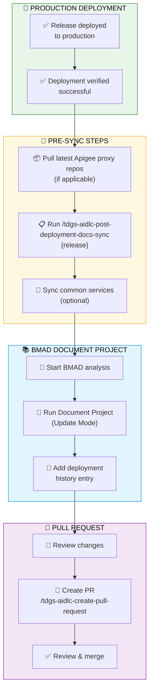

# Post-Deployment Documentation Sync

> **Role:** Engineering Manager | **Reading path:** [EM Guide](em-guide.md) | **Previous:** [Ops Runbook Update](ops-runbook-update.md) | **Next:** [Test Management](test-management.md)

This guide covers updating application documentation after a release has been deployed to production.

---

## Post-Deployment Documentation Sync

After a release has been deployed to production, the Engineering Manager should update the application documentation to reflect the deployed changes. A release may contain both features and hotfixes. This ensures the knowledge base stays in sync with production code.

This workflow uses **BMAD's Document Project** capability for intelligent code scanning and documentation updates, ensuring consistency with how documentation was initially generated.

### When to Run

Run this workflow after:
- A release branch has been merged to master and deployed to production
- Confirmation that production deployment is successful

### Workflow Overview



### Step 1: Update Non-Version-Controlled Sources

> [Step 2 →](#step-2-run-post-deployment-docs-sync)

Before running the sync, update any non-version-controlled sources that may have changed.

#### 1.1: Update Apigee Proxy Sources (if applicable)

If your project uses Apigee API Gateway, update the proxy sources based on your setup:

**Option A: Git-Based Apigee Repos**

If your Apigee proxies are in Git repositories, pull the latest changes:

```bash
cd tdgs-ovra-transaction-proxy && git pull && cd ..
cd tdgs-ovra-onlinecertificate-proxy && git pull && cd ..
cd tdgs-ovra-utility-proxy && git pull && cd ..
```

> ✅ The Apigee proxy repositories are version-controlled. Pulling the latest ensures the docs sync scans the most up-to-date proxy configurations.

**Option B: Manual Apigee Export (Legacy)**

If your Apigee proxies are NOT in Git, manually export the production-deployed revisions:

1. Log in to Apigee console → **Develop** → **API Proxies**
2. For each proxy that changed in this release:
   - Click the proxy name → **Project** → **Download Revision**
   - Download the **currently deployed revision** (production)
3. Extract and replace files in `apigee-exports/` folder

> ⚠️ The `apigee-exports/` folder must be up-to-date before running the docs sync.

### Step 2: Run Post-Deployment Docs Sync

> [← Step 1](#step-1-update-non-version-controlled-sources) | [Step 3 →](#step-3-run-bmad-document-project-update-mode)

#### 2.1: Open Copilot Chat

1. Press `Ctrl+Shift+I` (or click the Copilot icon in the sidebar)
2. Ensure you're in "Agent" mode

#### 2.2: Run the Sync Command

Type the following in Copilot Chat:

```
/tdgs-aidlc-post-deployment-docs-sync {release_version}
```

**Example:**
```
/tdgs-aidlc-post-deployment-docs-sync 4.0.0
```

#### 2.3: What Happens

The command will:

1. **Pre-flight Checks** - Verifies clean working tree, identifies release
2. **Find Deployed Issues** - Collects GitHub Issue IDs from merged PRs
3. **Check Apigee Sources** - Confirms latest proxy code is available (Git repos pulled OR `apigee-exports/` updated)
4. **Create Documentation Branch** - Creates `docs/post-deploy-{release}-{date}`
5. **Guide BMAD Document Project** - Provides instructions for running BMAD update (common repos scanned directly via symlinks)

### Step 3: Run BMAD Document Project (Update Mode)

> [← Step 2](#step-2-run-post-deployment-docs-sync) | [Step 4 →](#step-4-review-and-create-pr)

After the pre-sync steps, you'll be guided to run BMAD's Document Project to update the documentation.

#### 3.1: Activate BMAD Document Project Skill

1. Open a **new Agent chat session** (prevents context overflow)
2. Select **"Claude Opus 4.6"** for the model
3. BMAD 6.3.0+ is skills-based — invoke skills directly via slash commands (no agent selection required)

#### 3.2: Run Document Project Update

Use the following prompt template (the `/tdgs-aidlc-post-deployment-docs-sync` command will generate this for you):

```
I need to UPDATE the existing documentation in `{project}-docs/knowledge-base` 
folder after deploying release `{release}` to production. 

The release included issues: #123, #456, #789.

Please use Document Project option to:

1. Scan ALL code repositories in the workspace for changes
2. Scan the Apigee proxy repositories for updated proxy configurations
3. Compare current code with existing documentation
4. Update ONLY the sections that have changed — do not regenerate unchanged documentation

Focus on updating:
- API Specifications (`api/`) — sync with actual controller endpoints and models
- Business Rules (`business/business-rules-catalog.md`) — if validation logic changed
- Data Models (`shared/data-models.md`) — if entities or DTOs changed
- Repository Architecture (`repos/{service}/architecture.md`) — if service structure changed
- Apigee Documentation (`apigee/`) — if proxy configurations changed (scan Apigee proxy repos OR `apigee-exports/` folder)

After updates, provide a summary of what changed.
```

> 💡 **Why BMAD?** Using BMAD's Document Project ensures documentation updates follow the same intelligent scanning and generation patterns used during initial setup. This maintains consistency and leverages BMAD's understanding of your codebase structure.

### Step 4: Review and Create PR

> [← Step 3](#step-3-run-bmad-document-project-update-mode)

1. Review all documentation changes in VS Code
2. Add deployment history entry to `knowledge-base/project/deployment-history.md`
3. Run `/tdgs-aidlc-commit` to commit changes
4. Run `/tdgs-aidlc-create-pull-request` to create PR targeting `master`

### Command Options

| Option | Description | Example |
|--------|-------------|---------|
| `release` | Release version (required) | `4.0.0`, `release/4.0.0` |
| `issues` | Manual issue IDs | `issues:123,456,789` |
| `--sync-common-services` | Sync common services docs | `--sync-common-services` |
| `common-services-repo` | Common services repo | `common-services-repo:org/repo` |
| `--skip-apigee` | Skip Apigee proxy repo pull check | `--skip-apigee` |
| `--dry-run` | Preview without applying | `--dry-run` |

### Common Scenarios

#### Standard Release
```
/tdgs-aidlc-post-deployment-docs-sync 4.0.0
```

#### Skip Apigee Check (no Apigee in project)
```
/tdgs-aidlc-post-deployment-docs-sync 4.0.0 --skip-apigee
```

#### Specify Issues Manually
```
/tdgs-aidlc-post-deployment-docs-sync 4.0.0 issues:123,456,789
```

### Post-Deployment Checklist

- [ ] Production deployment confirmed successful
- [ ] Ran `/tdgs-aidlc-post-deployment-docs-sync {release}`
- [ ] Reviewed all documentation changes
- [ ] Verified flagged items (potential removals)
- [ ] Created PR for documentation updates
- [ ] PR reviewed and merged
- [ ] Team notified of documentation updates

---
