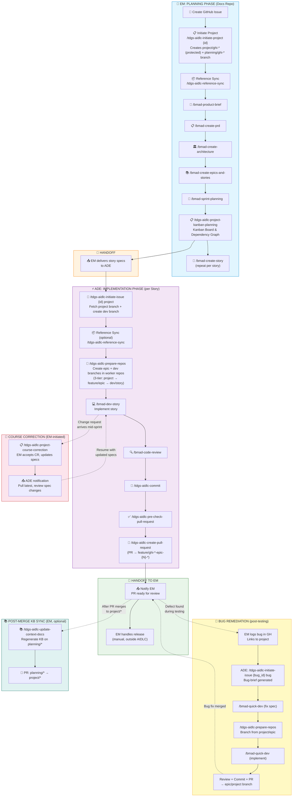
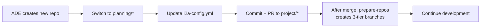
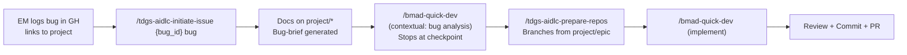

# Project Implementation (Full BMAD)

> **Role:** Agentic Delivery Engineer | **Reading path:** [ADE Guide](ade-guide.md) | **Previous:** [M&O Workflow](mo-workflow.md) | **Next:** [Test Management](test-management.md)

This guide covers the ADE implementation workflow for project-type issues where the EM has completed Full BMAD planning.

---

## Project Full BMAD (project)



**EM Planning Phase** (see [Project Planning](project-planning.md)):

| Step | Owner | Command | Description |
|------|-------|---------|-------------|
| - | EM | `/tdgs-aidlc-initiate-project {id}` | Create `project/ghi-*` (protected) + `planning/ghi-*` branch from master |
| - | EM | `/tdgs-aidlc-reference-sync` | Sync reference docs from shared services repo |
| - | EM | `/bmad-product-brief` | Create product brief from change brief |
| - | EM | `/bmad-create-prd` | Create Product Requirements Document |
| - | EM | `/bmad-create-architecture` | Create architecture/solution design |
| - | EM | `/bmad-create-epics-and-stories` | Define epics and user stories |
| - | EM | `/bmad-sprint-planning` | Plan sprints from epics |
| - | EM | `/bmad-create-story` | Create implementation-ready story spec (repeat per story) |
| - | EM | `/tdgs-aidlc-project-kanban-planning` | Create kanban board with dependency graph, prioritization, Harvey ball status |

**ADE Implementation Phase** (this guide, [below](#project-implementation-steps-full-bmad)):

| Step | Repository | Command | Description |
|------|------------|---------|-------------|
| - | Docs | `/tdgs-aidlc-initiate-issue {id} project` | Fetch project branch, create dev branch, verify EM artifacts |
| 1 | Docs | `/tdgs-aidlc-reference-sync` | (Optional) Re-sync reference docs for freshness |
| 2 | Docs | `/tdgs-aidlc-prepare-repos {spec-path}` | Create 3-tier branches (project → epic → dev) in worker repos |
| 3 | Worker | `/bmad-dev-story` | Implement the story (repeat per worker repo) |
| 4 | Worker | `/bmad-code-review` | Comprehensive code review |
| 5 | Worker | `/tdgs-aidlc-commit` | Stage and commit changes (on dev branch) |
| 6 | Worker | `/tdgs-aidlc-pre-check-pull-request` | Run CI pipeline on dev branch before PR |
| 7 | Worker | `/tdgs-aidlc-create-pull-request` | Create GitHub PR (targets epic branch: feature/ghi-*-epic-{N}-*) |
| 8 | - | Notify EM | Hand off to EM for Test Env, release, and production (manual) |

---

## Project Implementation Steps (Full BMAD)

This section covers the **ADE implementation workflow** for `project` type issues. The **EM completes all planning steps** (Initiate Project, Product Brief, PRD, Architecture, Epics, Sprint Planning, Kanban Planning, Create Story) before handing off to ADEs. See the [Project Planning](project-planning.md) guide for planning details.

> 💡 **If you were assigned a `feature` or `hotfix`**, use the [M&O Workflow](mo-workflow.md) instead.

### Pre-Work Requirements

> ⚠️ **MANDATORY**: Complete these steps before starting work on any `project` type issue.

Before beginning any workflow step, ADEs must:

| Step | Action | Details |
|------|--------|--------|
| 1 | **Get project branch name from EM** | Ask your EM for the `project/ghi-{id}-{slug}` branch name before proceeding |
| 2 | **Sync Docs Repository** | Fetch remote and check out the project branch:<br/>`git fetch origin`<br/>`git checkout project/ghi-{id}-{slug} && git pull` |
| 3 | **Discover Available Stories** | Run `/tdgs-aidlc-show-available-stories` to see unclaimed, unblocked stories |

> 💡 **Self-Service Story Pickup**: Run `/tdgs-aidlc-show-available-stories` to see what's free, then claim it with `/tdgs-aidlc-prepare-repos`. Branch push = atomic claim (first ADE to push wins). If another ADE already claimed the story, `prepare-repos` will block with an error.

---

### Prerequisites from EM

Before starting implementation, verify the EM has completed planning and the following artifacts exist:

| Artifact | Location | Verify |
|----------|----------|--------|
| Integration branch | `project/ghi-{id}-{slug}` | `git branch -r \| grep project/gh` |
| Change brief | `planning-artifacts/change-brief-{id}.md` | File exists |
| Product brief | `planning-artifacts/product-brief-{project-name}.md` | File exists |
| PRD | `planning-artifacts/prd.md` | File exists |
| Architecture | `planning-artifacts/architecture.md` | File exists |
| Epics & stories | `planning-artifacts/epics.md` | File exists |
| Sprint status | `implementation-artifacts/sprint-status.yaml` | File exists |
| Story spec(s) | `implementation-artifacts/{epic}-{story}-{slug}.md` | At least one file exists |

#### Getting Started

1. **Run show-available-stories** to discover what's available for pickup:
   ```
   /tdgs-aidlc-show-available-stories
   ```
   This will:
   - Read `sprint-status.yaml` for story statuses
   - Scan remote `dev/*` branches across worker repos for existing claims
   - Evaluate dependencies to identify blocked stories
   - Display categorized results: AVAILABLE / BLOCKED / CLAIMED / DONE

2. **Pick an available story** from the output and proceed to [Step 2: Prepare Repos](#step-2-prepare-repos) with its spec path.

3. **Collision prevention**: When you run `prepare-repos`, it checks for competing claims. If another ADE already pushed a `dev/*` branch for that story, you'll get a block:
   ```
   ⛔ ABORT: Story {N}-{S} already claimed by {other_user}
   ```
   Simply run `show-available-stories` again and pick a different story.

---

### Step 1: Show Available Stories

> [Step 2 →](#step-2-prepare-repos)

> **Self-service discovery** — run this before each story pickup to see what's free.

#### Command
```
/tdgs-aidlc-show-available-stories
```

Optionally filter by epic:
```
/tdgs-aidlc-show-available-stories --epic 1
```

#### What Happens
1. Reads `sprint-status.yaml` to get story statuses
2. Fetches remote branches from all worker repos
3. Scans for existing `dev/ghi-{id}-{N}-{S}-*` branches (= claims)
4. Evaluates `dependencies` section for blocking
5. Displays categorized output: AVAILABLE / BLOCKED / CLAIMED / DONE

#### Next Step
Pick an available story from the list and proceed to **Step 2: Prepare Repos**.

---

### Step 2: Prepare Repos

> [← Step 1](#step-1-show-available-stories) | [Step 3 →](#step-3-dev-story-worker-repos)

> Same command as M&O, but you **must specify the story spec path**. In the project workflow, there are multiple story specs — the command cannot auto-detect which one to use.

#### Command
```
/tdgs-aidlc-prepare-repos implementation-artifacts/{epic}-{story}-{slug}.md
```

**Example:**
```
/tdgs-aidlc-prepare-repos implementation-artifacts/1-1-project-scaffolding.md
```

The command reads the specified story spec to identify affected **worker repositories**, then for each one creates a **3-tier branch structure**:
- `project/ghi-{id}-{slug}` — **project branch** (protected, from master, if not exists)
- `feature/ghi-{id}-epic-{N}-{epic_slug}` — **epic branch** (from project branch, if not exists)
- `dev/ghi-{id}-{N}-{S}-{story_slug}-{username}` — **story branch** (from epic branch) — this is where you implement the user story

The epic number and slug are derived from the story spec filename and `epics.md`. Multiple stories in the same epic share the same `feature/*` epic branch.

> These are **worker repo** branches. The docs repo stays on the `project/*` branch (created by EM during `initiate-project`, with planning artifacts merged from `planning/*` via PR) — ADEs read story specs and sprint-status from there.

> **Repeat per story**: Run this step once per story in the sprint, then proceed through Steps 3–6 for each before moving to the next story.

#### Next Step
Proceed to **Step 3: Dev Story**.

---

### Step 3: Dev Story (Worker Repos)

> [← Step 2](#step-2-prepare-repos) | [Step 4 →](#step-4-code-review)

> 🔄 **FRESH CHAT RECOMMENDED**: Start this step in a new Agent chat session per worker repository.

#### Purpose
Implements a story from the story spec file. This uses BMAD's `/bmad-dev-story` skill which follows context from the dedicated story file.

#### Prerequisites
- Dev branch exists in the worker repository (from Step 2)
- Story spec available at `implementation-artifacts/{epic}-{story}-{slug}.md`
- **Fresh Agent chat session recommended** per worker repository

#### Chat Setup
1. **Select Model**: Ensure the Model is set to **Claude Opus 4.6**
2. **Mode**: Use **Agent** mode (not Ask mode)

#### Command
```
/bmad-dev-story
```

Point the agent to your story file:
```
/bmad-dev-story
Story: {docs}/implementation-artifacts/{epic}-{story}-{slug}.md
```

#### What Happens
The agent implements the story following the spec:
1. Reads the story spec for full context
2. Implements each task in order
3. Runs self-check against acceptance criteria
4. Performs adversarial review
5. Resolves findings

> 📋 **Note**: Since your EM has generated `project-context.md` (see [Step 2 in Knowledge Base Generation](knowledge-base-generation.md#step-2-generate-project-context)), the following common DB Enhancement conventions are applied automatically via `project-context.md` — you do NOT need to add them as manual instructions:
> - Database migration + rollback scripts (Oracle 19c Database-as-Code naming: `V<semver>_<seq>_<desc>.sql` / `U<semver>_<seq>_<desc>.sql`)
> - Idempotency wrappers with `SCHEMA_VERSION_HISTORY` check
> - `master_deploy.sql` manifest updates with dependency declarations
> - Baseline sync to `db/baseline/OVRA_METADATA.sql` (commented block with GHI reference, description, date, DDL)
> - Each DDL change to a distinct table = its own migration script (independent rollback)
> - `db/drift/drift_check.sql` must pass before deployment
> - Database-only issues skip app-layer tests — verification is via SQL commands
>
> These rules are defined in `project-context-custom-rules.md` and enforced by the generated `project-context.md`.

#### Next Step
After implementation, proceed to **Step 4: Code Review**.

---

### Step 4: Code Review

> [← Step 3](#step-3-dev-story-worker-repos) | [Step 5 →](#step-5-commit-changes)

> This step is identical to the M&O workflow. See [Step 6: Code Review](mo-workflow.md#step-6-code-review) for full details.

#### Command
```
/bmad-code-review
```

#### Next Step
Proceed to **Step 5: Commit Changes**.

---

### Step 5: Commit Changes

> [← Step 4](#step-4-code-review) | [Step 6 →](#step-6-pre-check-pull-request)

> This step is identical to the M&O workflow. See [Step 7: Commit Changes](mo-workflow.md#step-7-commit-changes) for full details.

#### Command
```
/tdgs-aidlc-commit
```

#### Next Step
Proceed to **Step 6: Pre-Check Pull Request**.

---

### Step 6: Pre-Check Pull Request

> [← Step 5](#step-5-commit-changes) | [Step 7 →](#step-7-create-pull-request)

> This step is identical to the M&O workflow. See [Step 8: Pre-Check Pull Request](mo-workflow.md#step-8-pre-check-pull-request) for full details.

#### Command
```
/tdgs-aidlc-pre-check-pull-request
```

#### Next Step
After pipeline passes, proceed to **Step 7: Create Pull Request**.

---

### Step 7: Create Pull Request

> [← Step 6](#step-6-pre-check-pull-request)

> This step is identical to the M&O workflow. See [Step 9: Create Pull Request](mo-workflow.md#step-9-create-pull-request) for full details.

The PR will target the **epic branch** (`feature/ghi-{issue_id}-epic-{N}-{epic_slug}`), NOT the project branch directly.

#### Command
```
/tdgs-aidlc-create-pull-request
```

#### Merge Flow
```
planning/ghi-{id}-*  → PR → project/ghi-{id}-*                (EM, after planning complete)
dev/ghi-{id}-{N}-{S}-*  → PR → feature/ghi-{id}-epic-{N}-*   (this step)
feature/ghi-{id}-epic-{N}-*  → PR → project/ghi-{id}-*        (EM, after all stories in epic)
project/ghi-{id}-*  → PR → master                            (EM, release)
```

#### Next Steps After PR

1. **Notify EM** — Hand off for Test Env deployment and release coordination
2. **Next Story** — Run `/tdgs-aidlc-show-available-stories` to see what's free, then repeat from [Step 2: Prepare Repos](#step-2-prepare-repos) for your next pickup
3. **Next Sprint** — After all stories in a sprint are complete, notify EM. EM creates story specs for the next sprint, then you repeat from show-available-stories

#### Switching Between Stories

Use `/tdgs-aidlc-switch` to switch between different stories in a multi-story project, or to switch between EM and ADE roles on the same issue. This command handles docs branch resolution and multi-repo workspace switching cleanly.

```
/tdgs-aidlc-switch {issue_id}                    # Auto-detect role
/tdgs-aidlc-switch {issue_id} ade                # Explicit ADE context
/tdgs-aidlc-switch {issue_id} ade {spec_path}    # Direct story branch (no interactive selection)
/tdgs-aidlc-switch {issue_id} em                 # Switch to EM planning context
```

For dual-role users (EM + ADE on same issue), commit before switching roles:
```
/tdgs-aidlc-commit
/tdgs-aidlc-switch 42 em     # Planning work
... do EM planning ...
/tdgs-aidlc-commit
/tdgs-aidlc-switch 42 ade    # Implementation work
```

---

### Post-Merge KB Sync (EM Responsibility)

After one or more PRs merge to `project/*` (epic → project or dev → project), the knowledge base may become stale. The EM triggers a KB sync to keep API specs, architecture docs, and business rules current for the next ADE.

#### When to Run

This is **optional at EM discretion**. Recommended triggers:
- Before assigning new work to an ADE (ensures fresh context)
- After a batch of PRs merge to `project/*`
- After a sprint's stories are all merged

> There is no requirement to sync after every single merge. Batching is fine.

#### Command

Switch to the `project/*` branch in the docs repo, then run:

```
/tdgs-aidlc-update-context-docs {issue_id}
```

#### What Happens

1. Detects `project/*` branch → enters **project sync mode**
2. Switches to (or creates) `planning/ghi-{id}-kb-sync` branch
3. Reads `.kb-sync-meta.yaml` to determine what changed since the last sync
4. Scans worker repos for new commits on `project/*` since last sync
5. For each affected KB section, performs **BMAD-quality exhaustive regeneration** from source code (not superficial file-path mapping)
6. Conditionally updates `project-context.md` if architecture/testing patterns changed
7. Writes updated `.kb-sync-meta.yaml` with new sync timestamp
8. All changes are staged on the `planning/*` branch, ready for commit

#### After the Sync

1. Review the KB changes on the `planning/*` branch
2. Use `/tdgs-aidlc-commit` to commit
3. Use `/tdgs-aidlc-create-pull-request` to open a PR from `planning/*` → `project/*`
4. Merge the PR to make updated KB available to ADEs

#### Fallback Behavior

If `.kb-sync-meta.yaml` is missing or corrupt (e.g., first sync on a project), the command falls back to **full reconciliation mode** — scanning all commits on `project/*` since its fork from master. A new `.kb-sync-meta.yaml` is created after the sync completes.

---

### Adding a New Repository Mid-Project

When a story requires a new service or repository that wasn't anticipated during planning, the ADE adds it to the project configuration before continuing development.

#### When This Applies

- A story spec references a repository/service that doesn't exist in `i2a-config.yml`
- `/tdgs-aidlc-prepare-repos` emits a warning about an unresolved repo reference
- Architecture evolution during implementation requires a new microservice, library, or database repo

#### Process (ADE-Owned)



1. **Create** the repository (via `gh repo create` or per architecture spec)
2. **Switch** docs repo to `planning/*` branch (or create from `project/*` HEAD):
   ```bash
   git checkout planning/ghi-{issue_id}-{slug}
   # If planning branch doesn't exist:
   git checkout project/ghi-{issue_id}-{slug}
   git checkout -b planning/ghi-{issue_id}-{slug}
   ```
3. **Update** `.github/i2a-config.yml` — add the new repo under `worker_repos`:
   ```yaml
   worker_repos:
     existing-service: "Texas-gov-Application-Services/txgov-tabc-existing-service"
     new-service: "Texas-gov-Application-Services/txgov-tabc-new-service"   # ← added
   ```
4. **Commit + PR** from `planning/*` → `project/*`:
   ```bash
   git add .github/i2a-config.yml
   git commit -m "chore: add new-service to worker_repos config"
   git push -u origin planning/ghi-{issue_id}-{slug}
   # Create PR targeting project/* branch
   ```
5. **After merge**: Re-run `/tdgs-aidlc-prepare-repos {story-spec}` — creates 3-tier branches in the new repo
6. **Continue** implementation on the dev branch

#### KB Implications

- After config is merged, run [incremental KB generation](knowledge-base-generation.md#adding-kb-for-new-repositories-incremental) to create initial knowledge-base docs for the new repo
- Subsequent `/tdgs-aidlc-update-context-docs` runs will then maintain those docs from code deltas
- The new repo gets its own `knowledge-base/repos/{repo-name}/` section

#### Notes

- The EM may also add repos during planning (on the `planning/*` branch) — the same config update applies
- Clone the new repo into your workspace before re-running `prepare-repos`
- If multiple stories need the new repo, only one config update PR is needed — subsequent `prepare-repos` runs will find it in config

> **EM-initiated repo additions** (not triggered by a `prepare-repos` warning): See [Adding Repositories to Workspace After KB Creation](setup.md#adding-repositories-to-workspace-after-kb-creation) and [Adding KB for New Repositories (Incremental)](knowledge-base-generation.md#adding-kb-for-new-repositories-incremental).

---

### Syncing Project Branch After M&O Production Release

> **Roadmap:** A `sync-project-branch` prompt is planned to automate this workflow. It requires repo-specific diff analysis, selective KB regeneration, and safe merge-base logic. Until then, follow the manual steps below.

> **Not the same as Post-Merge KB Sync.** Post-Merge KB Sync (`/tdgs-aidlc-update-context-docs`) handles deltas from **project implementation** PRs merging to `project/*`. This section handles deltas from **M&O releases merging to master** — a different source branch requiring manual delta scanning and regeneration.

When an M&O feature or hotfix is released to production and merged to master while a project is in-flight, the `project/*` branch becomes stale — its KB content no longer reflects the current state of worker repos.

**Do NOT `git merge master` into the project branch.** KB files are generated content — merge conflicts in YAML/markdown specs are tedious and error-prone. Instead, scan the delta and regenerate affected KB sections from the actual worker repo source.

#### When to Do This (EM Responsibility)

- After every M&O prod release that touches repos also used by the project
- Before assigning new stories to ADEs (ensures they get fresh context)
- When ADEs report stale KB or config drift

#### Process

1. **Review the master delta** — check what changed since `project/*` was last synced:
   ```bash
   cd <docs-repo>
   git fetch origin
   git log project/ghi-{id}-{slug}..origin/master --oneline
   ```
   Identify: new repos added to config, KB sections updated, config changes.

2. **Switch to a KB sync planning branch** (separate from the EM's original planning branch to avoid mixing concerns):
   ```bash
   # Use dedicated kb-sync branch (or create from project/* HEAD)
   git checkout planning/ghi-{id}-kb-sync
   git pull origin planning/ghi-{id}-kb-sync
   # If it doesn't exist:
   # git checkout project/ghi-{id}-{slug}
   # git checkout -b planning/ghi-{id}-kb-sync
   ```

3. **Update config if needed** — if master added new repos to `i2a-config.yml`, manually add those same entries on `planning/*`. Do NOT merge the file — just add the missing entries.

4. **Scan worker repos for the code delta** — check what changed on master since the project branch diverged:
   ```bash
   cd <worker-repo>
   git fetch origin
   # Find the fork point, then list commits since
   git log $(git merge-base origin/project/ghi-{id}-{slug} origin/master)..origin/master --oneline
   ```
   Identify affected areas: new endpoints, changed services, updated models.

5. **Regenerate affected KB sections** — run BMAD Document Project (exhaustive scan) scoped to the repos/areas that changed. Compare regenerated output with existing KB on `project/*` and update appropriately:

   | Code Delta | KB Action |
   |------------|-----------|
   | New API endpoints | Update OpenAPI specs in `knowledge-base/api/` |
   | New services/modules | Add repo-specific docs in `knowledge-base/repos/` |
   | Changed business logic | Update `business-rules-catalog.md` |
   | New config/dependencies | Update `technology-stack.md` |
   | New Apigee proxies | Update `knowledge-base/apigee/` |

6. **Update `project-context.md`** if the M&O release introduced new patterns, tech, or testing conventions.

7. **Commit + PR** from `planning/*` → `project/*`:
   ```
   /tdgs-aidlc-commit
   /tdgs-aidlc-create-pull-request
   ```

8. **After merge** — notify ADEs to pull latest `project/*` before resuming work.

#### Why NOT `git merge master`

- KB files are **generated content** — merge conflicts in YAML/markdown specs are tedious and unreliable
- Worker repo source code is the **single source of truth** — regenerating from source is always more accurate
- Planning artifacts on `project/*` (epics, stories, sprint status) have no equivalent on master — they never conflict anyway
- Config files (`i2a-config.yml`) are small enough to update manually

#### Edge Cases

| Scenario | Action |
|----------|--------|
| M&O and project both added the same new repo | Ensure the config entry exists once on `planning/*` |
| M&O release introduced breaking changes in worker repos | ADEs may need to merge master into their epic branches (coordinate case-by-case) |
| Multiple M&O releases while project was inactive | Batch the sync — scan full delta from last sync point to current master |

---

### Handling Course Corrections

When your EM applies a course correction (via `/tdgs-aidlc-project-course-correction`), you will receive a notification listing affected stories.

> **Note:** `/tdgs-aidlc-project-course-correction` is a **project-workflow only** command — it requires a `project/*` or `planning/*` branch and `sprint-status.yaml`. It does not apply to M&O (feature/hotfix) workflows. For M&O scope changes, handle them through standard issue workflow (update the issue, re-sync via `/tdgs-aidlc-initiate-issue`).

#### Step 1: Sync Your Branches

In the docs repo, pull the latest project branch to get updated artifacts:

```bash
cd {docs_repo_path}
git pull origin project/ghi-{issue_id}-{slug}
```

Review the Sprint Change Proposal in `planning-artifacts/sprint-change-proposal-*.md` for overall context.

#### Step 2: Check If Your Story Is Affected

Look for your story ID in the notification. **If your story is NOT listed, no action is required — continue as normal.** If it is listed, your action depends on the story's status:

| Your Story Status | What Changed | Your Action |
|---|---|---|
| **in-progress** | `## Course Correction CR-{seq}` section added to your spec | Read the delta instructions in the Course Correction section. Incorporate the changes into your current work. If the delta is large, consider starting a fresh `/bmad-dev-story` or `/bmad-quick-dev` session that reads the updated spec. Do NOT discard existing work unless the delta explicitly says to. |
| **review** | `## Course Correction CR-{seq}` section added to your spec | Same as in-progress — you must incorporate the changes before your PR can be approved. Pull latest spec, apply the delta, push updated code, and re-request review. |
| **ready-for-dev** | Spec was modified in place | Pull latest before starting. The spec you pick up is already updated. No special handling needed. |
| **done** | A new follow-up story was created (e.g., `1-4a`) that supersedes your completed story | Pick up the new story via `/tdgs-aidlc-show-available-stories` and `/tdgs-aidlc-prepare-repos`. The new story only contains delta work — your original code stays intact. |

#### Step 3: New Stories Available

If the notification lists new stories added by the CR, they appear in the available queue. Run `/tdgs-aidlc-show-available-stories` to see the updated list and claim work as usual.

#### Step 4: If You Need to Pause

If the Course Correction section in your spec says to pause (e.g., a dependency changed or work is being descoped), stop implementation, commit your current progress with `/tdgs-aidlc-commit`, and coordinate with your EM on next steps.

#### Key Rules

- Always pull the latest `project/*` branch in docs repo before resuming work after a course correction
- The `## Course Correction CR-{seq}` section in your spec is **additive** — it describes what changed on top of the original requirements, not a replacement
- If a story spec was modified while you were in the middle of implementing, `bmad-code-review` will catch drift between your code and the updated spec — run it before creating a PR

---

### Bug Remediation Process

When a defect is found during manual or automated testing after a story is marked "done", the EM logs it as a `bug` issue and assigns it to an ADE. Bug fixes follow an M&O-like flow (initiate → quick-dev → prepare-repos → implement) but branch from `project/*` or `feature/epic-*` instead of master.

#### Workflow Diagram



#### When to Use `bug` vs `hotfix`

| Type | When | Branches From | Tracking |
|------|------|---------------|----------|
| `bug` | Defect found during **project testing** (pre-release) | `project/*` or `feature/epic-*` | GitHub Issues with `bug` label |
| `hotfix` | Defect found in **production** (post-release) | `master` (M&O workflow) | Sprint-status or GitHub Issues |

If there is no active `project/*` branch, use `hotfix` instead.

#### Prerequisites

- The docs repo is on the `project/*` branch for the affected project
- A `bug` GitHub Issue exists with:
  - `bug` label
  - A link to the parent project issue (e.g., "Related to #42")
  - Reproduction steps, expected vs actual behavior

#### Step 1: Initiate Bug Issue

```
/tdgs-aidlc-initiate-issue {bug_id} bug
```

This command:
1. Fetches the bug GitHub Issue (body, comments, labels)
2. Identifies the linked parent project issue → resolves `project/ghi-{pid}-*` branch
3. Verifies docs repo is on the correct `project/*` branch
4. Generates `planning-artifacts/bug-brief-{bug_id}.md` with full bug context
5. Outputs next steps for the ADE

#### Step 2: Create Fix Spec (Quick-Dev with Bug Context)

```
/bmad-quick-dev
Bug fix for #{bug_id}. Read bug-brief at planning-artifacts/bug-brief-{bug_id}.md.
Produce focused fix spec: root cause, affected repos/files, parent branch, fix approach.
```

Quick-Dev adapts to produce a lighter spec focused on:
- Root cause analysis
- Affected repositories and files
- Parent branch for the fix
- Fix approach and acceptance criteria

> 📋 **DB Enhancement Note**: When the bug involves database changes, `project-context.md` auto-applies Oracle 19c Database-as-Code conventions:
> - Forward migration (`V<semver>_<seq>_<desc>.sql`) + rollback (`U<semver>_<seq>_<desc>.sql`)
> - Idempotency wrappers with `SCHEMA_VERSION_HISTORY` check
> - `master_deploy.sql` manifest updates
> - Baseline sync to `db/baseline/OVRA_METADATA.sql`
> - Each DDL change to a distinct table = its own script (independent rollback)
> - Database-only bug fixes skip app-layer tests — verification is via SQL commands
>
> You do NOT need to specify these as Additional Instructions — they are enforced by `project-context.md`.

The command stops at the planning checkpoint. Review and approve before proceeding.

#### Step 3: Prepare Repos (Bug Branches)

```
/tdgs-aidlc-prepare-repos
```

Reads the fix spec, identifies affected repos, and creates bug dev branches **from the parent branch** (not from master):

| Bug Scope | Dev Branch | Parent Branch |
|-----------|-----------|---------------|
| Project-level (cross-epic) | `dev/ghi-{bug_id}-bug-{slug}-{username}` | `project/ghi-{pid}-*` |
| Epic-level | `dev/ghi-{bug_id}-bug-e{N}-{slug}-{username}` | `feature/ghi-{pid}-epic-{N}-*` |
| Story-level | `dev/ghi-{bug_id}-bug-e{N}-s{S}-{slug}-{username}` | `feature/ghi-{pid}-epic-{N}-*` |

#### Step 4: Implement Fix

```
/bmad-quick-dev
```

Implement the fix in each affected worker repo. Use the fix spec as context.

#### Step 5: Code Review

```
/bmad-code-review
```

Standard adversarial code review — same as story workflow.

#### Step 6: Commit and PR

```
/tdgs-aidlc-commit
/tdgs-aidlc-create-pull-request
```

The PR target is automatically determined from the bug branch name:
- `dev/ghi-{bug_id}-bug-e{N}-*` → targets `feature/ghi-{pid}-epic-{N}-*` (epic branch)
- `dev/ghi-{bug_id}-bug-{slug}-*` (no `e{N}`) → targets `project/ghi-{pid}-*` (project branch)

#### Bug Tracking & Visibility

- Bugs are tracked via **GitHub Issues** with `bug` label, linked to the parent project
- Bugs are **NOT** tracked in `sprint-status.yaml` (they have their own lifecycle separate from story sprints)
- To view open bugs for a project: `gh issue list --label bug --search "linked:#{pid}" --state open`
- To view all bugs (open + closed): `gh issue list --label bug --search "linked:#{pid}"`

#### Bug Lifecycle (Verify & Close)

After the bug fix PR is merged:

1. **EM verifies** the fix in the Test Environment
2. **If verified:** EM closes the bug GitHub Issue with a comment referencing the merged PR
3. **If not verified:** EM re-opens or creates a follow-up bug issue with additional context
4. **Metrics:** Bug time-to-fix = `issue_created_at` → `pr_merged_at` (available from GitHub API)

#### Simplified Quick-Fix Path (Trivial Bugs)

For trivial, single-file bugs where root-cause is obvious (e.g., typo, off-by-one, missing null check), the ADE can skip the separate fix-spec step:

```
/tdgs-aidlc-initiate-issue {bug_id} bug    -- bug-brief generated
/tdgs-aidlc-prepare-repos                   -- branch from parent
(fix the code directly)
/tdgs-aidlc-commit                          -- commit fix
/tdgs-aidlc-create-pull-request             -- PR to parent branch
```

Skip `/bmad-quick-dev` (fix spec) and `/bmad-code-review` when the fix is self-evident and < 20 lines changed. Use judgment — if root-cause is unclear, follow the full flow.

#### Edge Cases

| Scenario | Behavior |
|----------|----------|
| Bug not linked to project | BAIL — the bug issue must reference a parent project issue |
| Bug spans multiple epics | Use project-level pattern; PR targets `project/*` |
| No `e{N}` in branch name | `create-pull-request` requires explicit target or resolves from bug-brief |
| PR target not found on remote | Prompt ADE to verify or specify manually |
| Bug found before any epic branch exists | Fix on project-level branch; PR targets `project/*` |
| Bug fix introduces new bugs (re-regression) | EM logs a new bug issue linking to the same project; the new bug follows the same flow independently. The original bug is still closed if its specific defect is fixed. |
| Bug-brief file missing when creating PR | `create-pull-request` falls back to the docs repo's current `project/*` branch to derive `{pid}`; prompts ADE as last resort |

---
