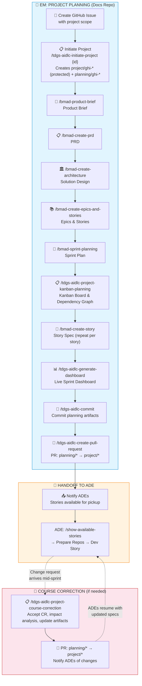

# Project Planning Workflow (Full BMAD)

> **Role:** Engineering Manager | **Reading path:** [EM Guide](em-guide.md) | **Previous:** [M&O Assignment](mo-assignment.md) | **Next:** [Ops Runbook Update](ops-runbook-update.md)

This guide covers the complete Full BMAD project planning workflow for `project` type issues: from Initiate Project through Story Specs, Dashboard Generation, and Handoff to ADEs.

> For M&O (feature/hotfix) issue assignment, see [M&O Assignment](mo-assignment.md).

---

## Assigning a Project

For larger initiatives that require full planning, the **EM completes all planning steps** before handing off to ADEs:

1. **Create and configure the GitHub Issue** with:
   - High-level project objectives and scope
   - Business justification
   - Key stakeholders and constraints
   - Acceptance criteria for the overall project
2. **Complete the Full BMAD planning workflow** — see the planning steps below for step-by-step instructions
3. **Notify ADEs that stories are available** — ADEs self-service from the pool:
   - **Issue ID** (e.g., `#42`)
   - **Project branch name** (e.g., `project/ghi-42-ovra-modernization`)
   - ADEs run `/tdgs-aidlc-show-available-stories` to discover and claim work

**Example message to ADEs after planning is complete:**
```
Project #42 planning is complete.
Branch: project/ghi-42-ovra-modernization
Story specs are in implementation-artifacts/.

Self-service pickup:
  1. /tdgs-aidlc-show-available-stories   ← see what's free
  2. /tdgs-aidlc-prepare-repos {story}    ← claim + create branches
  3. /bmad-dev-story → code-review → commit → PR

First ADE to push a dev/* branch claims the story.
See the Project Implementation guide for full steps.
```

> 💡 **No manual assignment needed**: ADEs use `/tdgs-aidlc-show-available-stories` to discover unclaimed, unblocked stories and claim them via `/tdgs-aidlc-prepare-repos`. Branch push is the atomic claim — first ADE to push wins. EM controls availability by managing which stories reach `ready-for-dev` status in `sprint-status.yaml`.

---

## Project Planning Workflow

For `project` type issues, the **EM completes all planning steps** before handing off implementation-ready story specs to ADEs. This section covers the end-to-end planning workflow that produces the artifacts ADEs need.

> 💡 **This section only applies to `project` type issues.** For `feature` and `hotfix` (M&O), ADEs handle the entire workflow themselves — see [M&O Assignment](mo-assignment.md).

### Planning Workflow Overview



### Session Boundaries & Progress Tracking

The planning workflow requires multiple chat sessions to stay within context limits. Use the checklist below to track progress and resume where you left off.

| # | Step | Command | Output Artifact (Check Exists) | Session |
|---|------|---------|-------------------------------|---------|
| 1 | Initiate Project | `/tdgs-aidlc-initiate-project` | `change-brief.md` + branches exist | A |
| 2 | Product Brief | `/bmad-product-brief` | `planning-artifacts/*brief*.md` | B |
| 3 | PRD | `/bmad-create-prd` | `planning-artifacts/*prd*.md` | C |
| 4 | Architecture | `/bmad-create-architecture` | `planning-artifacts/*architecture*.md` | D |
| 5 | Epics & Stories | `/bmad-create-epics-and-stories` | `planning-artifacts/*epic*.md` | E |
| 6 | Sprint Planning | `/bmad-sprint-planning` | `implementation-artifacts/sprint-status.yaml` | F |
| 7 | Kanban Planning | `/tdgs-aidlc-project-kanban-planning` | `implementation-artifacts/kanban-plan.md` + dashboard | G |
| 8 | Story Specs | `/bmad-create-story` (repeat) | `implementation-artifacts/story-spec-*.md` | H+ |
| 9 | Commit + PR | `/tdgs-aidlc-commit` + `/tdgs-aidlc-create-pull-request` | PR open: planning/* → project/* | any |

**Where you left off:** Check which output artifacts exist to determine your last completed step. Resume from the next step in a fresh chat.

**Why fresh chats?** Each BMAD planning skill loads the full knowledge-base and prior artifacts. Accumulated context from earlier steps would exceed practical limits, causing truncated output.

Steps 2-8 each benefit from a fresh session due to heavy KB loading.

### Prerequisites

Before starting the planning workflow:
- Be on **master branch** in the docs repository (up-to-date with origin)
- Have a clean working tree (no uncommitted changes)
- GitHub Issue exists with sufficient detail (project objectives, scope, acceptance criteria)
- `shared/` directory exists in the knowledge-base
- `.github/i2a-config.yml` configured with `issues.repository` and `worker_repos`

### Step 1: Initiate Project

> [Step 2 →](#step-2-product-brief)

#### Purpose
Creates a `project/ghi-*` **protected** integration branch and a `planning/ghi-*` working branch, scaffolds the project docs structure, and generates a change brief from a GitHub Issue. The EM works on the `planning/*` branch during planning — the `project/*` branch is protected and receives changes only via PR from `planning/*`.

#### Command
```
/tdgs-aidlc-initiate-project {issue_id}
```

**Examples:**
```
/tdgs-aidlc-initiate-project 42
/tdgs-aidlc-initiate-project #99
```

#### What Happens
1. ✅ **Load Configuration**: Reads `.github/i2a-config.yml` for issues repository and worker repos
2. ✅ **Pre-flight Checks**: Verifies master branch, clean tree, required docs exist
3. 🌿 **Create Integration Branch**: `project/ghi-{issue_id}-{slug}` from master (protected — no direct push)
4. 🌿 **Create Planning Branch**: `planning/ghi-{issue_id}-{slug}` from project branch
5. 📊 **Fetch GitHub Issue**: Gets issue body, comments, and metadata
6. 📎 **Fetch Attachments**: Downloads any user-uploaded files to `planning-artifacts/attachments/`
7. 📂 **Scaffold Docs Structure**: Ensures `planning-artifacts/` and `implementation-artifacts/` exist
8. 📄 **Generate Change Brief**: Creates `planning-artifacts/change-brief-{issue_id}.md`

> **Note:** The `project/*` branch is **protected** — no direct pushes allowed. You work on the `planning/*` branch during planning, then create a PR from `planning/*` → `project/*` when planning is complete. ADEs create their own `dev/*` branches from the project branch when they begin implementing stories.

#### Output Artifacts
- Integration branch: `project/ghi-{issue_id}-{slug}` (protected, created from master)
- Planning branch: `planning/ghi-{issue_id}-{slug}` (created from project branch)
- Change brief: `{docs}/planning-artifacts/change-brief-{issue_id}.md`
- Scaffolded directories: `planning-artifacts/`, `implementation-artifacts/`

#### Docs Folder Structure After Initiation
```
{docs}/
├── knowledge-base/               (existing — generated during setup)
├── planning-artifacts/           (for Full BMAD outputs)
│   ├── attachments/              (issue attachments)
│   ├── change-brief-{id}.md     (generated)
│   └── (Product Brief, PRD, Architecture, Epics, Sprint Plans go here)
├── implementation-artifacts/
│   └── (story specs will go here later)
└── project-context.md            (existing — generated during setup)
```

#### Edge Cases & Errors

| Error | Cause | Solution |
|-------|-------|----------|
| `Issues repository not configured` | Missing `issues.repository` in config | Update `.github/i2a-config.yml` |
| `Worker repositories not configured` | Missing `worker_repos` in config | Update `.github/i2a-config.yml` |
| `Issue not found` | Invalid issue ID or no access | Verify issue ID and repository |
| `Not on master branch` | Not on master | Switch to master: `git checkout master && git pull` |
| `Dirty tree` | Uncommitted changes | Commit or stash changes first |
| `Missing context docs` | `shared/` directory missing | Run documentation generation first |
| `Insufficient context` | Issue lacks detail | Update GitHub Issue with requirements |

> 🔄 **RECOMMENDED**: Open a **fresh Agent chat** before each planning step below.

> 💡 **Optional — Reference Sync**: If your workspace uses shared/common service repos that **cannot be symlinked** (due to network or permission constraints), run `/tdgs-aidlc-reference-sync` after Step 1 to sync their documentation via GitHub MCP. If your common repos ARE symlinked (the `common_repos` model), skip this — Document Project handles them automatically.

---

### Step 2: Product Brief

> [← Step 1](#step-1-initiate-project) | [Step 3 →](#step-3-create-prd)

Creates a product brief defining the project vision, goals, target users, and success metrics.

#### Command
```
/bmad-product-brief
```

Point the agent to your change brief as input:
```
/bmad-product-brief
Input: {docs}/planning-artifacts/change-brief-{issue_id}.md
```

#### What You'll Experience

1. **Intent Discovery** — The agent greets you and asks:
   - "What is this product/project about?"
   - "Do you have any existing documents, research, or brainstorming I should review?" (point it to the change brief and any attachments)
   - "Anything else to add before I dig in?"

2. **Contextual Discovery** — The agent analyzes your documents and does web research, then presents:
   - Key findings from your input documents
   - Surprises and gaps discovered
   - "Anything else you'd like to add, or shall we move on?"

3. **Guided Elicitation** — Conversational questioning (not a rote questionnaire) covering:
   - Vision & Problem
   - Users & Value
   - Market & Differentiation
   - Success & Scope
   - Pattern: "Based on your input, it sounds like [X]. Is that right?"

4. **Draft & Review** — Presents a draft brief with findings from three review lenses (Skeptic, Opportunity, Domain-Specific). Asks: "What do you think? Any changes?"

5. **Finalize** — Confirms completion and offers to create a detail pack (distillate) for PRD creation.

#### Your Actions
- Answer the elicitation questions based on your project knowledge
- Review the draft and request revisions if needed
- Confirm completion when satisfied
- Say "yes" to the distillate offer — it provides valuable context for the PRD step

#### Output
- **File:** `{docs}/planning-artifacts/product-brief-{project-name}.md`
- **Optional:** `{docs}/planning-artifacts/product-brief-{project-name}-distillate.md` (detail pack with rejected ideas, scope signals, competitive intel)

#### Next Step
Open a **fresh Agent chat** → proceed to Step 3.

---

### Step 3: Create PRD

> [← Step 2](#step-2-product-brief) | [Step 4 →](#step-4-create-architecture)

Creates a detailed Product Requirements Document from the product brief.

#### Command
```
/bmad-create-prd
```

#### What You'll Experience

The PRD uses a **step-file architecture** — you progress through multiple steps with menus and approval gates:

1. **Initialize** — Agent loads the product brief (and distillate if available), greets you, and presents the first step menu
2. **Step-by-Step Building** — Each step presents options or asks for input. The document grows incrementally as you progress. Press `C` (Continue) at each menu to advance.
3. **Approval Gates** — At certain points the agent asks for your confirmation before proceeding to the next section
4. **Iterative Refinement** — You can provide corrections or additional detail at any step

#### Your Actions
- Point the agent to the product brief: `planning-artifacts/product-brief-{project-name}.md`
- Press `C` to continue through each step menu
- Provide input when the agent asks clarifying questions
- Review each section as it's built and confirm before advancing
- The workflow maintains state via frontmatter (`stepsCompleted` array), so if interrupted you can resume

#### Output
- **File:** `{docs}/planning-artifacts/prd.md`

#### Next Step
Open a **fresh Agent chat** → proceed to Step 4.

---

### Step 4: Create Architecture

> [← Step 3](#step-3-create-prd) | [Step 5 →](#step-5-create-epics-and-stories)

Creates architecture and solution design decisions based on the PRD.

#### Command
```
/bmad-create-architecture
```

#### What You'll Experience

1. **Document Discovery** — Agent searches for input documents (PRD, UX, research) and presents what it found:
   - "I found these documents: [list]. Do you have any others you'd like me to include?"
   - Validates PRD exists (required input)
   - Menu: `[C] Continue to project context analysis`

2. **Collaborative Design** — Architecture is treated as a **peer discussion**, not a generated report. The agent asks about:
   - Technical stack preferences and constraints
   - Code structure and patterns
   - API design decisions
   - Database schema approaches
   - Security requirements
   - Performance patterns
   - Testing standards
   - Integration patterns

3. **Step-by-Step Decisions** — Each architectural concern is addressed with your input and the agent's recommendations

#### Your Actions
- Confirm discovered documents or point to additional ones
- Press `C` to continue through steps
- Provide your technical decisions and constraints when asked
- This is where your **domain expertise** matters most — the agent proposes, you decide
- Review each architecture decision for correctness

#### Output
- **File:** `{docs}/planning-artifacts/architecture.md`

#### Next Step
Open a **fresh Agent chat** → proceed to Step 5.

---

### Step 5: Create Epics and Stories

> [← Step 4](#step-4-create-architecture) | [Step 6 →](#step-6-sprint-planning)

Breaks down the PRD and architecture into epics and user stories.

#### Command
```
/bmad-create-epics-and-stories
```

#### What You'll Experience

1. **Prerequisite Validation** — Agent searches for PRD, Architecture, and optionally UX documents. Then extracts and presents:
   - Functional Requirements (FRs) count and examples
   - Non-Functional Requirements (NFRs) count
   - Architecture-derived requirements
   - UX requirements (if UX document exists)
   - Asks: "Do these extracted requirements accurately represent what needs to be built? Any additions or corrections?"

2. **Epic Design** — Agent proposes an epic structure based on extracted requirements. You review and confirm the organization.

3. **Story Creation** — For each epic, agent creates user stories with:
   - User story statement (As a... I want... So that...)
   - Acceptance criteria (BDD-formatted)
   - Technical requirements
   - Dependencies between stories

#### Your Actions
- Confirm the extracted requirements are complete (or add missing ones)
- Press `C` to continue once requirements are verified
- Review the proposed epic structure — suggest reordering or regrouping if needed
- Review stories within each epic for scope and completeness
- Pay attention to dependency chains — these drive parallelism later

#### Output
- **File:** `{docs}/planning-artifacts/epics.md`

#### Next Step
Open a **fresh Agent chat** → proceed to Step 6.

---

### Step 6: Sprint Planning

> [← Step 5](#step-5-create-epics-and-stories) | [Step 7 →](#step-7-kanban-planning)

Organizes stories into sprints based on dependencies, capacity, and priority. Generates the tracking file used by the self-service story pickup system.

#### Command
```
/bmad-sprint-planning
```

#### What You'll Experience

This step is largely **automated** with minimal interaction:

1. **Configuration Loading** — Agent reads config and locates the epics file
2. **Parsing** — "Parsing epic files and extracting all work items..."
3. **Status Detection** — Automatically detects which stories already have spec files (marks them `ready-for-dev`)
4. **Validation** — Reports:
   - All epics appear in sprint-status ✓/✗
   - All stories appear in sprint-status ✓/✗
   - No orphaned items ✓/✗
   - Valid status values ✓/✗
5. **Completion Summary** — Total Epics, Total Stories, Epics In Progress, Stories Completed

#### Your Actions
- Minimal — mostly confirm the output looks correct
- Review the generated `sprint-status.yaml` for accuracy
- Verify dependency/parallelism notes match your expectations (these drive `show-available-stories` blocking)
- Add the `dependencies` section if the agent didn't auto-generate it (required for self-service blocking)

#### Output
- **File:** `{docs}/implementation-artifacts/sprint-status.yaml`

#### Next Step
Open a **fresh Agent chat** → proceed to Step 7.

---

### Step 7: Kanban Planning

> [← Step 6](#step-6-sprint-planning) | [Step 8 →](#step-8-create-story-specs)

Creates a kanban board with a dependency graph, T-shirt sizing, prioritization, and Harvey ball status indicators based on your ADE team size or target completion date.

#### Command
```
/tdgs-aidlc-project-kanban-planning
```

To update plan parameters later (team size, hours/day, target date) without re-running prerequisite checks:
```
/tdgs-aidlc-project-kanban-planning update
```

#### What You'll Experience

1. **Capacity Planning** — Agent asks how you want to plan capacity:
   - **Option 1: Specify team size** — provide ADE count, plan calculates completion date
   - **Option 2: Specify target date** — provide target date, plan calculates minimum ADEs needed
2. **Dependency Analysis** — Analyzes story dependencies from the sprint plan and epics
3. **T-Shirt Sizing** — Each story gets a complexity-based T-shirt size (XS/S/M/L/XL) with estimated hours
4. **Kanban Board Generation** — Creates a visual board with:
   - Dependency graph showing story relationships and blocking chains
   - Prioritized story ordering optimized for your ADE count
   - Harvey ball status indicators for progress tracking
   - Parallel work lanes based on available ADEs
   - Story spec creation time factored into the total overhead

#### Your Actions
- Choose capacity planning mode (team size or target date)
- Provide ADE count or target completion date
- Review the dependency graph for accuracy
- Confirm prioritization ordering
- Verify parallel work assignments make sense for your team

#### Output
- **File:** `{docs}/implementation-artifacts/kanban-plan.md`
- **File:** `{docs}/implementation-artifacts/dashboard.md`
- **File:** `{docs}/implementation-artifacts/sprint-metrics.md`
- **File:** `{docs}/implementation-artifacts/sprint-dashboard.html`

#### Updating Later

Run `/tdgs-aidlc-project-kanban-planning update` anytime to change parameters (team size, hours/day, contingency, or target date) and regenerate all artifacts. You can also say "change team size" or "update kanban parameters" to trigger the update mode.

#### Next Step
Open a **fresh Agent chat** → proceed to Step 8.

---

### Step 8: Create Story Specs

> [← Step 7](#step-7-kanban-planning) | [Step 9 →](#step-9-commit-and-hand-off-to-ade)

Creates a dedicated, implementation-ready story spec file with all the context an AI agent needs to implement it. **Repeat this step for each story** in the current sprint before handing off to ADEs.

#### Command
```
/bmad-create-story
```

Specify which story to create:
```
/bmad-create-story
Create story [story-identifier] from sprint plan
```

#### What You'll Experience

1. **Story Selection** — If you don't specify a story:
   - Agent presents options: provide epic-story number (e.g., `1-2`), or auto-discover first backlog story
   - Auto-discovery uses `sprint-status.yaml` to find the next `backlog` story

2. **Exhaustive Analysis** (mostly automated, minimal interaction):
   - Loads ALL core artifacts (epics, PRD, architecture, UX, project context)
   - Analyzes previous story (if not first) for learnings and patterns
   - Git intelligence: analyzes recent commits for conventions
   - Web research: researches latest library/framework versions mentioned
   - Architecture analysis: extracts story-relevant guardrails

3. **Story Output** — Presents the comprehensive story file with:
   - Story header and metadata
   - Foundation (user story statement, acceptance criteria)
   - Developer Context: technical requirements, architecture compliance, file structure, testing requirements, previous story intelligence

4. **Completion** — Updates `sprint-status.yaml` from `backlog` → `ready-for-dev`

#### Your Actions
- Specify which story to create (or let it auto-discover the next one)
- Let the analysis run (it parallelizes independent analyses)
- Review the generated story spec for accuracy — especially:
  - Acceptance criteria match your intent
  - Technical requirements align with architecture decisions
  - Dependencies are correctly noted
- Repeat for each story in the sprint

#### Output
- **File:** `{docs}/implementation-artifacts/{epic}-{story}-{slug}.md`
- **Updated:** `sprint-status.yaml` (story status → `ready-for-dev`)

> 💡 **Tip:** Create all story specs for the current sprint before handing off. This allows ADEs to self-service from the full pool using `/tdgs-aidlc-show-available-stories`.

#### Next Step
Proceed to Step 8.1.

---

#### 8.1: Generate Sprint Dashboard

Generates a live HTML dashboard that auto-refreshes every 5 seconds, visualizing sprint-status.yaml with KPIs, donut charts, Harvey ball quality metrics, blocker cards, critical path, and velocity tracking.

#### Command
```
/tdgs-aidlc-generate-dashboard
```

#### What You'll Experience

1. **Discovery** — Agent finds your epics file and parses project structure
2. **Metadata Extraction** — Pulls milestones, risks, complexity, and critical path from kanban-plan.md
3. **Template Generation** — Injects project-specific data into the dashboard template
4. **Output** — Writes `sprint-dashboard.html` to your implementation-artifacts directory

#### Your Actions
- Confirm ADE count if prompted
- Review the generated dashboard in a browser

#### Viewing the Dashboard
```bash
cd {docs}/implementation-artifacts
python3 -m http.server 8080
# Open: http://localhost:8080/sprint-dashboard.html
```

#### Output
- **File:** `{docs}/implementation-artifacts/sprint-dashboard.html`

The dashboard reads `sprint-status.yaml` and `sprint-metrics.md` live — you do **not** need to regenerate it when story statuses change. Only regenerate after adding/removing epics or updating the kanban plan structure.

#### Sprint Dashboard Maintenance Commands

The following commands are available for ongoing sprint dashboard maintenance during the sprint:

| Command | Description |
|---------|-------------|
| `/tdgs-aidlc-update-metrics` | Update `sprint-status.yaml` with timing and Harvey ball metrics after story status changes |
| `/tdgs-aidlc-manage-blockers` | Add, resolve, or update blockers in `sprint-status.yaml` |
| `/tdgs-aidlc-metrics-report` | Generate a markdown metrics summary report |

These commands keep `sprint-status.yaml` and `sprint-metrics.md` current so the live dashboard reflects accurate progress.

#### Next Step
Proceed to Step 9.

---

### Step 9: Commit and Hand Off to ADE

> [← Step 8](#step-8-create-story-specs) | [Step 10 →](#step-10-project-course-correction)

After completing all planning artifacts and story specs:

1. **Commit all planning artifacts** (you are on the `planning/*` branch):
   ```
   /tdgs-aidlc-commit
   ```

2. **Push to origin:**
   ```bash
   git push origin planning/ghi-{issue_id}-{slug}
   ```

3. **Create PR from planning to project:**
   ```
   /tdgs-aidlc-create-pull-request
   ```
   This creates a PR from `planning/ghi-{issue_id}-{slug}` → `project/ghi-{issue_id}-{slug}`.
   Review and merge the PR to make planning artifacts available on the protected project branch.

4. **Notify ADEs** that stories are available for self-service pickup:
   - **Issue ID** (e.g., `#42`)
   - **Project branch name** (e.g., `project/ghi-42-ovra-modernization`)

**Example message to ADEs:**
```
Project #42 planning is complete.
Branch: project/ghi-42-ovra-modernization
Story specs are in implementation-artifacts/.

Self-service pickup:
  1. /tdgs-aidlc-show-available-stories   ← see what's free
  2. /tdgs-aidlc-prepare-repos {story}    ← claim + create branches
  3. /bmad-dev-story → code-review → commit → PR

First ADE to push a dev/* branch claims the story.
See the Project Implementation guide for full steps.
```

### What the EM Delivers to ADEs

| Artifact | Location | Purpose |
|----------|----------|---------|
| Integration branch (protected) | `project/ghi-{id}-{slug}` | Target for ADE dev branch PRs |
| Change brief | `planning-artifacts/change-brief-{id}.md` | Issue context |
| Product brief | `planning-artifacts/product-brief-{project-name}.md` | Vision and goals |
| PRD | `planning-artifacts/prd.md` | Requirements |
| Architecture | `planning-artifacts/architecture.md` | Technical design |
| Epics & stories | `planning-artifacts/epics.md` | Work breakdown |
| Sprint status | `implementation-artifacts/sprint-status.yaml` | Sprint assignments |
| Story specs | `implementation-artifacts/{epic}-{story}-{slug}.md` | Implementation-ready specs |
| Kanban plan | `implementation-artifacts/kanban-plan.md` | Dependency graph, prioritization, Harvey ball status |
| Dashboard summary | `implementation-artifacts/dashboard.md` | Markdown dashboard overview |
| Sprint metrics | `implementation-artifacts/sprint-metrics.md` | Sprint metrics data for dashboard |
| Sprint dashboard | `implementation-artifacts/sprint-dashboard.html` | Live auto-refreshing HTML dashboard with KPIs and metrics |

> After handoff, ADEs follow the [Project Implementation Steps](project-implementation.md) to implement each story.

### Planning Checklist

- [ ] Created GitHub Issue with project scope and acceptance criteria
- [ ] Ran `/tdgs-aidlc-initiate-project {id}` — project branch (protected) + planning branch created
- [ ] Ran `/bmad-product-brief` — product brief created
- [ ] Ran `/bmad-create-prd` — PRD created
- [ ] Ran `/bmad-create-architecture` — architecture created
- [ ] Ran `/bmad-create-epics-and-stories` — epics and stories defined
- [ ] Ran `/bmad-sprint-planning` — sprint plan created
- [ ] Ran `/tdgs-aidlc-project-kanban-planning` — kanban plan with dependency graph created
- [ ] Ran `/bmad-create-story` (per story) — story specs created
- [ ] Ran `/tdgs-aidlc-generate-dashboard` — live sprint dashboard HTML generated
- [ ] Committed all planning artifacts on `planning/*` branch
- [ ] Created PR from `planning/*` → `project/*` and merged
- [ ] Notified ADE(s) with issue ID, branch, and story spec locations

---

### Step 10: Project Course Correction

> [← Step 9](#step-9-commit-and-hand-off-to-ade)

When change requests arrive **after planning is complete and development is underway**, use the Project Course Correction workflow to assess impact, update planning artifacts, and notify ADEs — all without disrupting in-flight work unnecessarily.

#### When to Trigger

Run this workflow when:
- A stakeholder submits a change request (new requirement, scope change, or design revision)
- A technical limitation is discovered during implementation that requires re-planning
- Business priorities shift and stories need to be added, modified, or removed
- An external dependency changes that affects the current sprint

> ⚠️ **IMPORTANT:** This workflow is for changes **during active development**. If planning has not yet been handed off to ADEs, simply update the planning artifacts directly on the `planning/*` branch — no course correction workflow needed.

#### Command

```
/tdgs-aidlc-project-course-correction {issue_id} {source}
```

Where `{issue_id}` is your project's GitHub Issue ID (the same one used with `/tdgs-aidlc-initiate-project`) and `{source}` is where the change details live:

| Source | Syntax | Use When |
|--------|--------|----------|
| Issue comment | `comment` | Change request was posted as a comment on the project issue |
| Sub-issue | `sub-issue:456` | A separate sub-issue describes the change |
| Local document | `document:{path}` | Change details are in a file (PDF, markdown, etc.) |
| External URL | `url:{url}` | Change details are on a Confluence page or shared doc |
| Inline | `inline` | You'll describe the change directly in chat |

**Examples:**
```
/tdgs-aidlc-project-course-correction 42 comment
/tdgs-aidlc-project-course-correction #42 sub-issue:456
/tdgs-aidlc-project-course-correction 42 document:planning-artifacts/attachments/cr-payment-rules.pdf
/tdgs-aidlc-project-course-correction 42 inline
```

#### What You'll Experience

The workflow has three phases:

**Phase 1 — AIDLC Pre-Processing** (automated):
1. Pre-flight checks (branch, clean tree, planning artifacts)
2. Fetches change request details from your specified source
3. Generates a CR Brief document (`planning-artifacts/cr-brief-{issue_id}-{seq}.md`)
4. Ensures you're on the `planning/*` branch (recreates it from `project/*` if previously merged)

**Phase 2 — BMAD Impact Analysis** (interactive):

The prompt delegates to BMAD's `bmad-correct-course` skill, which runs an interactive 6-step process:
1. **Initialize** — loads PRD, Epics, Architecture, and your Change Request Brief
2. **Change Analysis Checklist** — you work through a systematic checklist covering trigger understanding, epic impact assessment, artifact conflicts, and path-forward evaluation
3. **Draft Change Proposals** — the agent drafts specific old → new changes per artifact for your review
4. **Sprint Change Proposal** — generates a comprehensive proposal document
5. **EM Approval Gate** — you approve, defer, or reject the change
6. **Workflow Completion** — summarizes proposed changes for hand-off to Phase 3

**Phase 3 — AIDLC Post-Processing** (on approval):
1. Applies planning artifact changes (PRD, Architecture, Epics) from the Sprint Change Proposal
2. Applies story-level changes based on status (see rules below)
3. Refreshes kanban plan, dashboard, and sprint metrics
4. Generates an ADE notification template you can copy-paste to the team
5. Commits all changes and creates a PR from `planning/*` → `project/*`

#### Story Status Rules

> **Done stories are immutable.** A completed story is never reopened. If a change affects a done story, a new follow-up story is created with only the delta.

| Story Status | What Happens |
|---|---|
| **done** | A new follow-up story is created (e.g., `1-4a`) describing only the delta. The original story and its merged code stay untouched. |
| **in-progress** | A `## Course Correction CR-{seq}` section is appended to the spec with delta instructions. The ADE reviews and incorporates the changes. |
| **review** | Same as in-progress — the ADE must incorporate changes before PR approval. |
| **ready-for-dev** | The spec is modified directly since no work has started. |
| **backlog** | The story is updated, rescoped, or removed as needed. |

#### Output

- **Sprint Change Proposal:** `planning-artifacts/sprint-change-proposal-{date}.md`
- **CR Brief:** `planning-artifacts/cr-brief-{issue_id}-{seq}.md`
- **Updated artifacts:** epics, sprint-status, kanban plan, dashboard, metrics, affected story specs
- **PR:** `planning/*` → `project/*` with full change summary
- **ADE notification:** A copy-paste template listing all affected stories and required actions

#### Your Actions

1. Provide the change source when running the command
2. Work through the BMAD impact analysis checklist interactively
3. Review and approve the Sprint Change Proposal
4. Review the PR and merge when satisfied
5. Copy-paste the ADE notification to the team channel

#### Course Correction Checklist

- [ ] Ran `/tdgs-aidlc-project-course-correction {id} {source}`
- [ ] Completed BMAD impact analysis checklist
- [ ] Approved Sprint Change Proposal
- [ ] Reviewed and merged the PR (planning/* → project/*)
- [ ] Notified ADEs using the generated notification template
- [ ] Verified ADEs acknowledged affected stories

---
