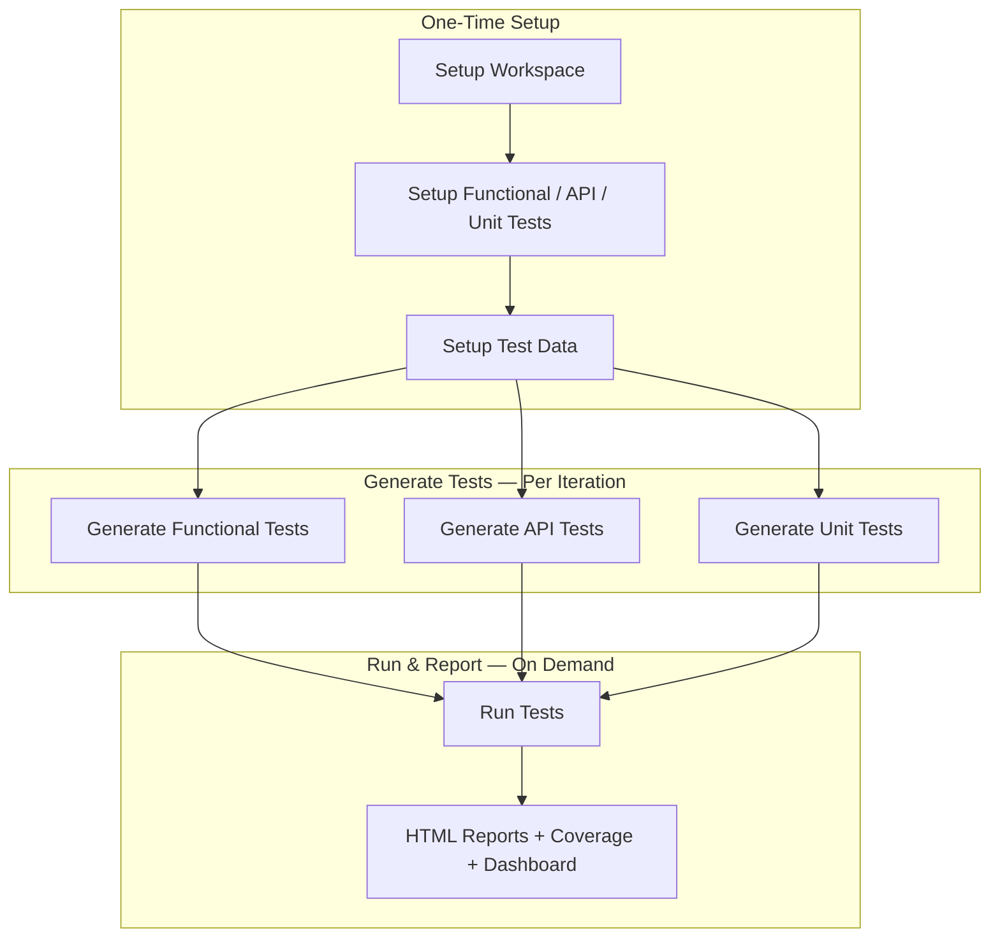
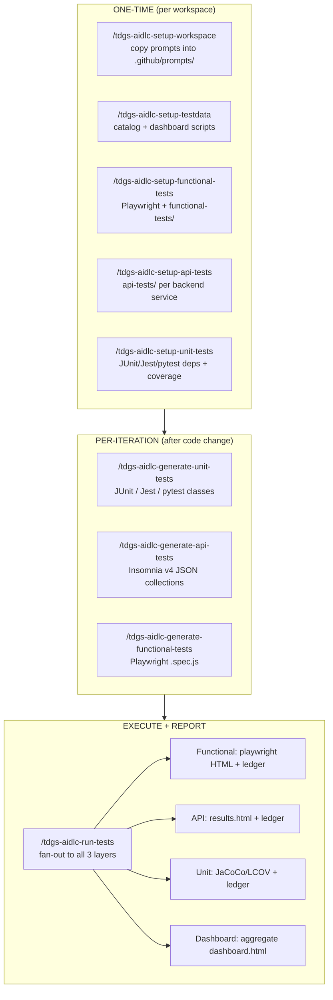

# Test Management User Guide

> **Role:** Both | **Reading path:** [EM Guide](em-guide.md) or [ADE Guide](ade-guide.md) | **Previous:** [Post-Deployment](post-deployment.md) (EM) / [Project Implementation](project-implementation.md) (ADE) | **Next:** [Reference](reference.md)

Comprehensive reference for automated test management across any multi-repository workspace. Covers **functional** (Playwright), **API** (Insomnia-format + Node runner), and **unit** (JUnit 5 / Jest / pytest) test layers — including prerequisites, prompts, coverage targets, and report generation. Application-agnostic — prompts auto-detect repos and stacks; OVRA examples are for illustration only.

## Workflow at a Glance



| Phase | Trigger | Prompts | Deliverables |
|-------|---------|---------|--------------|
| **Setup** | New workspace or new test layer | `setup-workspace` → `setup-functional-tests` · `setup-api-tests` · `setup-unit-tests` → `setup-testdata` | Playwright config, axios runner, Jest/JUnit scaffold, test-data-catalog.yaml, identity pools |
| **Generate** | Code changes, new endpoints, coverage gaps | `generate-functional-tests` · `generate-api-tests` · `generate-unit-tests` | Positive, negative-validation, negative-business-rule, boundary, and edge-case specs |
| **Run** | PR gate, regression cycle, audit | `run-tests` | Per-layer HTML reports, JaCoCo/Istanbul coverage, aggregated workspace dashboard |

### Sections at a Glance

| Section | Description |
|---------|-------------|
| [What You Get](#what-you-get) | Framework capabilities overview |
| [Key Constants & Conventions](#key-constants--conventions) | Default values and configuration |
| [The Pipeline](#the-pipeline) | Three-verb lifecycle diagram |
| [Quick Start](#quick-start) | Entry-point cheatsheets |
| [One-Time Setup Prompts](#one-time-setup-prompts) | Steps 1–4: scaffold each test layer |
| [Per-Iteration Prompts](#per-iteration-prompts) | Steps 1–4: generate tests + run |
| [Test Categorization & Slicing](#test-categorization--slicing) | Three-axis tag taxonomy |
| [Running Tests by Slice](#running-tests-by-slice--master-command-matrix) | Command matrix + CI lifecycle |
| [Test Data Catalog & Workspace Dashboard](#test-data-catalog--workspace-dashboard) | Catalog YAML + dashboard HTML |
| [Skip vs Fail](#skip-vs-fail--defect-classification) | Seven-status defect classification |
| [Reports & Where to Find Them](#reports--where-to-find-them) | Report locations per layer |
| [Issue-Scoped Testing (Quick-Dev)](#issue-scoped-testing-quick-dev) | Single-issue test generation |
| [Operational Rules & Gotchas](#operational-rules--gotchas) | 15 framework rules |
| [Directory Layout](#directory-layout) | Full workspace tree reference |
| [Reference: OVRA Project Results](#reference-ovra-project-results) | Example inventory & metrics |

---

### Quick-Ref: Prerequisites

> 🔔 **ONE-TIME:** The framework prompts install everything they need on first run. The tables below are reference only — you should not pre-install anything except VS Code, GitHub Copilot, Node.js, and Git.

#### Global Prerequisites

| Requirement | Version | Verify | Notes |
|---|---|---|---|
| **Node.js** | v18+ (LTS) | `node --version` | Required by Playwright + API runner |
| **npm** | 9.x+ | `npm --version` | Comes with Node |
| **Git** | 2.x+ | `git --version` | — |
| **VS Code** | Latest | — | With GitHub Copilot extension |
| **GitHub Copilot** | Latest | VS Code Extensions panel | Required for prompt execution |

#### Stack-Specific Prerequisites (Auto-Detected)

| Stack | Test Framework | Coverage Tool | Build Tool |
|---|---|---|---|
| **React / JS / TS** | Jest + React Testing Library | Istanbul (Jest coverage) | npm |
| **Java / Spring Boot** | JUnit 5 + Mockito | JaCoCo | Maven / Gradle |
| **Node.js (backend)** | Jest / Vitest | Istanbul / V8 | npm |
| **Python** | pytest + pytest-cov | coverage.py | pip / poetry |
| **Playwright (functional)** | Playwright Test | Business-rule coverage | npx |
| **API tests** | Node + axios (Insomnia v4 collection format) | Endpoint + variant coverage | npm |

---

### Quick-Ref: Test Report Locations

| Layer | Standalone HTML Summary | Native Tool Report | Markdown Summary |
|---|---|---|---|
| **Functional (Playwright)** | `{ui-repo}/functional-tests/test-results/test-summary.html` | `{ui-repo}/functional-tests/test-results/html-report/index.html` | `{ui-repo}/functional-tests/test-results/test-report.md` |
| **Unit (Java)** | `{java-repo}/test-results/test-summary.html` | `{java-repo}/target/site/jacoco/index.html` + `target/site/surefire-report.html` | `{java-repo}/test-results/test-report.md` |
| **Unit (JS/React)** | `{ui-repo}/test-results/test-summary.html` | `{ui-repo}/coverage/lcov-report/index.html` | `{ui-repo}/test-results/test-report.md` |
| **Unit (Python)** | `{python-repo}/test-results/test-summary.html` | `{python-repo}/htmlcov/index.html` | `{python-repo}/test-results/test-report.md` |
| **API** | `{service-repo}/api-tests/test-results/test-summary.html` | `{service-repo}/api-tests/test-results/results.json` | `{service-repo}/api-tests/test-results/test-report.md` |
| **Workspace dashboard** | `{docs-repo}/test-data/dashboard.html` (aggregates all services + UI) | — | — |

---

## What You Get

The framework wraps three test layers (functional / API / unit) behind a single set of `/tdgs-aidlc-*` prompts. Each capability below is delivered as scaffold + generator + runner output that you can re-run safely.

| Capability | Benefit | Delivered by |
|---|---|---|
| **3 test layers, one toolchain** | Functional (Playwright), API (Insomnia-format JSON + Node runner), Unit (JUnit 5 / Jest / pytest / xUnit). Single mental model across services. | `/tdgs-aidlc-setup-*` + `/tdgs-aidlc-generate-*` |
| **Test data catalog** | One YAML catalog of identity pools, payment cards, cross-service stubs. PII never lives in code or fixtures. | `/tdgs-aidlc-setup-testdata` |
| **Skip ≠ fail classification** | Tests that cannot run (data gap, infra down, contract drift) emit `skip` with reason — they do NOT inflate the failure count. | Runners + dashboard |
| **Workspace dashboard** | Aggregate pass-rate, coverage, run history, catalog-gap loop across every service + UI in one HTML page. | `/tdgs-aidlc-setup-testdata` + posttest hooks |
| **Idempotent re-runs** | Every prompt is safe to re-run; setup detects existing config and skips, generators append/update without losing manual edits. | All prompts |
| **Issue-scoped generation** | Quick-Dev workflow generates tests for a single GitHub issue without scanning the whole workspace. | `/bmad-quick-dev` (BMAD) + auto-scaffold hooks |
| **Slice-aware execution** | One tag taxonomy (`@smoke` / `@regression` / `@external-integration`) flows from generation → runners → dashboard → orchestrator (`--type=<slice>`). | All 8 prompts |
| **Mock + Real modes** | Functional and API both support a mocked dependency mode (default — fast, deterministic) and a real-integration mode that hits live external systems. | Mode-aware fixtures + `TEST_MODE` env |
| **Deterministic replay** | Set `RUN_SEED=<n>` and identical seed reproduces identical pass/fail/skip across runs (seeded PRNG for catalog picks, single worker, quarantine reset). | UI fixtures + service runners |

---

## Key Constants & Conventions

These values are wired into every scaffold and prompt. Override them at generation time; do not edit the scaffold by hand.

| Constant | Default | Where it lives | Override |
|---|---|---|---|
| **Coverage target** | 80% (line + branch) | `coverage.json` (per scaffold) + JaCoCo `<minimum>` + Jest `coverageThreshold` | Prompt parameter (e.g., `/tdgs-aidlc-generate-unit-tests 90`) |
| **Per-test timeout (max cap)** | 60_000 ms (flat — mock + real) | `playwright.config.js` `timeout` + axios client in API runner | Per-test `test.setTimeout()` (functional) |
| **Action / nav / expect timeouts** | 10_000 / 15_000 / 5_000 ms | `playwright.config.js` | Per-call override |

> ℹ️ **Timeout behavior:** 60 s is a safety cap, not a wait. Actions resolve immediately on match (typically 1–3 s); the cap only fires if something is genuinely stuck.
| **Quarantine threshold** | 5 consecutive failures → identity record auto-quarantined | `test-data-catalog.yaml` per-pool config | YAML edit |
| **Pass-rate formula** | `passed / (passed + failed + dataIssue + infra)` — only `skipped`, `contract`, `quarantine` excluded from denominator | Per-layer report generator | n/a |
| **Environments** | `local` (8080/8081/8082) · `test` · `stage` — **no `prod`/`production`** | `environments/*.json` (API) · `config/environments.js` (functional) | Add files; prod is explicitly forbidden |
| **Persisted coverage** | Functional: `functional-tests/test-results/coverage.json` · API: `api-tests/test-results/results.json` · Unit Java: `target/site/jacoco/jacoco.csv` · Unit JS: `coverage/coverage-summary.json` | Native tool outputs | n/a |
| **Run ledger** | `{docs-repo}/test-data/ledger.yaml` (append-only, fingerprint-deduped) | `generate-workspace-dashboard.js` | n/a |
| **Mode flag** | `TEST_MODE=mock` (default) \| `TEST_MODE=real` | env var read by every layer | Set per command |
| **Determinism seed** | Unset (random) \| `RUN_SEED=<int>` (replay) | env var → workers:1, seeded PRNG, quarantine reset | Set per command |

> 🔔 **ONE-TIME:** Every command shown in this guide is **idempotent**. Setup prompts detect existing scaffolds and skip; generators reconcile against current source without overwriting your edits; runners append to the ledger without rewriting prior runs. Re-running is the recommended way to re-sync after a code change.

> 💡 **Resuming interrupted prompts:** If a prompt stops mid-way (token limit, network drop), type **"continue"** in Copilot Chat — it picks up where it left off. For any follow-up adjustments, simply describe what you need in the same chat (e.g., *"increase coverage to 80%"*, *"add negative tests for the payment form"*, *"fix the dependency install error"*) and the prompt will handle it.

---

## The Pipeline

Three verbs, three jobs — read top-to-bottom for the lifecycle.



> 💡 **Tip:** The "three verbs" rule — `setup` scaffolds, `generate` writes tests, `run-tests` executes — applies to every layer. If a prompt seems to do something outside its verb, that is a bug in the prompt, not a feature.

---

## Quick Start

Pick the cheatsheet that matches your starting point.

### First-Time Setup (Fresh Workspace)

```bash
# Open the workspace folder in VS Code (NOT a child folder), then in Copilot Chat:
/tdgs-aidlc-setup-workspace
/tdgs-aidlc-setup-testdata
/tdgs-aidlc-setup-functional-tests
/tdgs-aidlc-setup-api-tests
/tdgs-aidlc-setup-unit-tests

# Generate (will scan, confirm repos, ask for coverage target — default 80%):
# ⚠️  PREREQUISITE: /tdgs-aidlc-setup-testdata must be run BEFORE generate-api-tests
#     and generate-functional-tests (they require the test-data catalog)
/tdgs-aidlc-generate-unit-tests
/tdgs-aidlc-generate-api-tests              # requires test-data-catalog.yaml
/tdgs-aidlc-generate-functional-tests       # requires test-data-catalog.yaml

# Run everything:
/tdgs-aidlc-run-tests
```

### After Code Changes (Re-Sync Existing Scaffold)

```bash
# Regenerate only the layers touched by your change:
/tdgs-aidlc-generate-unit-tests           # any backend or React change
/tdgs-aidlc-generate-api-tests            # backend endpoint / DTO change
/tdgs-aidlc-generate-functional-tests     # UI route / form / flow change

# Then run:
/tdgs-aidlc-run-tests
```

### Re-Run by Slice (No Regeneration)

```bash
# PR gate — fast smoke across every layer
/tdgs-aidlc-run-tests --type=smoke

# Nightly — full regression
/tdgs-aidlc-run-tests --type=regression

# Pre-release — only the tests that hit live external systems
/tdgs-aidlc-run-tests --type=external-integration       # real-mode only

# Single workflow (functional layer, all slices)
cd {ui-repo} && npx playwright test --grep "order-birth-certificate"
```

> 💡 **Tip:** `--type=` is **optional**. Without it, `run-tests` behaves exactly as before (runs everything in each layer). With it, the orchestrator appends `--grep @{type}` (functional), `--tag {type}` (API), and `-Dgroups={type}` (Java unit) and routes the result through the same reports.

> ℹ️ **Note:** `--type=external-integration` is **real-mode only**. The orchestrator will STOP and re-ask if `TEST_MODE` is `mock` or unset. It also skips the unit layer because Java's `@Tag("integration")` (Testcontainers / `@DataJpaTest`) is an internal-integration concept — different from the cross-system `@external-integration` tier used in functional / API.

---

## One-Time Setup Prompts

Each `/tdgs-aidlc-setup-*` prompt is idempotent: re-running re-validates the scaffold and reports any drift. None of them generate tests.

### Step 1: `/tdgs-aidlc-setup-functional-tests`

> [Step 2 →](#step-2-tdgs-aidlc-setup-api-tests)

**Target repo:** the detected UI repo (one only).

**What you get:**

| Artifact | Purpose |
|---|---|
| `playwright.config.js` | Multi-browser projects (chromium / visual / i18n-es), `fullyParallel:false` for determinism, `retain-on-failure` for trace/video, `webServer` block (omitted when `TEST_BASE_URL` is set). |
| `functional-tests/support/fixtures/` | Auth, network-mock, catalog (persona-aware record picker), with seeded `mulberry32` PRNG when `RUN_SEED` is set. |
| `functional-tests/support/helpers/` | `flow-runner.js` (13 step kinds), `react-select-helper.js` (4-strategy locator + Enter-key commit + singleValue verify), `date-picker-helper.js`, `wizard-helper.js`, `api-mock.js` (mode-aware mock/real), `network-capture.js`, `notification-verifier.js`, `a11y-audit.js`. |
| `functional-tests/support/factories/` | `registrant`, `payment`, `recipient`, `invalid-data` — PII from catalog only; addresses use Faker. |
| `functional-tests/tests/e2e/{positive,negative,edge-case}/` | Empty folders ready for generated specs. |
| `functional-tests/tests/flows/` | `flow-descriptor.schema.json` (validates flow JSON), one `.flow.json` per workflow. |
| `functional-tests/scripts/` | `generate-report.js` (parses Playwright JSON → standalone HTML + Markdown), `verify-failure-artifacts.js`. |

**npm scripts wired into the UI repo `package.json`:**

| Script | Command | When to use |
|---|---|---|
| `test:e2e` | `npx playwright test` | Full functional suite (all slices, mock mode) |
| `test:e2e:smoke` | `npx playwright test --grep @smoke` | PR gate (~2 specs / 10 tests on OVRA) |
| `test:e2e:regression` | `cross-env TEST_MODE=mock npx playwright test --grep @regression` | Nightly / pre-release full regression |
| `test:e2e:external-integration` | `cross-env TEST_MODE=real npx playwright test --grep @external-integration` | Real-mode integration; hits live externals |
| `test:e2e:headed` | `npx playwright test --headed` | Debug with visible browser |
| `test:e2e:debug` | `npx playwright test --debug` | Step through with Playwright Inspector |
| `test:e2e:report` | `npx playwright show-report` | Open the interactive HTML report |
| `posttest` | `node ../{docs-repo}/test-data/scripts/generate-workspace-dashboard.js` | Refreshes the cross-app dashboard after every run |

> ⚠️ **IMPORTANT:** The `test:e2e:positive` script from v2 was **removed** — test intent is now expressed via folder layout (`tests/e2e/positive/`) plus the `@smoke` tag, not via a tag named `@positive`. If you have automation scripts that still call `test:e2e:positive`, switch them to `test:e2e:smoke` or `test:e2e --grep "positive/"`.

---

### Step 2: `/tdgs-aidlc-setup-api-tests`

> [← Step 1](#step-1-tdgs-aidlc-setup-functional-tests) | [Step 3 →](#step-3-tdgs-aidlc-setup-unit-tests)

**Target repos:** every backend service that exposes HTTP endpoints (auto-detected).

**What you get (per service):**

| Artifact | Purpose |
|---|---|
| `api-tests/collections/{service}.json` | Insomnia v4 workspace with folder tree `Positive/`, `Negative/`, `Negative/Security/`, `Edge-Case/`, a `Default Suite`, and a `ping` smoke request. |
| `api-tests/environments/{local,test,stage}.json` | Ports + ctx paths + `AUTH_TOKEN` placeholder (required for `test` / `stage`). |
| `api-tests/config/assertion-contract.json` | Frozen 19-method allow-list (mini-chai) shared by generator + runner. |
| `api-tests/config/coverage.json` | Target 80% (override per prompt run). |
| `api-tests/config/field-format-map.json` + `field-required-map.json` | Per-DTO date format + required-field truth table. |
| `api-tests/config/audit-config.json` | Globs + `externalCallers[]` list — feeds `audit-coverage.js`. |
| `api-tests/scripts/test-runner.js` | Node + axios; mini-chai (19 methods); pre-send guards (UNCAPTURED / literal-placeholder / unresolved-token / stub-TODO); per-run snapshot to `test-results/runs/<runId>/`; seeded PRNG via `RUN_SEED`. |
| `api-tests/scripts/generate-report.js` | Math-invariant gate → renders standalone HTML dashboard + Markdown. |
| `api-tests/scripts/lint-collection.js` | `LINT-1..LINT-12` (token references, pool coverage, quoting, dates, PII literals, contract methods, attack-payload folder…). Wired as `pretest`. |
| `api-tests/scripts/audit-coverage.js` | `AUDIT-1..AUDIT-5` (controller coverage; phantom URL; `List<>` variant coverage; discriminator-branch coverage with chain-inherited carve-out; API-surface intersection). Wired as `posttest`. |

**npm scripts (per service):**

| Script | Command |
|---|---|
| `pretest` | `node scripts/lint-collection.js` |
| `test` | `node scripts/test-runner.js --env=local` |
| `test:test` | `node scripts/test-runner.js --env=test` |
| `test:stage` | `node scripts/test-runner.js --env=stage` |
| `test:dry-run` | `node scripts/test-runner.js --dry-run` |
| `test:verbose` | `node scripts/test-runner.js --verbose` |
| `test:collection` | `node scripts/test-runner.js --collection=collections/{service}.json` |
| `posttest` | `node scripts/audit-coverage.js collections/*.json && node ../../{docs-repo}/test-data/scripts/generate-workspace-dashboard.js` |

Runner CLI also accepts `--tag <name>` (filters `unit_test.metadata.tags.includes(name)` — used by `run-tests --type=`).

---

### Step 3: `/tdgs-aidlc-setup-unit-tests`

> [← Step 2](#step-2-tdgs-aidlc-setup-api-tests) | [Step 4 →](#step-4-tdgs-aidlc-setup-testdata)

**Target repos:** every repo with production code (frontend + backend + lambda + scripts).

**What you get (per stack):**

| Stack | Dependencies added | Coverage enforcement |
|---|---|---|
| **Java / Spring Boot** | `spring-boot-starter-test` (JUnit 5 + Mockito), `maven-surefire-plugin` ≥3.2.5 (pinned for JUnit 5 visibility), `jacoco-maven-plugin`, `maven-surefire-report-plugin` (HTML test results) | JaCoCo `<rule>` LINE+BRANCH `<minimum>` from `coverage_target_decimal`; `haltOnFailure=false` (warnings, not build break) |
| **React / JS / TS** | `@testing-library/react`, `@testing-library/jest-dom`, `@testing-library/user-event`; `react-scripts test` retained | `jest.config.js coverageThreshold.global` from `coverage_target` |
| **Python** | `pytest`, `pytest-cov`, `pytest-mock` | `pytest.ini --cov-fail-under=<target>` |
| **C# / .NET** | `xUnit` (or `NUnit`), `Moq`, `Coverlet.collector` | `dotnet test` + `--collect:"XPlat Code Coverage"` + Coverlet threshold |

> 🔔 **Test category filtering (Surefire 3.x native).** Tests authored per `/tdgs-aidlc-generate-unit-tests` carry `@Tag("smoke")` on the first happy-path `@Test` per class and `@Tag("regression")` on all others; `@Tag("integration")` is an OPTIONAL orthogonal axis for `@DataJpaTest` / `@SpringBootTest` / Testcontainers and composes with smoke/regression. Run a slice via `mvn test -Dgroups=smoke` (or `regression` / `integration`). NO `<groups>` block in `pom.xml` is required — Surefire 3.x honors `-Dgroups=…` natively; default `mvn test` runs all. Pair `@Tag` with `@Nested` + `@DisplayName` for human-readable Surefire output.

---

### Step 4: `/tdgs-aidlc-setup-testdata`

> [← Step 3](#step-3-tdgs-aidlc-setup-unit-tests)

**Target repo:** the documentation / shared-data repo (auto-detected; defaults to the workspace `docs-sim` or `docs` folder).

**What you get:**

| Artifact | Purpose |
|---|---|
| `test-data/test-data-catalog.yaml` | One YAML for the whole workspace — pools (identity-instate, identity-outofstate, payment-card, recipient-email, …), chains (multi-step prerequisites), screens, stubs (cross-service handoff values). `schemaVersion: catalog-v1`. |
| `test-data/ledger.yaml` | Append-only run history (fingerprint dedup; preserves prior runs across all layers). `schemaVersion: ledger-v2`. |
| `test-data/data-ledger.schema.json` + `ledger.schema.json` | Ajv schemas (catalog-v1, ledger-v2, data-ledger api-v1/v2 + functional-v1/v2). |
| `test-data/scripts/generate-workspace-dashboard.js` | Aggregates every service's `results.json` + functional `results.json` + unit reports into one HTML dashboard with Run History, identity-pool status, catalog-gap loop, math-invariant gate. Concurrency-safe via `acquireLock` / `releaseLock` (5 s timeout, 30 s stale recovery). |
| `test-data/scripts/lib/{math,html-escape}.js` | Shared utilities. |
| `test-data/dashboard.html` | Pre-rendered "no runs yet" placeholder. |

> ⚠️ **IMPORTANT:** PII (real names / SSN / DOB / addresses) MUST live in `test-data-catalog.yaml` only. Factories and fixtures pull from the catalog by pool name; they NEVER use Faker for fields the catalog owns (Faker is allowed only for non-PII address-line text). See [Operational Rules & Gotchas](#operational-rules--gotchas).

---

## Per-Iteration Prompts

Run these after any source change. Each one scans, confirms which repos to include, asks for the coverage target (default 80%), and produces reports.

### Step 1: `/tdgs-aidlc-generate-functional-tests`

> [Step 2 →](#step-2-tdgs-aidlc-generate-api-tests)

> **Prerequisite:** Run `/tdgs-aidlc-setup-testdata` first. This prompt requires `test-data-catalog.yaml` to exist with UI screen mappings and identity pools.

**Scope:** the UI repo only.

**Discovery → emission flow:**

1. Scan UI source: routes, form schemas, validation rules, components, i18n, error handlers.
2. Scan backend repos for API contracts (DTOs, validation annotations) consumed by the UI.
3. Scan docs repo for documented business rules and user flows.
4. Reconcile with existing specs (no duplicates; respects manual edits).
5. Emit Playwright `.spec.js` into `tests/e2e/{positive,negative,edge-case}/{workflow}/` and JSON flow files into `tests/flows/`.
6. Apply slice tags to `test.describe(...)` titles:
   - `@smoke` on the first happy-path spec per workflow + on first-combo dynamic test.
   - `@regression` on all other specs.
   - `@external-integration` on specs that hit live external systems (e.g., real Apigee passthrough, real payment gateway) PLUS `test.skip(process.env.TEST_MODE !== 'real', ...)` guard.
   - `@quarantine` on known-flaky specs (excluded from PR gate via `--grep-invert @quarantine`).

**Reports produced:**

| Report | Path | Contents |
|---|---|---|
| Standalone summary | `functional-tests/test-results/test-summary.html` | Pass rate, slice breakdown, failed-test details, embedded screenshots/traces refs |
| Playwright HTML | `functional-tests/test-results/html-report/index.html` | Interactive timeline, network log, console log |
| Markdown summary | `functional-tests/test-results/test-report.md` | PR-ready summary |
| JSON | `functional-tests/test-results/results.json` | Consumed by workspace dashboard |
| JUnit XML | `functional-tests/test-results/results.xml` | CI/CD |

---

### Step 2: `/tdgs-aidlc-generate-api-tests`

> [← Step 1](#step-1-tdgs-aidlc-generate-functional-tests) | [Step 3 →](#step-3-tdgs-aidlc-generate-unit-tests)

> **Prerequisite:** Run `/tdgs-aidlc-setup-testdata` first. This prompt requires `test-data-catalog.yaml` to exist with identity pools and API chain definitions.

**Scope:** every backend service (auto-detected via controller globs from `audit-config.json`).

**Discovery → emission flow:**

1. Phase 0 DTO inventory: for every `@RequestBody` parameter, list ALL `List<*>` fields + every discriminator field branched in `*ServiceImpl`.
2. Phase 1 endpoint inventory from controllers + `@*Mapping` annotations.
3. Emit Insomnia v4 requests into `collections/{service}.json` under `Positive/`, `Negative/`, `Negative/Security/`, `Edge-Case/` folders.
4. For each `unit_test` resource, set `metadata.tags = [tier, ...extInt]` where:
   - `tier` = `'smoke'` for the FIRST positive request per (folder=Positive, endpoint), else `'regression'`.
   - `'external-integration'` is appended when the controller's basename appears in `audit-config.externalCallers[]`.
5. Pre-flight checks: `lint-collection.js` (LINT-1..LINT-12), `audit-coverage.js` (AUDIT-1..AUDIT-5), `assertion-contract.json` (19-method allow-list).

**Reports produced:**

| Report | Path |
|---|---|
| Standalone summary | `api-tests/test-results/test-summary.html` |
| Per-collection visual | `api-tests/test-results/results.html` |
| JSON | `api-tests/test-results/results.json` (also under `runs/<runId>/` for replay) |
| Markdown | `api-tests/test-results/test-report.md` |

---

### Step 3: `/tdgs-aidlc-generate-unit-tests`

> [← Step 2](#step-2-tdgs-aidlc-generate-api-tests) | [Step 4 →](#step-4-tdgs-aidlc-run-tests)

**Scope:** every repo with testable code (one Java service / one React app / etc.).

**Discovery → emission flow:**

1. Discover production classes (controllers, services, DAOs, utilities, components, hooks).
2. Generate one test class per production class (Java) or one `*.test.js` per component (React); place tests in `src/__tests__/{mirrored-path}/` for React, `src/test/java/{package}/` for Java.
3. Apply slice tags:
   - `@Tag("smoke")` on the FIRST happy-path `@Test` per class.
   - `@Tag("regression")` on all other `@Test` methods.
   - `@Tag("integration")` is OPTIONAL and orthogonal — apply when the class uses `@DataJpaTest` / `@SpringBootTest` / Testcontainers. Composes with smoke/regression.
4. Use `@Nested` + `@DisplayName` for human-readable grouping (positive / negative-validation / boundary / edge-case / negative-business-rule).
5. Coverage-gated per module: after generation runs, if coverage < target, add more tests before moving to the next module.

**Reports produced:**

| Report | Path |
|---|---|
| Standalone summary | `{repo}/test-results/test-summary.html` |
| Markdown | `{repo}/test-results/test-report.md` |
| JaCoCo (Java) | `target/site/jacoco/index.html` + `jacoco.csv` |
| Surefire (Java) | `target/site/surefire-report.html` + `target/surefire-reports/*.xml` |
| Jest LCOV (JS) | `coverage/lcov-report/index.html` + `coverage-summary.json` |

> 💡 **Tip:** The unit-test layer DOES NOT split positive/negative into folders. JUnit 5 convention is one test class per production class, with intent expressed in `@Nested` class names and method names (`shouldRejectInvalidInput`, `shouldAcceptBoundaryValue`, …). See [Test Intent Per Layer](#test-intent-per-layer).

---

### Step 4: `/tdgs-aidlc-run-tests`

> [← Step 3](#step-3-tdgs-aidlc-generate-unit-tests)

The orchestrator — runs unit + API + functional in dependency order, classifies results, refreshes the dashboard, and appends to the ledger.

> 🔔 **This prompt is for local development (VS Code + Copilot).** CI/CD pipelines and GitHub Actions runners should use the native CLI commands in [Native CLI Lifecycle](#native-cli-lifecycle-ci-runners-no-copilot) instead — no Copilot required.

**Optional CLI flags:**

| Flag | Effect |
|---|---|
| `--type=<slice>` | `smoke` \| `regression` \| `external-integration`. Fan-out: functional appends `--grep @{type}`; API appends `--tag {type}`; unit appends `-Dgroups={type}`. `external-integration` is real-mode-only and skips unit. |
| `--repo=<name>` | Limit to a single repo |
| `--service=<name>` | Limit to a single backend service |
| `--mock-only` | Force `TEST_MODE=mock` for every layer |
| `--real-only` | Force `TEST_MODE=real`; refuses if no real-mode credentials |

Setting `RUN_SEED=<int>` enables deterministic replay across the orchestrated run (workers:1 in Playwright, seeded PRNG in API + UI catalog picks, quarantine reset).

---

## Test Categorization & Slicing

This taxonomy collapses prior tag sprawl (`@critical` / `@slow` / `@positive` etc.) into **three orthogonal axes** with **three emitted tags** + folder-based intent. The same three slices (`@smoke` · `@regression` · `@external-integration`) work in every layer — see [Running Tests by Slice](#running-tests-by-slice--master-command-matrix) for the master command matrix.

### Three Orthogonal Axes

| Axis | Question it answers | Cardinality | Vocabulary |
|---|---|---|---|
| **A. Execution tier** | _When_ should it run? | Mutually exclusive per test | `@smoke` (PR gate / first happy path) · `@regression` (nightly / pre-release / everything else) |
| **B. Dependency scope** | _What_ does it touch? | Orthogonal — 0 or 1 | `@external-integration` (functional + API only; absent when test mocks externals) |
| **C. Test intent** | _Why_ does it exist? | Orthogonal — by folder / by `@Nested` | `positive` · `negative` · `negative/security` · `edge-case` · `boundary` · `negative-business-rule` |

Free-form, NOT a tag:

- **Workflow** — encoded via folder path + `test.describe(...)` title (functional) / collection sub-folder (API) / test class name (unit). Filter with `--grep "<workflow>"`.

### Emitted Tag Vocabulary + Filter Syntax

| Tag | Where emitted | Filter |
|---|---|---|
| `@smoke` | Functional: appended to `test.describe(...)` title. API: `unit_test.metadata.tags=['smoke']`. Unit: `@Tag("smoke")` on first happy-path `@Test`. | Functional: `npx playwright test --grep @smoke`. API: `node scripts/test-runner.js --tag smoke`. Unit: `mvn test -Dgroups=smoke` (Surefire 3.x native). |
| `@regression` | Same locations as `@smoke`, on every test that is not `@smoke`. | `--grep @regression` · `--tag regression` · `-Dgroups=regression`. |
| `@external-integration` | Functional + API only. Functional adds `test.skip(process.env.TEST_MODE !== 'real', ...)`; API adds the tag when controller basename is in `audit-config.externalCallers[]`. | `TEST_MODE=real --grep @external-integration` · `--tag external-integration` (real-mode only). Unit layer skips this tag entirely. |
| `@quarantine` | Optional — applied per spec when known-flaky. | PR gate uses `--grep-invert @quarantine` to exclude. |

### Test Intent Per Layer

Positive / negative / edge-case applies to **all three layers**, but the mechanism differs by stack convention.

| Layer | Positive | Negative | Edge-case | Integration |
|---|---|---|---|---|
| **Functional (Playwright)** | folder `tests/e2e/positive/` | folder `tests/e2e/negative/forms/` + `tests/e2e/negative/business-rules/` | folder `tests/e2e/edge-case/` | Implicit — every functional test IS integration (UI → backend) |
| **API (Insomnia + Node runner)** | folder `collections/.../Positive/` | folder `Negative/` + `Negative/Security/` | folder `Edge-Case/` | Implicit — every API test IS integration (HTTP → deployed service) |
| **Unit Java (JUnit 5)** | `@Test` method name (BDD: `shouldDoX`); `@Nested` class group | Method name (`shouldRejectX`, `shouldThrowY`) | Method name (`shouldHandleEmptyX`, `shouldRecoverFromZ`) | Orthogonal `@Tag("integration")` when class uses `@DataJpaTest` / `@SpringBootTest` / Testcontainers |
| **Unit React (Jest)** | `describe(...)` block | `describe('when input invalid', …)` | `describe('boundary', …)` | Naming `*.integration.test.js` (Jest has no native tag system) |

> ℹ️ **Note:** Unit Java's `@Tag("integration")` is an **internal** integration concept (in-process Testcontainers / Spring context) — DIFFERENT from `@external-integration` (functional + API, real third-party calls). Both can coexist; they belong to different axes.

### `@quarantine` — Exclusion-Only Stability Tag

| Use | Don't use |
|---|---|
| Annotating a known-flaky spec to keep PR gate green | As a substitute for fixing the spec |
| Excluding from PR gate: `--grep-invert @quarantine` | On unit tests (Java has `@Disabled` for that) |
| Tracking with a linked issue ID in the spec comment | Indefinitely — review quarantine list every sprint |

### Deprecated Tags

| Old tag | Why dropped | Migration |
|---|---|---|
| `@critical` | Redundant with `@smoke` (industry-standard term for "must-pass PR gate"). | Replace with `@smoke` |
| `@slow` (functional) | Express via timeout / test budget, not via tag. Not actionable as a filter. | Remove; if test exceeds budget, fix the test or raise its `test.setTimeout()` |
| `@positive` | Folder layout already expresses intent; no spec emits this tag today. | Remove; rely on folder `tests/e2e/positive/` |
| `@Tag("unit")` (Java) | Default — every unit test IS a unit test; tagging is noise. | Remove; coverage by default |
| `@Tag("slow")` (Java) | Out of scope for this framework. | Remove |

---

## Running Tests by Slice — Master Command Matrix

The same three slices (`smoke` / `regression` / `external-integration`) work in every layer. Pick the row + column you need.

### Layer × Slice Matrix

| Layer | All | `@smoke` | `@regression` | `@external-integration` | Single file / class |
|---|---|---|---|---|---|
| **Unit Java** (per service) | `mvn test` | `mvn test -Dgroups=smoke` | `mvn test -Dgroups=regression` | n/a (use functional/API) | `mvn test -Dtest=SomeClassTest` |
| **Unit JS / React** (UI repo) | `npm test` | `npx react-scripts test --watchAll=false --testNamePattern="@smoke"` | `... --testNamePattern="@regression"` | n/a | `npx react-scripts test --watchAll=false -- src/__tests__/path/X.test.js` |
| **Functional (Playwright)** | `npm run test:e2e` | `npm run test:e2e:smoke` | `npm run test:e2e:regression` | `npm run test:e2e:external-integration` (real-mode) | `npx playwright test tests/e2e/positive/{file}.spec.js` |
| **API** (per service) | `npm test` | `npm test -- --tag smoke` | `npm test -- --tag regression` | `TEST_MODE=real npm test -- --tag external-integration` | `npm test -- --collection=collections/{service}.json` |
| **By workflow** (any layer) | n/a | n/a | n/a | n/a | Functional: `npx playwright test --grep "order-birth-certificate"` · API: filter by collection folder · Unit: `-Dtest=OrderDetailsDaoImplTest` |

### `/tdgs-aidlc-run-tests --type=<slice>` Orchestrator

Fan-out behavior — the orchestrator appends the right flag to each layer's native runner:

| Slice | Functional (Playwright) | API (Node runner) | Unit (Maven Surefire) |
|---|---|---|---|
| `--type=smoke` | `npx playwright test --grep @smoke` | `node scripts/test-runner.js --tag smoke` | `mvn test -Dgroups=smoke` |
| `--type=regression` | `... --grep @regression` | `... --tag regression` | `mvn test -Dgroups=regression` |
| `--type=external-integration` (real-mode-only) | `TEST_MODE=real ... --grep @external-integration` | `TEST_MODE=real ... --tag external-integration` | **SKIPPED** (Java @Tag has no external-integration tier) |
| _(omitted)_ | `npx playwright test` | `node scripts/test-runner.js` | `mvn test` |

> ⚠️ **IMPORTANT:** `--type=external-integration` aborts with a re-ask if `TEST_MODE=mock` (or unset). External-integration tests by definition hit live systems — running them mocked is meaningless and would pollute the dashboard.

### Mock vs Real Mode

| Mode | When to use | Configuration |
|---|---|---|
| **Mock** (default) | Day-to-day dev, PR gate, deterministic replay | `TEST_MODE=mock` (or unset). Functional: `api-mock.js` returns canned responses. API: in-memory stubs override `apiChain` outbound calls. |
| **Real** | Pre-release, external-integration slice, smoke against live `test`/`stage` env | `TEST_MODE=real`. Functional: `webServer` omitted, `TEST_BASE_URL` points at deployed UI. API: real backends; `AUTH_TOKEN` required. |

### Native CLI Lifecycle (CI Runners, No Copilot)

For GitHub Actions, GitLab, Jenkins, or any runner without Copilot, drive the same scaffolds with their **native** tools — no `/tdgs-aidlc-*` prompts required. The setup prompts only need to run **once** per workspace; everything below is pure shell.

#### Java service (Maven)

| Goal | Command | Output |
|---|---|---|
| Compile + run unit tests + JaCoCo report | `mvn clean test` | `target/surefire-reports/`, `target/site/jacoco/` |
| Compile + test + package (skip integration) | `mvn clean install -DskipITs` | `target/*.jar` + above |
| Full lifecycle incl. Failsafe integration tests | `mvn clean verify` | adds `target/failsafe-reports/` |
| Slice — smoke only | `mvn clean test -Dgroups=smoke` | as above (filtered) |
| Slice — regression only | `mvn clean test -Dgroups=regression` | — |
| Single test class | `mvn test -Dtest=OrderDetailsDaoImplTest` | — |
| Re-render HTML report only | `mvn surefire-report:report jacoco:report` | `target/site/*.html` |
| Enforce coverage gate explicitly | `mvn jacoco:check` (uses `<rule>` from setup) | exits non-zero if below threshold |

#### React / UI repo (npm)

| Goal | Command | Output |
|---|---|---|
| Clean install (CI-deterministic) | `npm ci` | `node_modules/` |
| Unit tests + coverage | `npm test -- --coverage --watchAll=false` | `coverage/lcov-report/` + `coverage-summary.json` |
| Production build | `npm run build` | `build/` |
| Functional — full suite (mock) | `npm run test:e2e` | `functional-tests/test-results/` |
| Functional — smoke slice | `npm run test:e2e:smoke` | — |
| Functional — regression slice | `npm run test:e2e:regression` | — |
| Functional — external-integration (real) | `npm run test:e2e:external-integration` | — |
| Open Playwright report | `npm run test:e2e:report` | opens `html-report/index.html` |

#### API tests (per backend service)

| Goal | Command | Output |
|---|---|---|
| Install runner deps | `cd {service}/api-tests && npm ci` | `node_modules/` |
| Run against `local` env | `npm test` | `test-results/results.{html,json,xml}` |
| Run against `test` env | `npm run test:test` | — |
| Run against `stage` env | `npm run test:stage` | — |
| Slice — smoke | `npm test -- --tag smoke` | — |
| Slice — regression | `npm test -- --tag regression` | — |
| Slice — external-integration (real) | `TEST_MODE=real npm test -- --tag external-integration` | — |
| Dry-run (validate collection, no HTTP) | `npm run test:dry-run` | — |

#### Workspace-wide dashboard refresh

After **any** of the above (`mvn test`, `npm test`, etc.), the per-layer `posttest` hook auto-refreshes `{docs-repo}/test-data/dashboard.html`. To force a refresh manually:

```bash
node {docs-repo}/test-data/scripts/generate-workspace-dashboard.js
```

#### Typical CI sequence (reference only — no YAML emitted)

```bash
# 1. Install
cd tx-ovra-ui && npm ci && cd -
for svc in tx-ovra-orderdetails-service tx-ovra-receipt-service tx-ovra-verificationletter-service; do
  cd "$svc/api-tests" && npm ci && cd -
done

# 2. Unit (every Java service + UI)
for svc in tx-ovra-*-service; do (cd "$svc" && mvn clean test -Dgroups=smoke); done
cd tx-ovra-ui && npm test -- --coverage --watchAll=false && cd -

# 3. API (per service)
for svc in tx-ovra-*-service; do (cd "$svc/api-tests" && npm test -- --tag smoke); done

# 4. Functional (UI repo)
cd tx-ovra-ui && npm run test:e2e:smoke && cd -

# 5. Dashboard (automatic via posttest; explicit fallback)
node tx-ovra-docs-sim/test-data/scripts/generate-workspace-dashboard.js
```

> 💡 **Tip:** Swap `smoke` → `regression` for nightly. Swap `TEST_MODE=real npm run test:e2e:external-integration` in for pre-release. No CI YAML is shipped by this framework — each team writes their own runner script around these primitives.

---

## Test Data Catalog & Workspace Dashboard

The catalog + dashboard are the cross-service glue. They live in the docs repo so every service shares one source of truth.

### Test Data Catalog (`{docs-repo}/test-data/test-data-catalog.yaml`)

`schemaVersion: catalog-v1`. Sections:

| Section | Purpose | Example |
|---|---|---|
| `pools.identity-instate` | Real in-state identity records (DOB, SSN-last-4, names) | 13–14 records for OVRA |
| `pools.identity-outofstate` | Out-of-state identity records | 1 record minimum |
| `pools.payment-card` | Tokenized payment cards (TexasGov EPAY style) | 1+ records |
| `pools.recipient-email` | Email destinations for mailed receipts | 1+ records |
| `pools.order-status-search` | Order status lookup keys | 1+ records |
| `pools.<derived>` | Pools with `records: []` — populated at runtime from an upstream chain (e.g., `order-number`) | n/a |
| `chains.<name>` | Multi-step prerequisite chains (e.g., `apiChain.SaveOrder → SaveOrderDetails → AmountDistribution`) | Used by api-tests `apiChain.inject` |
| `screens.<name>` | UI screen → field → catalog-pool mapping | Drives functional factories |
| `stubs.<service>.<field>` | Cross-service handoff values (e.g., `stubs.orderdetails.orderNumber`) | `"TODO-PROVIDE-VALUE"` until user pastes a real value |

> ⚠️ **IMPORTANT:** The catalog is **law**. Generators MUST NOT emit literal PII anywhere (LINT-9 catches English-name regex matches). If a pool record lacks a field your test needs, fix the catalog — do NOT hardcode in the test or fixture.

#### Quarantine threshold

Each pool record carries a `consecutiveFailureCount`. When it hits the per-pool threshold (default 5), the record is auto-quarantined and `pickAvailable()` returns the next record. Reset manually in YAML between debug iterations, or raise the threshold per pool.

### Run Ledger (`{docs-repo}/test-data/ledger.yaml`)

`schemaVersion: ledger-v2`. Append-only with fingerprint dedup. Each `runs[]` entry carries `runSeed` (if `RUN_SEED` was set), per-layer counts, dashboard pointer.

### Workspace Dashboard (`{docs-repo}/test-data/dashboard.html`)

Generated by `{docs-repo}/test-data/scripts/generate-workspace-dashboard.js`. Eight sections:

| # | Section | Source |
|---|---|---|
| 1 | Headline — overall pass rate, run timestamp, mode (mock/real), seed (if any) | Aggregated from layer reports |
| 2 | Per-layer summary cards (Unit / API / Functional) | `results.json` per layer |
| 3 | Per-service breakdown table | `api-tests/test-results/results.json` per service |
| 4 | Functional slice breakdown (by `@smoke` / `@regression` / `@external-integration`) | Playwright `results.json` |
| 5 | Failed test details (collapsible per failure) | Layer reports |
| 6 | Catalog-gap loop — pool gaps + TODO-PROVIDE-VALUE stubs detected this run | `lint-collection.js` + runner |
| 7 | Identity-pool status — quarantine counts per pool | `test-data-catalog.yaml` |
| 8 | Run History — last N runs with pass-rate trend (fingerprint-deduped, no overwrite) | `ledger.yaml` |

Concurrency-safe: `acquireLock` / `releaseLock` (5 s timeout, 30 s stale recovery) wrap every ledger write so two services finishing simultaneously don't lose entries.

### Per-Run Snapshot

Each service runner writes `api-tests/test-results/runs/<runId>/{results.json, data-ledger.json}` per run. The dashboard reads `results.json` (latest) for headline figures; the `runs/` archive supports cross-run comparison and `RUN_SEED` replay verification.

---

## Skip vs Fail — Defect Classification

A test that cannot run is NOT a failure. The runners classify every result into one of seven statuses; only `failed` counts against the pass rate.

| Status | Meaning | Where surfaced | Action |
|---|---|---|---|
| ✅ **passed** | Assertion succeeded | Dashboard headline, included in denominator | None |
| ❌ **failed** | Real defect — API returned wrong response, UI showed wrong text, unit assertion fired | Dashboard failed-detail panel, included in denominator | File bug; fix code |
| ⚠️ **data-issue** | Catalog gap, identity-pool exhausted, stub value is still `TODO-PROVIDE-VALUE` | Section 6 "Catalog gaps" + skip reason in report | Update catalog / paste stub value; re-run |
| ⚠️ **infra** | Service unreachable, DB down, network failure, env-var missing | Skip reason in report; NOT a layer failure | Bring up infra; re-run |
| ⚠️ **contract** | Response shape doesn't match `assertion-contract.json` or DTO schema | Pre-send guard / response validator | Investigate — likely a backend contract change |
| 🔵 **skipped** | Deliberately skipped (`test.skip`, `@Disabled`, `apiChain.skipIf` condition met) | Reason logged | None |
| 🟡 **quarantine** | Spec is tagged `@quarantine` (known flaky) | Excluded from PR gate via `--grep-invert @quarantine` | Track + fix |

**Pass-rate formula** (identical across layers): `passed / (passed + failed + dataIssue + infra)`. `skipped`, `contract`, `quarantine` are excluded from both numerator and denominator. `dataIssue` and `infra` remain in the denominator because they represent real test attempts that did not pass. `0.0` when denominator is 0.

### Cross-Service Skip Payload

When a downstream test needs a value produced by an upstream service that isn't part of this run, the runner emits a `skip` with payload:

```json
{
  "status": "skipped",
  "reason": "missing-cross-service-stub",
  "stub": "stubs.orderdetails.orderNumber",
  "producer": "tx-ovra-orderdetails-service /SaveOrder"
}
```

Dashboard Section 6 surfaces this so you know exactly which stub to populate.

### Stub Override (User-Supplied Value)

When a stub is `TODO-PROVIDE-VALUE`, the runner classifies as `data-issue`. To fix:

1. Open `{docs-repo}/test-data/test-data-catalog.yaml`.
2. Find `stubs.<service>.<field>`.
3. Replace `TODO-PROVIDE-VALUE` with a real value (e.g., from a recent upstream run).
4. Re-run that service's `npm test`. The data-issue → passed (assuming the value is valid).

> 💡 **Tip:** API tests are backend-direct — they hit one service at a time and never call another service to obtain data. The stub + data-issue + user-supplies-value loop is the framework's standard cross-service handoff. Do NOT propose chained SETUP requests across services.

---

## Reports & Where to Find Them

Every layer emits the same five-shape report set; only the file location differs.

| Shape | Functional | API | Unit (Java) | Unit (JS) |
|---|---|---|---|---|
| Standalone HTML summary | `functional-tests/test-results/test-summary.html` | `api-tests/test-results/test-summary.html` | `test-results/test-summary.html` | `test-results/test-summary.html` |
| Native tool HTML | `test-results/html-report/index.html` (Playwright) | `test-results/results.html` | `target/site/jacoco/index.html` + `target/site/surefire-report.html` | `coverage/lcov-report/index.html` |
| Markdown | `test-results/test-report.md` | `test-results/test-report.md` | `test-results/test-report.md` | `test-results/test-report.md` |
| JSON | `test-results/results.json` | `test-results/results.json` (+ `runs/<runId>/`) | `target/site/jacoco/jacoco.csv` | `coverage/coverage-summary.json` |
| JUnit XML | `test-results/results.xml` | n/a | `target/surefire-reports/*.xml` | n/a |

### Workspace-Wide Aggregator

`{docs-repo}/test-data/dashboard.html` is the **single page** to bookmark — it aggregates every service + the UI + every unit repo into one view with run history. Refreshed by every `posttest` hook + manually via:

```bash
node {docs-repo}/test-data/scripts/generate-workspace-dashboard.js
```

### Cross-Report Consistency Rule

Every generate prompt performs a **math-invariant** check before rendering: per-layer totals across `.html`, `.md`, `.json`, `.xml` must agree exactly. A discrepancy triggers regeneration of the divergent file. The check result is logged in the Markdown footer.

### Format Consistency

All standalone HTML summaries share the same shell (header banner, coverage gauge, summary cards, breakdown tables, failed-test detail, gap analysis) so navigation is identical layer-to-layer.

---

## Issue-Scoped Testing (Quick-Dev)

For incremental work on a single GitHub issue, tests are generated as part of the Quick-Dev spec-and-implementation workflow — **not** via the full workspace-scan prompts.

### Pipeline

| Phase | Action | Owner |
|---|---|---|
| **Quick-Dev planning** | Plans test tasks (unit / functional / API) for the specific issue; populates `files_to_create` / `files_to_modify` | `/bmad-quick-dev` (ADE) |
| **Quick-Dev execution** | Writes the planned test files alongside production code | ADE |
| **Post-Quick-Dev** | Run **issue-scoped** tests (commands below), then optionally full regression | ADE |

### Prerequisites

`project-context.md` MUST exist in the docs repo with Testing Rules — set up by the EM via `/bmad-generate-project-context`. Without it, Quick-Dev's planner does not emit functional or API tasks. See [Knowledge Base Generation — Step 2](knowledge-base-generation.md#step-2-generate-project-context).

### Auto-Scaffold Check

During Quick-Dev, the agent checks infrastructure exists for each layer the spec touches — but only for layers in the spec. Spec-driven; if Quick-Dev omitted functional tests from the spec, Quick-Dev will not scaffold them.

| Layer touched | Check | Auto-scaffold |
|---|---|---|
| Backend (Java) | `spring-boot-starter-test` in pom.xml | `/tdgs-aidlc-setup-unit-tests` |
| Backend (any layer) | `api-tests/` directory | `/tdgs-aidlc-setup-api-tests` |
| Frontend (React) | `@testing-library/react` in package.json | `/tdgs-aidlc-setup-unit-tests` |
| Frontend (UI flows) | `functional-tests/` directory | `/tdgs-aidlc-setup-functional-tests` |

Layers not touched by the issue are skipped — a backend-only fix does NOT scaffold Playwright; a frontend-only fix does NOT scaffold API tests.

### Selective Run Commands

After Quick-Dev writes the tests, run **only the issue-scoped files**:

| Layer | Command | Reports |
|---|---|---|
| **Backend unit** | `cd {service} && mvn test -Dtest={TestClass} -Plocal` | `target/surefire-reports/`, `target/site/jacoco/` |
| **Frontend unit** | `cd {ui-repo} && npx react-scripts test --watchAll=false --coverage --testPathPattern="{path}"` | `coverage/lcov-report/` |
| **Functional** | `cd {ui-repo} && npx playwright test {spec-file} --reporter=html,json` | `functional-tests/test-results/` |
| **API** | `cd {service}/api-tests && npm test -- --collection={file}` | `api-tests/test-results/` |

Quick-Dev's `test-summary-gh{id}-*.md` artifact prints the exact commands. After the issue-scoped run, optionally do a full regression check before opening the PR.

### Test Data for Issue-Scoped Tests

Issue-scoped tests may not have the full chain of upstream data that a workspace-wide run would produce. Handle this based on the test's dependency profile:

| Scenario | What to do |
|---|---|
| **Self-contained** (no upstream data needed) | Write the test normally — factories + Faker generate all inputs. |
| **Needs cross-service data** (e.g., an order number from `/SaveOrder`) | Provide a real value in `test-data-catalog.yaml` under `stubs.<service>.<field>`, OR mock the upstream response in the test fixture. |
| **Needs identity-pool record** | Use an existing pool entry from the catalog (pick by `pool: identity-instate`). If the pool is exhausted, add a new record or mock. |
| **Chain flow not yet built** | Mock the expected response shape inline (functional: `api-mock.js`; API: stub in collection `pre_request_script`; unit: Mockito/Jest mock). |

> 💡 **Industry standard:** Issue-scoped tests should be **independently runnable** — they must not depend on a prior test run having populated state. Either supply the data explicitly (catalog stub) or mock the dependency. This ensures tests pass on any machine without running the full chain first.

### Scope Boundaries

- Tests are scoped to the **issue** being worked on. Existing unrelated tests are NOT touched.
- Issue-scoped DOES NOT replace `/tdgs-aidlc-generate-*` for periodic full-workspace runs.
- Use full-workspace scans after major milestones or on demand for coverage audits.

### Issue-Scoped vs Full Scan

| Aspect | Issue-scoped (Quick-Dev) | Full workspace scan |
|---|---|---|
| Trigger | Part of normal dev workflow | On-demand via generate prompts |
| Scope | Files in the spec only | All code in all repos |
| When | Every issue | Milestones, CI/CD gates, audits |
| Tests created | 5–20 per issue | 500–2000+ |
| Time | Included in Quick-Dev | Separate session |

---

## Operational Rules & Gotchas

These are the rules that keep the framework correct across re-runs. Most are enforced by linters / audits, but knowing them speeds up debugging.

1. **The catalog is law.** All PII (names, SSN, DOB) MUST come from `test-data-catalog.yaml` pools. Hardcoded literals are caught by LINT-9 (English-name regex) and LINT-11 (catalog-coverage completeness).
2. **Faker is forbidden for PII.** Faker is allowed only for non-PII address-line text where the catalog doesn't own the field.
3. **`TEST_MODE` is mandatory in scripts that hit external systems.** `mock` is default; `real` requires deployed-env credentials.
4. **No `prod` / `production` environment.** Environments are `local` / `test` / `stage` only.
5. **Identity quarantine threshold = 5.** A record auto-quarantined after 5 consecutive failures. Reset between debug runs by editing `consecutiveFailureCount` in YAML.
6. **aidlc ↔ github prompt sync.** `.github/prompts/tdgs-aidlc-*.prompt.md` is byte-identical to `tdgs-aidlc-starter-kit/src/prompts/tdgs-aidlc-*.prompt.md`. `diff -q` MUST be silent after every prompt edit.
7. **Per-test timeout 60 s flat (mock + real).** 60 s is a MAX CAP, not a default wait — Playwright resolves on first match. Do NOT use `isReal ? 180_000 : 30_000`; inflated timeouts mask real defects.
8. **`fullyParallel: false` in `playwright.config.js`.** Required for deterministic replay when `RUN_SEED` is set.
9. **`@external-integration` is real-mode only.** Functional specs add `test.skip(process.env.TEST_MODE !== 'real', ...)`; API runner refuses real-mode without `AUTH_TOKEN`.
10. **API tests are backend-direct.** They never call another service to fetch data; cross-service handoff is via `stubs.<service>.<field>` (manually populated). Do NOT propose chained SETUP requests across services.
11. **`audit-coverage.js` AUDIT-5 controls phantom-endpoint warnings.** A controller endpoint that no caller (UI or Apigee) reaches is informational, not a failure.
12. **Mini-chai contract is frozen.** `api-tests/config/assertion-contract.json` lists the 19 allowed methods. Generators that emit anything else fail LINT.
13. **Per-test budget for optional artifact-capture `wait-api` steps = 500 ms.** A 5 s timeout × 11 captures = 55 s blown budget; the 500 ms cap keeps the suite within 60 s/test.
14. **Node 18+ required for Playwright.** Default shell `node` may be older; use `nvm use 20`.
15. **No CI YAML in prompts.** The framework prescribes CLI commands; CI integration is the user's responsibility.

---

## Directory Layout

```
{workspace}/                                           ← Workspace root (NOT a git repo)
│
├── {ui-repo}/                                         ← Frontend UI repo
│   ├── playwright.config.js                           ← Multi-browser, fullyParallel:false, retain-on-failure
│   ├── package.json                                   ← npm scripts: test:e2e, test:e2e:smoke,
│   │                                                       test:e2e:regression, test:e2e:external-integration
│   ├── test-results/                                  ← Unit test reports (generated by scripts/generate-report.js)
│   │   ├── test-summary.html                          ← Standalone HTML dashboard
│   │   └── test-report.md                             ← Markdown coverage report
│   ├── coverage/                                      ← Jest LCOV output
│   ├── src/__tests__/                                 ← Unit tests (mirrored structure)
│   │   ├── components/                                ← mirrors src/components/
│   │   ├── hooks/                                     ← mirrors src/hooks/
│   │   ├── utils/                                     ← mirrors src/utils/
│   │   └── pages/                                     ← mirrors src/pages/
│   └── functional-tests/
│       ├── config/
│       │   ├── environments.js                        ← local / test / stage (NO prod)
│       │   └── coverage.json                          ← Target 80% (override per run)
│       ├── support/
│       │   ├── fixtures/                              ← auth, network, catalog (mulberry32 PRNG)
│       │   ├── factories/                             ← registrant, payment, recipient, invalid-data
│       │   ├── helpers/                               ← flow-runner, react-select, date-picker, …
│       │   ├── mocks/                                 ← Mock responses + schemas
│       │   └── page-objects/                          ← Page Object Model classes
│       ├── tests/
│       │   ├── e2e/
│       │   │   ├── positive/                          ← Happy path specs (folder = test intent)
│       │   │   ├── negative/                          ← Validation + business-rule rejection
│       │   │   │   ├── forms/                         ← Field validation per form
│       │   │   │   └── business-rules/                ← Valid input, rule rejects
│       │   │   └── edge-case/                         ← XSS / SQLi / i18n / a11y / deep-link
│       │   └── flows/
│       │       ├── flow-descriptor.schema.json        ← Validates flow JSON
│       │       └── *.flow.json                        ← One per workflow
│       ├── scripts/
│       │   ├── generate-report.js                     ← Playwright JSON → standalone HTML + MD
│       │   └── verify-failure-artifacts.js
│       ├── test-results/
│       │   ├── test-summary.html                      ← ★ Standalone summary
│       │   ├── html-report/                           ← Playwright interactive
│       │   ├── test-report.md                         ← Markdown summary (for PRs)
│       │   ├── results.json                           ← Consumed by dashboard
│       │   └── results.xml                            ← JUnit XML
│       └── README.md
│
├── {backend-service-repo}/                            ← One per backend service
│   ├── {pom.xml | package.json | *.csproj | requirements.txt}
│   ├── test-results/                                  ← Unit test reports (generated by scripts/generate-report.js)
│   │   ├── test-summary.html                          ← Standalone HTML dashboard
│   │   └── test-report.md                             ← Markdown coverage report
│   ├── src/test/                                      ← Unit test classes
│   │   └── java/{base-package}/
│   │       ├── TestDataBuilder.java                   ← Shared builder
│   │       └── MockConfig.java                        ← @MockBean setup
│   ├── target/                                        ← (Java) JaCoCo + Surefire output
│   │   ├── site/jacoco/index.html
│   │   ├── site/surefire-report.html
│   │   └── surefire-reports/*.xml
│   └── api-tests/
│       ├── package.json                               ← pretest: lint, posttest: audit + dashboard
│       ├── collections/{service}.json                 ← Insomnia v4 workspace
│       ├── environments/
│       │   ├── local.json                             ← Port 808x + ctx /service
│       │   ├── test.json                              ← + AUTH_TOKEN
│       │   └── stage.json                             ← + AUTH_TOKEN
│       ├── config/
│       │   ├── assertion-contract.json                ← Frozen 19-method allow-list
│       │   ├── coverage.json                          ← Target 80%
│       │   ├── field-format-map.json                  ← Per-DTO date format
│       │   ├── field-required-map.json                ← Per-DTO required flags
│       │   └── audit-config.json                      ← Globs + externalCallers[]
│       ├── scripts/
│       │   ├── test-runner.js                         ← Node + axios + mini-chai + RUN_SEED
│       │   ├── generate-report.js                     ← Math-invariant gate + HTML/MD
│       │   ├── lint-collection.js                     ← LINT-1..LINT-12
│       │   └── audit-coverage.js                      ← AUDIT-1..AUDIT-5
│       ├── test-results/
│       │   ├── test-summary.html                      ← ★ Standalone summary
│       │   ├── results.html                           ← Visual per-request
│       │   ├── results.json                           ← Consumed by dashboard
│       │   ├── test-report.md                         ← Markdown summary (for PRs)
│       │   └── runs/<runId>/                          ← Per-run snapshot (RUN_SEED replay)
│       └── README.md
│
├── {docs-repo}/                                       ← Shared data + dashboard
│   └── test-data/
│       ├── test-data-catalog.yaml                     ← Pools / chains / screens / stubs
│       ├── ledger.yaml                                ← Append-only run history
│       ├── data-ledger.schema.json
│       ├── ledger.schema.json
│       ├── scripts/
│       │   ├── generate-workspace-dashboard.js        ← Cross-service aggregator
│       │   └── lib/{math,html-escape}.js
│       └── dashboard.html                             ← ★ Single-page workspace dashboard
│
└── .github/
    ├── prompts/                                       ← Copy of starter-kit prompts
    │   ├── tdgs-aidlc-setup-workspace.prompt.md
    │   ├── tdgs-aidlc-setup-testdata.prompt.md
    │   ├── tdgs-aidlc-setup-functional-tests.prompt.md
    │   ├── tdgs-aidlc-setup-api-tests.prompt.md
    │   ├── tdgs-aidlc-setup-unit-tests.prompt.md
    │   ├── tdgs-aidlc-generate-functional-tests.prompt.md
    │   ├── tdgs-aidlc-generate-api-tests.prompt.md
    │   ├── tdgs-aidlc-generate-unit-tests.prompt.md
    │   └── tdgs-aidlc-run-tests.prompt.md
    └── i2a-skills/                                    ← Skill modules (loaded on-demand by prompts)
        ├── tdgs-aidlc-setup-api-tests/                ← API test scaffold skill
        │   ├── SKILL.md, workflow.md
        │   ├── templates/                             ← Script templates (test-runner, lint, audit, report)
        │   └── tools/                                 ← runner-contract.md, insomnia examples
        ├── tdgs-aidlc-generate-api-tests/             ← API test generation skill
        │   ├── SKILL.md, workflow.md
        │   ├── templates/, tools/, scripts/           ← Guardrails, discovery, generation rules, checks
        ├── tdgs-aidlc-setup-unit-tests/               ← Unit test scaffold skill
        │   ├── SKILL.md, workflow.md
        │   └── tools/                                 ← java-scaffold, javascript-scaffold, guardrails
        ├── tdgs-aidlc-generate-unit-tests/            ← Unit test generation skill
        │   ├── SKILL.md, workflow.md
        │   └── tools/                                 ← discovery, generation-rules, guardrails, contracts
        ├── tdgs-aidlc-setup-functional-tests/         ← Functional test scaffold skill
        │   ├── SKILL.md, workflow.md
        │   └── tools/                                 ← scaffold-structure, component-detection, fixtures
        └── tdgs-aidlc-generate-functional-tests/      ← Functional test generation skill
            ├── SKILL.md, workflow.md
            └── tools/                                 ← discovery, gap-analysis, guardrails, contracts
```

---

## Reference: OVRA Project Results

> The following section shows actual test results from the Texas OVRA (Online Vital Records Application) project as a reference example. Your project's results will differ based on your repos and code.

### OVRA Workspace Overview

| Item | Detail |
|---|---|
| **Application** | Texas OVRA — Online Vital Records Application |
| **Repos** | 4 application repos + 1 docs repo |
| **UI repo** | `tx-ovra-ui` (React 16.13.1) |
| **Backend services** | `tx-ovra-orderdetails-service`, `tx-ovra-receipt-service`, `tx-ovra-verificationletter-service` (Spring Boot 3.5.0, Java 21) |

### OVRA Functional Test Inventory (2026-05-25)

| Aspect | Count |
|---|---|
| Total specs | 11 |
| `@smoke` specs | 2 (positive flows; first-combo dynamic) |
| `@regression` specs | 11 (all) |
| `@external-integration` specs | 2 (real Apigee + real payment gateway) |
| `@quarantine` specs | 9 (known-flaky; excluded from PR gate) |

Playwright `--list` totals (info): `@smoke` → 10 tests / 2 files · `@regression` → 815 tests / 11 files · `@external-integration` → 680 tests / 2 files.

### OVRA API Test Inventory (2026-05-25)

| Service | Requests | `@smoke` | `@regression` | `@external-integration` |
|---|---|---|---|---|
| `tx-ovra-orderdetails-service` | 38 | 6 | 29 | 3 |
| `tx-ovra-receipt-service` | 13 | 3 | 10 | 10 |
| `tx-ovra-verificationletter-service` | 17 | 3 | 14 | 0 |

### OVRA Unit Test Inventory

| Repo | Framework | `@Tag("smoke")` | `@Tag("regression")` | `@Tag("integration")` | Total `@Test` |
|---|---|---|---|---|---|
| `tx-ovra-orderdetails-service` | JUnit 5 + Mockito | 4 | 19 | 4 (integration subpackage: model + dao) | 23 |
| `tx-ovra-receipt-service` | JUnit 5 + Mockito | 0 | 0 | 0 | 0 (not yet generated) |
| `tx-ovra-verificationletter-service` | JUnit 5 + Mockito | 0 | 0 | 0 | 0 (not yet generated) |
| `tx-ovra-ui` | Jest + RTL | (n/a — Jest uses naming) | (n/a) | (`*.integration.test.js`) | varies |

> ℹ️ **Note:** The 0-count services intentionally have no tests yet — tx-ovra-tst is a **prompt-first** workspace; existing artifacts are partial samples used to validate prompt rules. A 0-count is NOT a framework failure; it means no validation surface exists yet for that layer. See [Operational Rules & Gotchas](#operational-rules--gotchas).

### OVRA Workflows

Verified on disk: `order-birth-certificate` · `order-death-certificate` · `order-marriage-certificate` · `order-divorce-verification` · `order-stillbirth-fetaldeath` · `order-vital-record` (cross-cutting) · `address-validation` · `payment-flow`.

Filter examples:

```bash
# Functional — all tests touching the birth-certificate workflow
cd tx-ovra-ui && npx playwright test --grep "order-birth-certificate"

# API — only the SaveOrderDetails endpoint (folder-based)
cd tx-ovra-orderdetails-service/api-tests && \
  npm test -- --collection=collections/orderdetails.json

# Unit — single class
cd tx-ovra-orderdetails-service && mvn test -Dtest=OrderDetailsDaoImplTest
```

### Earlier OVRA Snapshot (2026-03-23 Baseline)

This earlier run is preserved here to show the order-of-magnitude shape of a full workspace run. Counts will not match the 2026-05-25 retrofit because the tag taxonomy changed; the pass-rate formula is identical.

| Test type | Total | Passed | Failed | Skipped | Pass rate |
|---|---|---|---|---|---|
| Functional | 238 | 237 | 0 | 1 | 99.6% |
| Unit | 1,579 | 1,579 | 0 | 0 | 100.0% |
| API | 178 | 108 | 70 | 0 | 60.7% |
| **TOTAL** | **1,995** | **1,924** | **70** | **1** | **96.4%** |

> ℹ️ **Note:** Earlier API failures were due to missing Oracle connectivity in `local` — classified as `infra` / `data-issue` today (excluded from the denominator). Re-running now would surface the same conditions but under the current classification.

#### Earlier functional breakdown (by folder, pre-tag)

| Folder | Files | Tests | Passed | What it covers |
|---|---|---|---|---|
| `positive/` | 14 | 100 | 99 | Happy-path flows, form submissions, navigation |
| `negative/` | 10 | 79 | 79 | Validation errors, missing fields, API errors |
| `edge-case/` | 10 | 59 | 59 | XSS / SQL injection / network failure / i18n |

#### Earlier unit coverage

| Repo | Framework | Tests | Line coverage | Target | Status |
|---|---|---|---|---|---|
| `tx-ovra-ui` | Jest + RTL | 1,042 | 71.7% | 70% | ✅ PASS |
| `tx-ovra-orderdetails-service` | JUnit 5 | 313 | 91.3% | 80% | ✅ PASS |
| `tx-ovra-receipt-service` | JUnit 5 | 165 | 83.1% | 80% | ✅ PASS |
| `tx-ovra-verificationletter-service` | JUnit 5 | 59 | 89.8% | 80% | ✅ PASS |

#### Earlier API breakdown by service

| Service | Port | Total | Passed | Failed | Pass rate |
|---|---|---|---|---|---|
| `tx-ovra-orderdetails-service` | 8080 | 89 | 58 | 31 | 65.2% |
| `tx-ovra-receipt-service` | 8081 | 36 | 17 | 19 | 47.2% |
| `tx-ovra-verificationletter-service` | 8082 | 53 | 33 | 20 | 62.3% |

---

> 💡 **Tip:** This guide is the user-facing surface. The authoritative behavior lives in `.github/prompts/tdgs-aidlc-*.prompt.md` (mirrored from `tdgs-aidlc-starter-kit/src/prompts/`). If this guide and the prompt disagree, the prompt wins — please open an issue so the guide can be re-synced.
