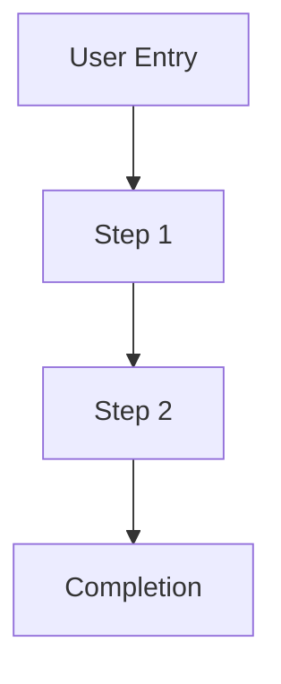
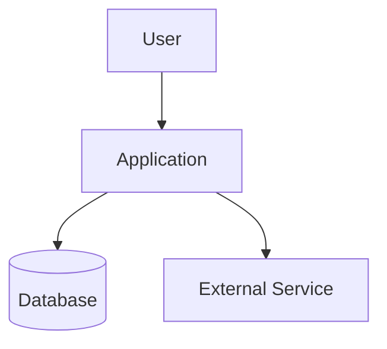
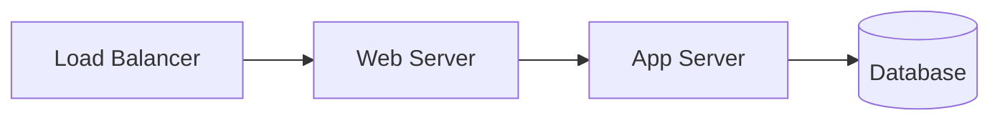
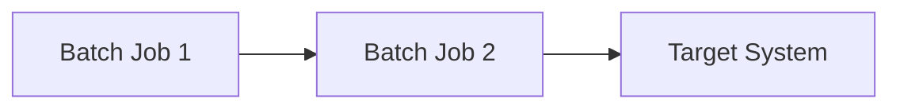

# {APPLICATION_NAME} Run Book

| | |
|:---|:---|
| Document Name | {APPLICATION_NAME} Run Book |
| Application Acronym | {ACRONYM} |
| Application Tier | {TIER_1 / TIER_2 / TIER_3} |
| Critical Notes | {CRITICAL_NOTES — e.g., Tier 1, real-time payment processing, PII data} |
| Application URL (Production) | {PRODUCTION_URL} |
| Document Version | 1.0 |
| Document Status | Draft |
| Document Author | {AUTHOR_NAME} |
| Date Released | |
| Last Updated | {DATE} |


---

## Document Review and Approval History


| Version | Date | Author | Change Description | Approved By |
|:--------|:-----|:-------|:-------------------|:------------|
| 1.0 | {DATE} | {AUTHOR_NAME} | Initial draft | |

---

## Table of Contents

1. [Introduction](#1-introduction) *(REQUIRED)*
2. [Contact List](#2-contact-list) *(REQUIRED)*
   - 2.1 [Customer Directory](#21-customer-directory) *(IF APPLICABLE)*
   - 2.2 [3rd Party Vendor Information](#22-3rd-party-vendor-information) *(IF APPLICABLE)*
3. [Application Overview](#3-application-overview) *(IF APPLICABLE)*
   - 3.1 [Application Flow Diagram](#31-application-flow-diagram) *(IF APPLICABLE)*
   - 3.2 [Key Business Functions](#32-key-business-functions) *(IF APPLICABLE)*
4. [Environment Overview](#4-environment-overview) *(REQUIRED)*
   - 4.1 [Application Architecture Diagram](#41-application-architecture-diagram) *(REQUIRED)*
   - 4.2 [Technical Architecture Diagram](#42-technical-architecture-diagram) *(REQUIRED)*
   - 4.3 [Servers and Infrastructure](#43-servers-and-infrastructure) *(IF APPLICABLE)*
       - 4.3.1 [Production Servers / URL](#431-production-servers--url) *(REQUIRED)*
       - 4.3.2 [Staging Servers / URL](#432-staging-servers--url) *(REQUIRED)*
       - 4.3.3 [Test/UAT Servers / URL](#433-testuat-servers--url) *(REQUIRED)*
       - 4.3.4 [Dev Servers / URL](#434-dev-servers--url) *(IF APPLICABLE)*
       - 4.3.5 [Database Endpoints](#435-database-endpoints) *(REQUIRED)*
       - 4.3.6 [DNS Considerations](#436-dns-considerations) *(REQUIRED)*
   - 4.4 [Backup and Recovery](#44-backup-and-recovery) *(IF APPLICABLE)*
5. [Deployment](#5-deployment) *(REQUIRED)*
   - 5.1 [Source Control (GitHub)](#51-source-control-github) *(REQUIRED)*
   - 5.2 [CI/CD Pipeline](#52-cicd-pipeline) *(REQUIRED)*
   - 5.3 [Automation and Orchestration Dependencies](#53-automation-and-orchestration-dependencies) *(IF APPLICABLE)*
6. [Integrations](#6-integrations) *(IF APPLICABLE)*
   - 6.1 [Google reCAPTCHA](#61-google-recaptcha) *(IF APPLICABLE)*
7. [Operations](#7-operations) *(REQUIRED)*
   - 7.1 [Daily Checklist](#71-daily-checklist) *(REQUIRED)*
   - 7.2 [Routine Automated Processes](#72-routine-automated-processes) *(IF APPLICABLE)*
   - 7.3 [Routine Manual Processes](#73-routine-manual-processes) *(IF APPLICABLE)*
   - 7.4 [Batch Processing](#74-batch-processing) *(IF APPLICABLE)*
   - 7.5 [Database Scripts](#75-database-scripts) *(IF APPLICABLE)*
   - 7.6 [Restart Procedures](#76-restart-procedures) *(IF APPLICABLE)*
8. [Monitor](#8-monitor) *(REQUIRED)*
   - 8.1 [Splunk — Exception Logs](#81-splunk--exception-logs) *(REQUIRED)*
   - 8.2 [Splunk — API / Apigee Logs](#82-splunk--api--apigee-logs) *(REQUIRED)*
   - 8.3 [Splunk — Application Dashboard](#83-splunk--application-dashboard) *(REQUIRED)*
   - 8.4 [AppDynamics](#84-appdynamics) *(REQUIRED)*
       - 8.4.1 [List of Applications in AppDynamics](#841-list-of-applications-in-appdynamics)
       - 8.4.2 [Application Performance](#842-application-performance)
       - 8.4.3 [Application Health](#843-application-health)
       - 8.4.4 [Monitor Errors and Exceptions](#844-monitor-errors-and-exceptions)
   - 8.5 [What to Look at Next — Triage Guide](#85-what-to-look-at-next--triage-guide) *(REQUIRED)*
   - 8.6 [Google Analytics Dashboard](#86-google-analytics-dashboard) *(IF APPLICABLE)*
9. [Appendix](#9-appendix) *(IF APPLICABLE)*
   - 9.1 [Screen Shots](#91-screen-shots) *(IF APPLICABLE)*
   - 9.2 [Error Page Handling](#92-error-page-handling) *(IF APPLICABLE)*
   - 9.3 [Session Timeout](#93-session-timeout) *(IF APPLICABLE)*
   - 9.4 [Useful Tips](#94-useful-tips) *(IF APPLICABLE)*
   - 9.5 [Glossary](#95-glossary) *(IF APPLICABLE)*
   - 9.6 [References](#96-references) *(IF APPLICABLE)*
   - 9.7 [Change Log](#97-change-log) *(IF APPLICABLE)*

---

## 1. Introduction


> Provide a brief summary of the application, its business purpose, primary users, and any relevant background. Include the agency or department responsible.

**Application Name:** {APPLICATION_NAME}  
**Acronym:** {ACRONYM}  
**Agency/Owner:** Texas.gov Application Services  
**ServiceNow CMDB CI Name:** {SERVICENOW_CI_NAME}  
**Purpose:** {BRIEF_DESCRIPTION_OF_BUSINESS_PURPOSE}  

**Key Stakeholders:**
- **Primary Users:** {DESCRIBE_PRIMARY_USER_BASE}

**Scope of This Run Book:**
> This Run Book provides operational procedures, monitoring guidance, deployment processes, and troubleshooting steps for the {APPLICATION_NAME} application across all environments (Production, Staging, Test/UAT).

---

## 2. Contact List


> List key contacts for application support, development, and operations.

| Contact Group | Email |
|---|---|
| Architecture Group | {ARCHITECTURE_GROUP_EMAIL} |
| M&O Group | {M&O_GROUP_EMAIL} |
| DevOps Group | {DEVOPS_GROUP_EMAIL} |
| Database Administration Group | {DBA_GROUP_EMAIL} |
| Security Group | {SECURITY_GROUP_EMAIL} |

---

## 2.1 Customer Directory


> List key customer contacts, stakeholders, and business owners.

| Customer / Agency | Contact Name | Phone | Email | Role / Title | Notes |
|:------------------|:-------------|:------|:------|:-------------|:------|
| {CUSTOMER_NAME} | {CONTACT_NAME} | {PHONE} | {EMAIL} | {ROLE} | {NOTES} |

---

## 2.2 3rd Party Vendor Information


### 2.2.1 Vendor Contact Information

| Vendor | Service Provided | Support URL | Support Phone | Support Email | Notes |
|:-------|:----------------|:------------|:--------------|:--------------|:------|
| {VENDOR_NAME} | {SERVICE_DESCRIPTION} | {URL} | {PHONE} | {EMAIL} | {NOTES} |

---

## 3. Application Overview


> Provides a business and functional overview of the application, including end-to-end process flows, key business functions, and user roles. This section establishes the functional context required for effective operations, troubleshooting, and support.

---

## 3.1 Application Flow Diagram


> Describe the end-to-end user flow and business process steps. Include flow diagrams showing the user journey from entry point to completion.

<!-- Replace with generated diagram or embed:  -->


**Process Steps:**
1. {STEP_1_DESCRIPTION}
2. {STEP_2_DESCRIPTION}
3. {STEP_3_DESCRIPTION}
4. {STEP_N_DESCRIPTION}

**Decision Points:**
- {DECISION_POINT_1}: {CRITERIA_AND_OUTCOMES}
- {DECISION_POINT_2}: {CRITERIA_AND_OUTCOMES}

---

## 3.2 Key Business Functions


> List the key business functions, capabilities, and user roles supported by this application. This context helps operations teams prioritize incidents, assess impact, and escalate appropriately.

**Key Functions:**

| Function | Description | Priority |
|:---------|:------------|:---------|
| {FUNCTION_NAME} | {DESCRIPTION} | {HIGH/MEDIUM/LOW} |

**User Roles:**

| Role | Description | Access Level |
|:-----|:------------|:-------------|
| {ROLE_NAME} | {DESCRIPTION} | {ACCESS_LEVEL} |

**Business Rules:**
- {BUSINESS_RULE_1}
- {BUSINESS_RULE_2}
- {BUSINESS_RULE_3}

---

## 4. Environment Overview


> Describe the environments used for this application and provide high-level architecture context including diagrams, server details, and infrastructure configuration.

---

## 4.1 Application Architecture Diagram


> Insert a high-level application architecture diagram showing major components, integrations, and data flows.

<!-- Replace with generated diagram or embed:  -->


**Key Components:**
- {COMPONENT_1}: {DESCRIPTION}
- {COMPONENT_2}: {DESCRIPTION}
- {COMPONENT_3}: {DESCRIPTION}

---

## 4.2 Technical Architecture Diagram


> Insert a technical architecture diagram showing servers, networks, firewalls, load balancers, and infrastructure elements.

<!-- Replace with generated diagram or embed:  -->


**Infrastructure Layers:**
- **Presentation Layer:** {DESCRIPTION}
- **Application Layer:** {DESCRIPTION}
- **Data Layer:** {DESCRIPTION}
- **Integration Layer:** {DESCRIPTION}

---

## 4.3 Servers and Infrastructure


---

### 4.3.1 Production Servers / URL

| Server Name | IP Address | Role | OS | Notes |
|---|---|---|---|---|
| {SERVER_NAME} | {IP_ADDRESS} | {ROLE} | {OS_VERSION} | {NOTES} |

**Production URL:** {PRODUCTION_URL}

---

### 4.3.2 Staging Servers / URL

| Server Name | IP Address | Role | OS | Notes |
|---|---|---|---|---|
| {SERVER_NAME} | {IP_ADDRESS} | {ROLE} | {OS_VERSION} | {NOTES} |

**Staging URL:** {STAGING_URL}

---

### 4.3.3 Test/UAT Servers / URL

| Server Name | IP Address | Role | OS | Notes |
|---|---|---|---|---|
| {SERVER_NAME} | {IP_ADDRESS} | {ROLE} | {OS_VERSION} | {NOTES} |

**Test/UAT URL:** {UAT_URL}

---

### 4.3.4 Dev Servers / URL


| Server Name | IP Address | Role | OS | Notes |
|---|---|---|---|---|
| {SERVER_NAME} | {IP_ADDRESS} | {ROLE} | {OS_VERSION} | {NOTES} |

**Dev URL:** {DEV_URL}

---

### 4.3.5 Database Endpoints

| Environment | Endpoint | Port | Schema | Notes |
|---|---|---|---|---|
| Production | {PROD_DB_ENDPOINT} | {PORT} | {SCHEMA_NAME} | {NOTES} |
| Staging | {STAGE_DB_ENDPOINT} | {PORT} | {SCHEMA_NAME} | {NOTES} |
| Test/UAT | {UAT_DB_ENDPOINT} | {PORT} | {SCHEMA_NAME} | {NOTES} |

**Database Technology:** {DATABASE_TYPE_AND_VERSION}  
**Connection Pooling:** {CONNECTION_POOL_DETAILS}  
**Access Control:** {ACCESS_CONTROL_MECHANISM}

---

### 4.3.6 DNS Considerations

<!-- **SECTION TYPE:** REQUIRED -->

| Item | Value |
|:-----|:------|
| Domain Name | {PRODUCTION_DOMAIN} |
| DNS Provider | {DNS_PROVIDER} |
| CDN Provider | {CDN_PROVIDER_OR_NONE} |
| TTL (Production) | {TTL_SECONDS} |
| DNS Failover Configured | {YES/NO} |
| Failover Target | {FAILOVER_TARGET_IF_APPLICABLE} |

**DNS Records:**

| Environment | Record Type | Name | Value | TTL | Notes |
|:------------|:------------|:-----|:------|:----|:------|
| Production | {A/CNAME} | {DOMAIN} | {VALUE} | {TTL} | {NOTES} |
| Staging | {A/CNAME} | {DOMAIN} | {VALUE} | {TTL} | {NOTES} |
| Test/UAT | {A/CNAME} | {DOMAIN} | {VALUE} | {TTL} | {NOTES} |

**DNS Change Process:**
- **Who can request:** {ROLE}
- **Approval required:** {YES/NO}
- **Change window:** {MAINTENANCE_WINDOW}
- **Propagation time:** {EXPECTED_PROPAGATION_TIME}

**Troubleshooting:**
- If DNS not resolving: {RESOLUTION_STEPS}
- If CDN caching stale content: {CACHE_INVALIDATION_STEPS}

---

## 4.4 Backup and Recovery


### 4.4.1 Production Backup System

#### Application & Web Servers

> Describe the backup solution and frequency for application/web servers.

**Backup Solution:** {BACKUP_TOOL_OR_SYSTEM}  
**Backup Frequency:** {FREQUENCY_DESCRIPTION}  
**Backup Location:** {STORAGE_LOCATION}  
**Recovery Time Objective (RTO):** {RTO_TARGET}  
**Recovery Point Objective (RPO):** {RPO_TARGET}

#### Database Servers

> Describe the backup solution and frequency for database servers.

**Backup Solution:** {BACKUP_TOOL_OR_SYSTEM}  
**Backup Types:** {FULL/DIFFERENTIAL/INCREMENTAL}  
**Backup Frequency:** {FREQUENCY_DESCRIPTION}  
**Backup Location:** {STORAGE_LOCATION}  
**Point-in-Time Recovery:** {AVAILABLE_YES_NO}  
**Recovery Time Objective (RTO):** {RTO_TARGET}  
**Recovery Point Objective (RPO):** {RPO_TARGET}

#### Batch Servers

> Describe the backup solution and frequency for batch servers.

**Backup Solution:** {BACKUP_TOOL_OR_SYSTEM}  
**Backup Frequency:** {FREQUENCY_DESCRIPTION}  
**Backup Location:** {STORAGE_LOCATION}  
**Recovery Time Objective (RTO):** {RTO_TARGET}  
**Recovery Point Objective (RPO):** {RPO_TARGET}

---

### 4.4.2 Backup Verification and Testing

**Verification Frequency:** {HOW_OFTEN_BACKUPS_ARE_TESTED}  
**Test Restore Procedure:**
1. {STEP_1}
2. {STEP_2}
3. {STEP_3}

**Last Successful Restore Test:** {DATE}

---

## 5. Deployment


> Describe the full deployment process including source control, CI/CD pipeline, deployment procedures, and approval workflows.

---

## 5.1 Source Control (GitHub)


**Repository URL:** {GITHUB_REPO_URL}  
**Access Control:** Read / Write
**Main/Master Branch:** {DESCRIPTION_AND_PROTECTION_RULES}

---

## 5.2 CI/CD Pipeline


**Pipeline Tool:** {JENKINS/GITHUB_ACTIONS/AZURE_DEVOPS/OTHER}  
**Pipeline Configuration Location:** {CONFIG_FILE_PATH_OR_URL}

**Pipeline Stages:**

| Stage | Description | Tools/Scripts | Success Criteria | Failure Action |
|:------|:------------|:--------------|:-----------------|:---------------|
| 1. Code Checkout | {DESCRIPTION} | {TOOL} | {CRITERIA} | {ACTION} |
| 2. Build | {DESCRIPTION} | {TOOL} | {CRITERIA} | {ACTION} |
| 3. Unit Tests | {DESCRIPTION} | {TOOL} | {CRITERIA} | {ACTION} |
| 4. Code Quality Scan | {DESCRIPTION} | {TOOL} | {CRITERIA} | {ACTION} |
| 5. Security Scan | {DESCRIPTION} | {TOOL} | {CRITERIA} | {ACTION} |
| 6. Package/Artifact Creation | {DESCRIPTION} | {TOOL} | {CRITERIA} | {ACTION} |
| 7. Deploy to Target Environment | {DESCRIPTION} | {TOOL} | {CRITERIA} | {ACTION} |
| 8. Post-Deployment Tests | {DESCRIPTION} | {TOOL} | {CRITERIA} | {ACTION} |

**Pipeline Triggers:**
- {TRIGGER_1}: {DESCRIPTION}
- {TRIGGER_2}: {DESCRIPTION}

**Artifact Storage:** {ARTIFACT_REPOSITORY_LOCATION}

### 5.2.1 Deployment to Production

| Step | Action | Command/Tool | Notes |
|---|---|---|---|
| 1 | {ACTION_DESCRIPTION} | `{COMMAND}` | {NOTES} |
| 2 | {ACTION_DESCRIPTION} | `{COMMAND}` | {NOTES} |
| 3 | {ACTION_DESCRIPTION} | `{COMMAND}` | {NOTES} |

**Post-Deployment Validation:**
- [ ] {VALIDATION_STEP_1}
- [ ] {VALIDATION_STEP_2}
- [ ] {VALIDATION_STEP_3}

**Rollback Procedure:**
1. {ROLLBACK_STEP_1}
2. {ROLLBACK_STEP_2}
3. {ROLLBACK_STEP_3}

---

## 5.3 Automation and Orchestration Dependencies


> Provides a detailed listing of all automation and orchestration dependencies, including links to relevant artifacts such as automation libraries, pipeline configurations, and scheduling tools.

### 5.3.1 Automation Inventory

| Automation Name | Type | Tool / Framework | Purpose | Artifact Link |
|:----------------|:-----|:-----------------|:--------|:--------------|
| {AUTOMATION_NAME} | CI/CD Pipeline | {TOOL_NAME} | {PURPOSE} | {URL_OR_PATH} |
| {AUTOMATION_NAME} | Test Automation | {TOOL_NAME} | {PURPOSE} | {URL_OR_PATH} |
| {AUTOMATION_NAME} | Batch / Scheduler | {TOOL_NAME} | {PURPOSE} | {URL_OR_PATH} |
| {AUTOMATION_NAME} | Infrastructure as Code | {TOOL_NAME} | {PURPOSE} | {URL_OR_PATH} |

### 5.3.2 Orchestration Dependencies

| Orchestration Component | System | Dependency Type | Failure Impact | Artifact Link |
|:------------------------|:-------|:----------------|:---------------|:--------------|
| {COMPONENT_NAME} | {SYSTEM_NAME} | {TYPE} | {IMPACT_DESCRIPTION} | {URL_OR_PATH} |

**Dependency Failure Handling:**
> {DESCRIBE_HOW_FAILURES_IN_ORCHESTRATION_DEPENDENCIES_ARE_DETECTED_AND_HANDLED}

### 5.3.3 Automation Libraries and Artifacts

| Library / Artifact | Version | Location / Link | Used By | Notes |
|:-------------------|:--------|:----------------|:--------|:------|
| {LIBRARY_NAME} | {VERSION} | {URL_OR_PATH} | {CONSUMING_COMPONENT} | {NOTES} |

---

## 6. Integrations


> Describe all external system integrations, data flows, and dependencies. Document integration patterns, error handling, and contact information for each integration.

## Integration Template

> Duplicate this template for each external integration.

### Integration: {INTEGRATION_NAME}

| Field | Value |
|---|---|
| Integration Name | {NAME} |
| Integration Type | {REST / SOAP / Batch / Event / Message Queue / File Transfer} |
| Direction | {Inbound / Outbound / Bidirectional} |
| Frequency | {REAL-TIME / HOURLY / DAILY / ON-DEMAND} |
| Protocol | {HTTP/HTTPS / FTP / SFTP / MESSAGE_QUEUE} |
| Authentication | {METHOD_USED} |
| Data Format | {JSON / XML / CSV / OTHER} |
| Data Exchanged | {DESCRIPTION_OF_DATA} |
| Volume | {EXPECTED_TRANSACTION_VOLUME} |
| SLA | {RESPONSE_TIME_OR_PROCESSING_WINDOW} |
| Error Handling | {ERROR_HANDLING_APPROACH} |
| Retry Logic | {RETRY_STRATEGY} |
| Contact | {INTEGRATION_CONTACT} |

**Integration Flow:**
1. {STEP_1}
2. {STEP_2}
3. {STEP_3}

**Error Scenarios:**

| Error Type | Cause | Detection Method | Resolution |
|:-----------|:------|:-----------------|:-----------|
| {ERROR_TYPE} | {CAUSE} | {HOW_DETECTED} | {RESOLUTION_STEPS} |

**Monitoring:**
- **Health Check Endpoint:** {URL_OR_METHOD}
- **Alert Conditions:** {ALERT_CRITERIA}
- **Dashboards:** {MONITORING_DASHBOARD_LINK}

---

## 6.1 Google reCAPTCHA


### 6.1.1 Technologies Added

**reCAPTCHA Version:** {V2 / V3 / ENTERPRISE}  
**Implementation Approach:** {CLIENT-SIDE_AND_SERVER-SIDE_DESCRIPTION}  
**Site Key:** {SITE_KEY}  
**Forms Protected:**
- {FORM_1_NAME_AND_URL}
- {FORM_2_NAME_AND_URL}
- {FORM_3_NAME_AND_URL}

**Configuration:**
```
{INSERT_CONFIGURATION_DETAILS_OR_CODE_SNIPPET}
```

### 6.1.2 Apigee Details

**Apigee Proxy Name:** {PROXY_NAME}  
**Apigee Proxy URL:** {PROXY_URL}  
**Policy Configuration:**
- **Policy Name:** {POLICY_NAME}
- **Policy Type:** {POLICY_TYPE}
- **Threshold Score (v3):** {SCORE_THRESHOLD}

**Request Flow:**
1. {STEP_1}
2. {STEP_2}
3. {STEP_3}

### 6.1.3 API Calls

**API Collection:** {COLLECTION_NAME_OR_LINK}

**Sample Test Call:**
```http
POST {API_ENDPOINT}
Content-Type: application/json

{
  "recaptchaToken": "{TOKEN_FROM_CLIENT}",
  ...other payload fields...
}
```

**Expected Response:**
```json
{
  "success": true,
  "score": 0.9,
  "action": "submit"
}
```

### 6.1.4 Error Handling

| Error | Cause | Resolution |
|---|---|---|
| Token validation failed | Invalid or expired token | Request user to retry; refresh page |
| Low score (< threshold) | Suspected bot activity | Block submission or require additional verification |
| reCAPTCHA service unavailable | Google service outage | Fallback to manual review or temporarily bypass |
| Missing token | Client-side integration issue | Check JavaScript implementation; verify site key |

**Monitoring:**
- **reCAPTCHA Analytics:** {LINK_TO_GOOGLE_ADMIN_CONSOLE}
- **Alert on:** {ALERT_CONDITIONS}

---

## 7. Operations


> Describes routine automated and manual processes required to manage the daily operations of this platform.

---

## 7.1 Daily Checklist


| Task | Type | Frequency | Expected Result |
|:-----|:-----|:----------|:----------------|
| Verify application health check URL returns HTTP 200 | Manual | Daily | Health check endpoint returns HTTP 200 with no errors; application is accessible in all environments |
| Review Splunk dashboard for new errors | Manual | Daily | No new critical or high-severity errors; any exceptions are known, tracked, and within acceptable thresholds |
| Confirm all scheduled batch jobs completed successfully | Automated | Daily | All batch jobs show a successful completion status with no failures or warnings in the job scheduler |
| Review AppDynamics performance and health dashboards | Manual | Daily | Response times, error rates, and resource utilization are within defined baseline thresholds; no health rule violations |
| Validate monitoring alerts are active and configured | Manual | Weekly | All configured alerts are enabled, routing to the correct recipients, and triggering as expected |
| Review pending change requests or approvals | Manual | Daily | All pending change requests are reviewed, assigned, and progressing through the approval workflow with no blockers |
| Check disk space on all servers | Automated | Daily | Disk utilization on all servers is below {THRESHOLD}%; no storage alerts are triggered |
| Verify backup completion | Automated | Daily | All scheduled backups completed successfully with no errors; backup logs confirm data integrity |

---

## 7.2 Routine Automated Processes


> List all automated processes that run on a recurring schedule to support platform operations.

| Process Name | Schedule | Trigger | Tool / System | Alert on Failure |
|:-------------|:---------|:--------|:--------------|:-----------------|
| {PROCESS_NAME} | {SCHEDULE} | {TRIGGER} | {TOOL} | {YES/NO_AND_METHOD} |

---

## 7.3 Routine Manual Processes


> List all manual operational tasks performed on a recurring basis.

| Process Name | Frequency | Steps Summary | Estimated Duration |
|:-------------|:----------|:--------------|:-------------------|
| {PROCESS_NAME} | {FREQUENCY} | {SUMMARY_OF_STEPS} | {DURATION} |

---

## 7.4 Batch Processing


### 7.4.1 General Information

**Batch Processing Framework:** {FRAMEWORK_OR_TOOL}  
**Scheduling Tool:** {SCHEDULER_NAME}  
**Scheduler Access:** {URL_OR_ACCESS_INSTRUCTIONS}  
**Log Location:** {LOG_FILE_PATH_OR_SYSTEM}

### 7.4.2 Running Batch Processes

| Batch Job | Schedule | Trigger | Description | Est. Duration |
|---|---|---|---|---|
| {JOB_NAME} | {SCHEDULE} | {TRIGGER} | {DESCRIPTION} | {DURATION} |

**Batch Job Dependencies:**
> Describe any dependencies between batch jobs or external system dependencies.

<!-- Replace with actual batch dependency diagram if applicable -->


### 7.4.3 Running On-Demand Batch Jobs

**Steps to Run Manually:**
1. {STEP_1}
2. {STEP_2}
3. {STEP_3}

**Command:**
```bash
{COMMAND_TO_RUN_BATCH_JOB}
```

### 7.4.4 Batch Troubleshooting

| Issue | Likely Cause | Resolution |
|---|---|---|
| Batch job failed to start | {CAUSE} | {RESOLUTION_STEPS} |
| Batch job timed out | {CAUSE} | {RESOLUTION_STEPS} |
| Batch job completed with errors | {CAUSE} | {RESOLUTION_STEPS} |
| Batch job stuck/hanging | {CAUSE} | {RESOLUTION_STEPS} |

---

## 7.5 Database Scripts


### 7.5.1 Database Deployment

**Database Change Process:**
1. {STEP_1}
2. {STEP_2}
3. {STEP_3}

**Script Execution Tool:** {TOOL_NAME}  
**Script Repository:** {REPOSITORY_LOCATION}  
**Deployment Validation:**
- [ ] {VALIDATION_STEP_1}
- [ ] {VALIDATION_STEP_2}

### 7.5.2 Database Refresh

> Steps to refresh non-production environments with production data (anonymized/masked as appropriate).

**Refresh Frequency:** {FREQUENCY}  
**Data Masking Required:** {YES/NO}  
**Masking Tool:** {TOOL_NAME_IF_APPLICABLE}

**Refresh Steps:**
1. {STEP_1}
2. {STEP_2}
3. {STEP_3}

**Post-Refresh Validation:**
- [ ] {VALIDATION_1}
- [ ] {VALIDATION_2}

### 7.5.3 Database Documentation

**Database Schema Documentation:** {LINK_TO_SCHEMA_DOCS}

**Key Database Objects:**
> Document critical tables, views, stored procedures, and other database objects relevant to operations.

| Object Name | Type | Purpose | Notes |
|:------------|:-----|:--------|:------|
| {OBJECT_NAME} | {TABLE/VIEW/STORED_PROC/FUNCTION} | {PURPOSE} | {NOTES} |

---

## 7.6 Restart Procedures


> Document the conditions under which the application should be restarted and the exact steps to follow.

### 7.6.1 Restart Conditions (Restart When)

| Condition | Severity | Decision Authority | Approval Required |
|:----------|:---------|:-------------------|:------------------|
| Application process becomes unresponsive | High | {ROLE} | {YES/NO} |
| Memory / CPU threshold exceeded for > {X} minutes | High | {ROLE} | {YES/NO} |
| Exception rate exceeds alert threshold | High | {ROLE} | {YES/NO} |
| Performance degradation impacts users | Medium | {ROLE} | {YES/NO} |
| Scheduled maintenance window | Low | {ROLE} | {YES/NO} |

### 7.6.2 Pre-Restart Checklist

- [ ] Verify restart is authorized by {ROLE}
- [ ] Notify stakeholders via {COMMUNICATION_METHOD}
- [ ] Create incident ticket: {TICKETING_SYSTEM}
- [ ] Verify backup is current
- [ ] Check for any ongoing transactions
- [ ] Document reason for restart

### 7.6.3 Restart Steps

| Step | Action | Command / Tool | Est. Time |
|:-----|:-------|:---------------|:----------|
| 1 | Notify stakeholders before restart | {COMMUNICATION_METHOD} | {TIME} |
| 2 | Stop application service | `{STOP_COMMAND}` | {TIME} |
| 3 | Verify all processes stopped | `{VERIFICATION_COMMAND}` | {TIME} |
| 4 | Clear cache (if applicable) | `{CLEAR_CACHE_COMMAND}` | {TIME} |
| 5 | Start application service | `{START_COMMAND}` | {TIME} |
| 6 | Validate health check URL | {HEALTH_CHECK_URL} | {TIME} |
| 7 | Confirm monitoring alerts cleared | {MONITORING_TOOL} | {TIME} |
| 8 | Notify stakeholders of completion | {COMMUNICATION_METHOD} | {TIME} |

### 7.6.4 Post-Restart Validation

- [ ] Application health check returns HTTP 200
- [ ] No new exception logs in Splunk
- [ ] AppDynamics shows normal performance
- [ ] CPU and memory usage within normal range
- [ ] All integrations responding normally
- [ ] User login functionality confirmed
- [ ] Stakeholders notified of completion
- [ ] Incident ticket updated

**Rollback Plan (if restart fails):**
1. {ROLLBACK_STEP_1}
2. {ROLLBACK_STEP_2}
3. {ROLLBACK_STEP_3}

---

## 8. Monitor


> Describe all monitoring tools, dashboards, queries, and procedures used to detect and diagnose issues.

---

## 8.1 Splunk — Exception Logs


**Splunk URL:** {SPLUNK_INSTANCE_URL}  
**Access Requirements:** {ACCESS_INSTRUCTIONS}

**Exception Log Query:**
```spl
index="{INDEX_NAME}" sourcetype="{SOURCETYPE}" level=ERROR OR level=FATAL
| stats count by exception_type, message
| sort - count
```

**Common Exception Patterns:**

| Exception Type | Typical Cause | First Response |
|:---------------|:--------------|:---------------|
| {EXCEPTION_CLASS} | {CAUSE} | {RESPONSE_STEPS} |

**Alert Configuration:**
- **Alert Name:** {ALERT_NAME}
- **Trigger Condition:** {CONDITION}
- **Notification Recipients:** {EMAIL_OR_PAGERDUTY}

---

## 8.2 Splunk — API / Apigee Logs


**API Log Query:**
```spl
index="{INDEX_NAME}" sourcetype="{APIGEE_SOURCETYPE}"
| stats avg(response_time) as avg_response, count by api_endpoint, status_code
| where status_code >= 400
```

**Key Metrics to Monitor:**
- API response time
- Error rate by endpoint
- Request volume
- Authentication failures

---

## 8.3 Splunk — Application Dashboard


**Dashboard Name:** {DASHBOARD_NAME}  
**Dashboard URL:** {SPLUNK_DASHBOARD_URL}

**Dashboard Panels:**
1. **{PANEL_1_NAME}:** {DESCRIPTION_AND_PURPOSE}
2. **{PANEL_2_NAME}:** {DESCRIPTION_AND_PURPOSE}
3. **{PANEL_3_NAME}:** {DESCRIPTION_AND_PURPOSE}

---

## 8.4 AppDynamics


**AppDynamics URL:** {APPDYNAMICS_URL}  
**Access Requirements:** {ACCESS_INSTRUCTIONS}

### 8.4.1 List of Applications in AppDynamics

| Application Name | URL | Tier | Node |
|---|---|---|---|
| {APP_NAME} | {APPDYNAMICS_APP_URL} | {TIER_NAME} | {NODE_NAME} |

### 8.4.2 Application Performance

> Document application performance baselines, key performance indicators, and performance monitoring strategies.

**Key Performance Indicators:**

| Metric | Threshold | Action if Exceeded |
|:-------|:----------|:-------------------|
| Average Response Time | {THRESHOLD_MS} | {ACTION} |
| Error Rate | {THRESHOLD_%} | {ACTION} |
| Calls per Minute | {THRESHOLD} | {ACTION} |
| CPU Utilization | {THRESHOLD_%} | {ACTION} |
| Memory Utilization | {THRESHOLD_%} | {ACTION} |

**Performance Dashboard:** {DASHBOARD_LINK}

#### Performance Baselines

| Metric | Baseline | Target | Threshold (Warning) | Threshold (Critical) | Measurement Method |
|:-------|:---------|:-------|:-------------------|:---------------------|:-------------------|
| Page Load Time | {BASELINE_MS} | {TARGET_MS} | {WARNING_MS} | {CRITICAL_MS} | {METHOD} |
| API Response Time | {BASELINE_MS} | {TARGET_MS} | {WARNING_MS} | {CRITICAL_MS} | {METHOD} |
| Database Query Time | {BASELINE_MS} | {TARGET_MS} | {WARNING_MS} | {CRITICAL_MS} | {METHOD} |
| Transaction Processing Time | {BASELINE_MS} | {TARGET_MS} | {WARNING_MS} | {CRITICAL_MS} | {METHOD} |
| Concurrent Users Supported | {BASELINE} | {TARGET} | {WARNING} | {CRITICAL} | {METHOD} |
| Throughput (TPS) | {BASELINE} | {TARGET} | {WARNING} | {CRITICAL} | {METHOD} |

#### Performance Monitoring Strategy

**Monitoring Tools:**
- **Primary Tool:** {TOOL_NAME}
- **Secondary Tool:** {TOOL_NAME}
- **Synthetic Monitoring:** {YES/NO_AND_TOOL}
- **Real User Monitoring:** {YES/NO_AND_TOOL}

**Monitoring Frequency:**
- **Real-time Metrics:** {INTERVAL}
- **Aggregated Reports:** {FREQUENCY}
- **Trend Analysis:** {FREQUENCY}

**Performance Dashboard:** {DASHBOARD_URL}

#### Performance Testing Results

| Test Type | Date | Users/Load | Results | Pass/Fail | Notes |
|:----------|:-----|:-----------|:--------|:----------|:------|
| Load Test | {DATE} | {LOAD} | {RESULTS_SUMMARY} | {PASS/FAIL} | {NOTES} |
| Stress Test | {DATE} | {LOAD} | {RESULTS_SUMMARY} | {PASS/FAIL} | {NOTES} |
| Endurance Test | {DATE} | {LOAD} | {RESULTS_SUMMARY} | {PASS/FAIL} | {NOTES} |
| Spike Test | {DATE} | {LOAD} | {RESULTS_SUMMARY} | {PASS/FAIL} | {NOTES} |

**Last Performance Test:** {DATE}  
**Next Scheduled Test:** {DATE}  
**Performance Test Report Location:** {DOCUMENT_LOCATION}

#### Performance Optimization History

| Date | Issue | Optimization Applied | Result |
|:-----|:------|:--------------------|:-------|
| {DATE} | {ISSUE_DESCRIPTION} | {OPTIMIZATION_DESCRIPTION} | {RESULT_IMPROVEMENT} |

#### Performance Troubleshooting Guide

| Symptom | Likely Cause | Investigation Steps | Resolution |
|:--------|:-------------|:-------------------|:-----------|
| Slow page load | {CAUSE} | {STEPS} | {RESOLUTION} |
| High API latency | {CAUSE} | {STEPS} | {RESOLUTION} |
| Database bottleneck | {CAUSE} | {STEPS} | {RESOLUTION} |
| Memory issues | {CAUSE} | {STEPS} | {RESOLUTION} |
| CPU spikes | {CAUSE} | {STEPS} | {RESOLUTION} |

### 8.4.3 Application Health

> Document application health monitoring, health check endpoints, and health status indicators.

**Health Rules Configured:**
- {HEALTH_RULE_1}: {DESCRIPTION_AND_THRESHOLD}
- {HEALTH_RULE_2}: {DESCRIPTION_AND_THRESHOLD}
- {HEALTH_RULE_3}: {DESCRIPTION_AND_THRESHOLD}

**Health Check Procedure:**
1. {STEP_1}
2. {STEP_2}
3. {STEP_3}

#### Health Check Endpoints

| Environment | Health Check URL | Expected Response | Response Code | Check Frequency | Timeout |
|:------------|:----------------|:------------------|:--------------|:----------------|:--------|
| Production | {HEALTH_CHECK_URL} | {EXPECTED_RESPONSE} | {HTTP_CODE} | {FREQUENCY} | {TIMEOUT_SECONDS} |
| Staging | {HEALTH_CHECK_URL} | {EXPECTED_RESPONSE} | {HTTP_CODE} | {FREQUENCY} | {TIMEOUT_SECONDS} |
| Test/UAT | {HEALTH_CHECK_URL} | {EXPECTED_RESPONSE} | {HTTP_CODE} | {FREQUENCY} | {TIMEOUT_SECONDS} |

**Health Check Authentication:** {AUTHENTICATION_METHOD}

#### Health Status Indicators

| Component | Health Indicator | Healthy State | Degraded State | Unhealthy State | Action Required |
|:----------|:----------------|:--------------|:---------------|:----------------|:----------------|
| Web Server | {INDICATOR} | {HEALTHY_CRITERIA} | {DEGRADED_CRITERIA} | {UNHEALTHY_CRITERIA} | {ACTION} |
| Application Server | {INDICATOR} | {HEALTHY_CRITERIA} | {DEGRADED_CRITERIA} | {UNHEALTHY_CRITERIA} | {ACTION} |
| Database | {INDICATOR} | {HEALTHY_CRITERIA} | {DEGRADED_CRITERIA} | {UNHEALTHY_CRITERIA} | {ACTION} |
| Cache | {INDICATOR} | {HEALTHY_CRITERIA} | {DEGRADED_CRITERIA} | {UNHEALTHY_CRITERIA} | {ACTION} |
| External APIs | {INDICATOR} | {HEALTHY_CRITERIA} | {DEGRADED_CRITERIA} | {UNHEALTHY_CRITERIA} | {ACTION} |

#### Dependency Health Monitoring

**Internal Dependencies:**

| Dependency | Health Check Method | Healthy Criteria | Alert On Failure |
|:-----------|:-------------------|:-----------------|:-----------------|
| {DEPENDENCY_NAME} | {METHOD} | {CRITERIA} | {YES/NO} |

**External Dependencies:**

| Dependency | Health Check Method | Healthy Criteria | SLA | Fallback Strategy |
|:-----------|:-------------------|:-----------------|:----|:------------------|
| {DEPENDENCY_NAME} | {METHOD} | {CRITERIA} | {SLA} | {FALLBACK} |

#### Service Availability

**Availability Targets:**
- **Target Uptime:** {PERCENTAGE}%
- **Scheduled Maintenance Window:** {DAY_AND_TIME}
- **Unplanned Downtime Limit:** {HOURS_PER_MONTH}

**Current Month Availability:**

| Week | Uptime % | Downtime (minutes) | Incidents | Notes |
|:-----|:---------|:-------------------|:----------|:------|
| Week 1 | {UPTIME_%} | {DOWNTIME} | {COUNT} | {NOTES} |
| Week 2 | {UPTIME_%} | {DOWNTIME} | {COUNT} | {NOTES} |
| Week 3 | {UPTIME_%} | {DOWNTIME} | {COUNT} | {NOTES} |
| Week 4 | {UPTIME_%} | {DOWNTIME} | {COUNT} | {NOTES} |

**Historical Availability:** {LINK_TO_AVAILABILITY_REPORT}

#### Health Monitoring Alerts

| Alert Name | Condition | Severity | Recipients | Action Required |
|:-----------|:----------|:---------|:-----------|:----------------|
| {ALERT_NAME} | {CONDITION} | {CRITICAL/WARNING/INFO} | {RECIPIENTS} | {ACTION} |

**Alert Configuration Location:** {CONFIGURATION_LOCATION}  
**Alert Escalation Policy:** {POLICY_DOCUMENT_LINK}

#### Health Dashboard

**Dashboard URL:** {DASHBOARD_URL}  
**Access Requirements:** {ACCESS_INSTRUCTIONS}

**Dashboard Panels:**
1. **{PANEL_NAME}:** {DESCRIPTION}
2. **{PANEL_NAME}:** {DESCRIPTION}
3. **{PANEL_NAME}:** {DESCRIPTION}

**Refresh Rate:** {REFRESH_INTERVAL}  
**Data Retention:** {RETENTION_PERIOD}

### 8.4.4 Monitor Errors and Exceptions

**Error Detection:**
- **Automatic Detection:** {YES/NO_AND_CONFIGURATION}
- **Error Threshold:** {THRESHOLD}
- **Alert Recipients:** {EMAIL_OR_PAGERDUTY}

**Top Errors to Monitor:**
1. {ERROR_TYPE_1}: {DESCRIPTION}
2. {ERROR_TYPE_2}: {DESCRIPTION}
3. {ERROR_TYPE_3}: {DESCRIPTION}

---

## 8.5 What to Look at Next — Triage Guide


> When an alert fires or an issue is reported, use this guide to determine where to start investigating.

| Priority | Symptom / Alert | First Look | Second Look | Escalate To |
|:---------|:----------------|:-----------|:------------|:------------|
| 1 | Application unavailable / HTTP 5xx | AppDynamics health dashboard | Server status / service status | Operations Lead |
| 2 | Performance degradation | AppDynamics slow transactions | Database query times / connection pool | DBA |
| 3 | Batch job failure | Batch logs / job scheduler | Dependency system status | Technical Lead |
| 4 | Integration error | Splunk API logs | Upstream system status / network | Integration Lead |
| 5 | Authentication failure | Splunk exception logs | Identity provider status | Security Contact |
| 6 | Database connection errors | Database server status | Connection pool settings | DBA |
| 7 | Memory issues | AppDynamics memory metrics | Heap dump analysis | Technical Lead |
| 8 | High error rate | Splunk exception logs | Recent deployment changes | Development Lead |

**Escalation Matrix:**

| Severity | Response Time | Escalation Path |
|:---------|:--------------|:----------------|
| Critical (P1) | 15 minutes | {ESCALATION_PATH} |
| High (P2) | 1 hour | {ESCALATION_PATH} |
| Medium (P3) | 4 hours | {ESCALATION_PATH} |
| Low (P4) | Next business day | {ESCALATION_PATH} |

---

## 8.6 Google Analytics Dashboard


**Google Analytics Property ID:** {GA_PROPERTY_ID}  
**Google Tag Manager Container ID:** {GTM_CONTAINER_ID}  
**Analytics Dashboard URL:** {DASHBOARD_URL}  
**Access Requirements:** {ACCESS_INSTRUCTIONS}

### 8.6.1 Key Metrics Tracked

| Metric | Description | Alert Threshold |
|:-------|:------------|:----------------|
| Page Views | {DESCRIPTION} | {THRESHOLD_OR_EXPECTED_RANGE} |
| Unique Users | {DESCRIPTION} | {THRESHOLD_OR_EXPECTED_RANGE} |
| Conversion Rate | {DESCRIPTION} | {THRESHOLD_OR_EXPECTED_RANGE} |
| Bounce Rate | {DESCRIPTION} | {THRESHOLD_OR_EXPECTED_RANGE} |
| Average Session Duration | {DESCRIPTION} | {THRESHOLD_OR_EXPECTED_RANGE} |

### 8.6.2 Custom Events Tracked

| Event Name | Trigger | Purpose |
|:-----------|:--------|:--------|
| {EVENT_NAME} | {TRIGGER_CONDITION} | {TRACKING_PURPOSE} |

### 8.6.3 Goals and Funnels

| Goal Name | Funnel Steps | Conversion Tracking |
|:----------|:-------------|:--------------------|
| {GOAL_NAME} | {STEPS} | {TRACKING_METHOD} |

### 8.6.4 Tag Manager Configuration

**Tags Configured:**
1. {TAG_NAME}: {PURPOSE_AND_TRIGGER}
2. {TAG_NAME}: {PURPOSE_AND_TRIGGER}

**Triggers:**
1. {TRIGGER_NAME}: {CONDITION}
2. {TRIGGER_NAME}: {CONDITION}

**Variables:**
1. {VARIABLE_NAME}: {VALUE_OR_CONFIGURATION}

---

## 9. Appendix


---

## 9.1 Screen Shots


> Insert annotated screen shots of key application screens, workflows, and administrative interfaces.

### Key Application Screens

**{SCREEN_1_NAME}**


*Description: {DESCRIBE_WHAT_THIS_SCREEN_SHOWS}*

**{SCREEN_2_NAME}**


*Description: {DESCRIBE_WHAT_THIS_SCREEN_SHOWS}*

---

## 9.2 Error Page Handling


> Describe error pages, their causes, and remediation steps.

| Error Code | Message | Cause | Resolution |
|---|---|---|---|
| 400 | Bad Request | {CAUSE} | {RESOLUTION} |
| 401 | Unauthorized | {CAUSE} | {RESOLUTION} |
| 403 | Forbidden | {CAUSE} | {RESOLUTION} |
| 404 | Not Found | {CAUSE} | {RESOLUTION} |
| 500 | Internal Server Error | {CAUSE} | {RESOLUTION} |
| 502 | Bad Gateway | {CAUSE} | {RESOLUTION} |
| 503 | Service Unavailable | {CAUSE} | {RESOLUTION} |
| 504 | Gateway Timeout | {CAUSE} | {RESOLUTION} |

**Custom Error Pages:**
- {CUSTOM_ERROR_1}: {DESCRIPTION_AND_TRIGGER}
- {CUSTOM_ERROR_2}: {DESCRIPTION_AND_TRIGGER}

**Error Logging:** All errors are logged to {LOGGING_SYSTEM}

---

## 9.3 Session Timeout


> Describe session timeout behavior and configuration.

| Environment | Timeout (minutes) | Configuration Location | Warning Before Timeout |
|---|---|---|---|
| Production | {TIMEOUT_MINUTES} | {CONFIG_FILE_OR_PARAMETER} | {YES/NO_AND_WARNING_TIME} |
| Staging | {TIMEOUT_MINUTES} | {CONFIG_FILE_OR_PARAMETER} | {YES/NO_AND_WARNING_TIME} |
| Test/UAT | {TIMEOUT_MINUTES} | {CONFIG_FILE_OR_PARAMETER} | {YES/NO_AND_WARNING_TIME} |

**Session Timeout Behavior:**
- {DESCRIBE_WHAT_HAPPENS_WHEN_SESSION_TIMES_OUT}
- {DESCRIBE_USER_EXPERIENCE}
- {DESCRIBE_DATA_RETENTION_OR_LOSS}

**Extending Session:**
> {DESCRIBE_IF_AND_HOW_USERS_CAN_EXTEND_SESSION}

---

## 9.4 Useful Tips


> Add tips, known quirks, helpful shortcuts, or important operational notes for support teams.

### Common Issues and Quick Fixes

**{ISSUE_1}**
- **Symptom:** {DESCRIPTION}
- **Quick Fix:** {RESOLUTION}

**{ISSUE_2}**
- **Symptom:** {DESCRIPTION}
- **Quick Fix:** {RESOLUTION}

### Performance Optimization Tips

- {TIP_1}
- {TIP_2}
- {TIP_3}

### Helpful Commands

```bash
## {COMMAND_DESCRIPTION}
{COMMAND}

## {COMMAND_DESCRIPTION}
{COMMAND}
```

### Known Limitations

- {LIMITATION_1}
- {LIMITATION_2}

### Best Practices

- {BEST_PRACTICE_1}
- {BEST_PRACTICE_2}

---

## 9.5 Glossary


| Term | Definition |
|:-----|:-----------|
| {TERM_1} | {DEFINITION} |
| {TERM_2} | {DEFINITION} |
| {TERM_3} | {DEFINITION} |

---

## 9.6 References


| Document | Location / URL | Purpose |
|:---------|:---------------|:--------|
| {DOCUMENT_NAME} | {LINK_OR_PATH} | {PURPOSE} |

---

## 9.7 Change Log


| Date | Version | Author | Change Description |
|:-----|:--------|:-------|:-------------------|
| {DATE} | {VERSION} | {AUTHOR} | {DESCRIPTION} |

---

*Document Generated: {DATE}*  
*Template Version: 1.1*  
*Source: {ORGANIZATION_NAME} Run Book Template Generator*

---

# SECTION TYPE LEGEND

**REQUIRED:** Required section that must be included in all Run Books  
**IF APPLICABLE:** Optional section that should be included based on application requirements  

**Table of Contents Markers:**
- *(REQUIRED)* = Always required in all Run Books
- *(IF APPLICABLE)* = Include only if applicable to your application

---

# AC REQUIRED FIELDS (Must Be Present in All Run Books)

The following fields are **explicitly required** by acceptance criteria and must be populated:

| AC Required Field | Location | Section # | Type |
|:------------------|:---------|:----------|:-----|
| **Critical Notes** | Header table | Header | REQUIRED |
| **Application URL** | Header table | Header | REQUIRED |
| **DNS Considerations** | Environment Overview | 4.3.6 | REQUIRED |
| **What to Look at Next** | Monitor | 8.5 | REQUIRED |
| **3rd Party Resolution** | Contact List | 2.2 | IF APPLICABLE* |
| **Restart When** | Operations | 7.6.1 | IF APPLICABLE* |
| **Failover When** | Operations / Integrations | (custom) | IF APPLICABLE* |

*Include if applicable to the application

## AC REQUIRED CONTENT (Must Be Included)

### ✓ Daily Operational Checklist (AC REQUIRED)
- **Section 7.1:** Daily Checklist
- **Purpose:** Describes routine checks and monitoring tasks to manage the daily operations of the platform

### ✓ Automation and Orchestration Dependencies (AC REQUIRED IF APPLICABLE)
- **Section 5.3:** Automation and Orchestration Dependencies
- **Purpose:** Detailed listing of automation and orchestration dependencies with links to other relevant artifacts (e.g. automation libraries)
- **Include When:** Application uses automation frameworks, orchestration tools, or pipeline dependencies

### ✓ Validation and Required Approvals (AC REQUIRED)
- **Section 5.2.1:** Deployment to Production
- **Purpose:** Validation and required approvals in accordance with defined Run Book process workflow

---

# TEMPLATE USAGE INSTRUCTIONS

## Customization Steps

1. **Populate all AC REQUIRED FIELDS first** — these cannot be omitted
2. **Replace all {PLACEHOLDER} values** with actual application-specific information
3. **Evaluate IF APPLICABLE sections** — only remove if truly not applicable:
   - 2.2 3rd Party Vendor Escalation (remove only if NO vendor dependencies)
   - 3.1 Application Flow Diagram (remove only if simple single-page application)
   - 3.2 Key Business Functions (remove only if not needed for operations context)
   - 4.4 Backup and Recovery (remove only if team does NOT manage backups)
   - 5.3 Automation and Orchestration Dependencies (remove only if NO automation)
   - 6.1 Google reCAPTCHA (remove only if NOT using reCAPTCHA)
   - 7.6 Restart Procedures (remove only if restart is never required)
   - 8.6 Google Analytics Dashboard (remove only if NOT using Google Analytics)
4. **Update the Table of Contents** after removing IF APPLICABLE sections
5. **Remove all HTML comments** (lines starting with `<!--`) before finalizing
6. **Populate all tables** with actual data from your application
7. **Add diagrams** in the designated sections
8. **Review and approve** following your document control process
9. **Save the final document** to the appropriate location in your repository

---

## Validation Checklist Before Submission

Run through this checklist before considering the Run Book complete:

### AC Required Fields — All Populated?
- [ ] Critical Notes in header
- [ ] Application URL in header
- [ ] DNS Considerations section complete
- [ ] What to Look at Next section complete
- [ ] 3rd Party Resolution (if applicable)
- [ ] Restart When conditions (if applicable)
- [ ] Failover When conditions (if applicable)

### AC Required Content — All Documented?
- [ ] Daily Checklist completed
- [ ] Automation/Orchestration Dependencies listed with artifact links (if applicable)
- [ ] Deployment Approval and Sign-Off workflow documented

### General Completeness
- [ ] All {PLACEHOLDER} values replaced
- [ ] All tables populated with actual data
- [ ] All diagrams inserted
- [ ] HTML comments removed
- [ ] Table of Contents updated
- [ ] Document reviewed and approved

---

