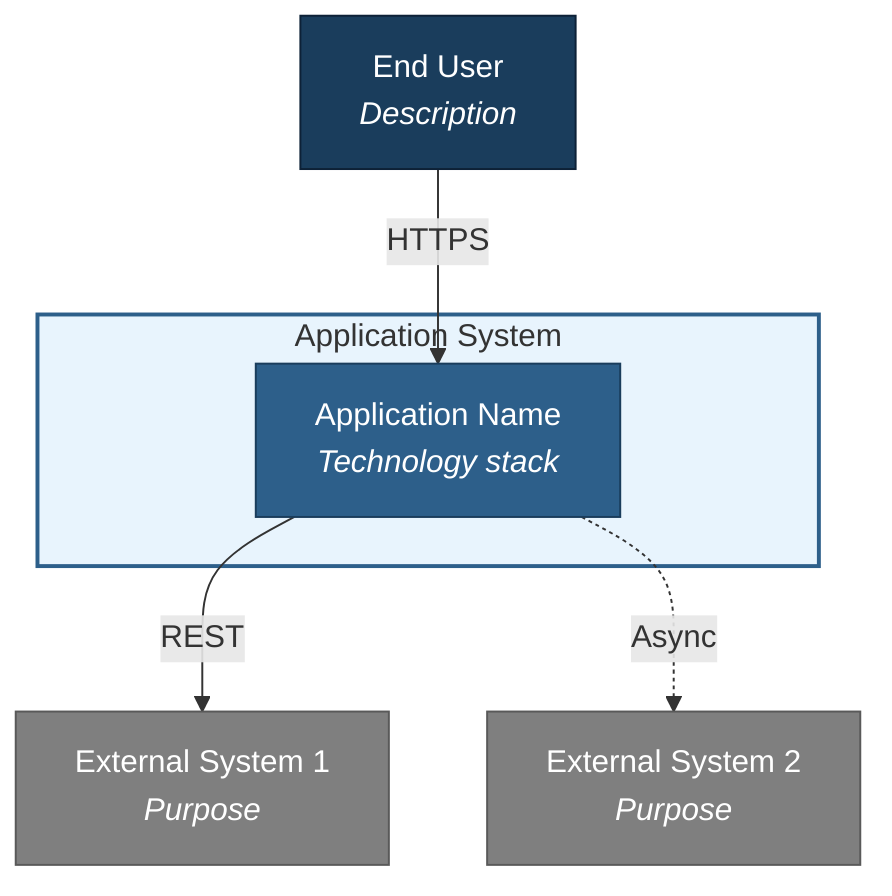
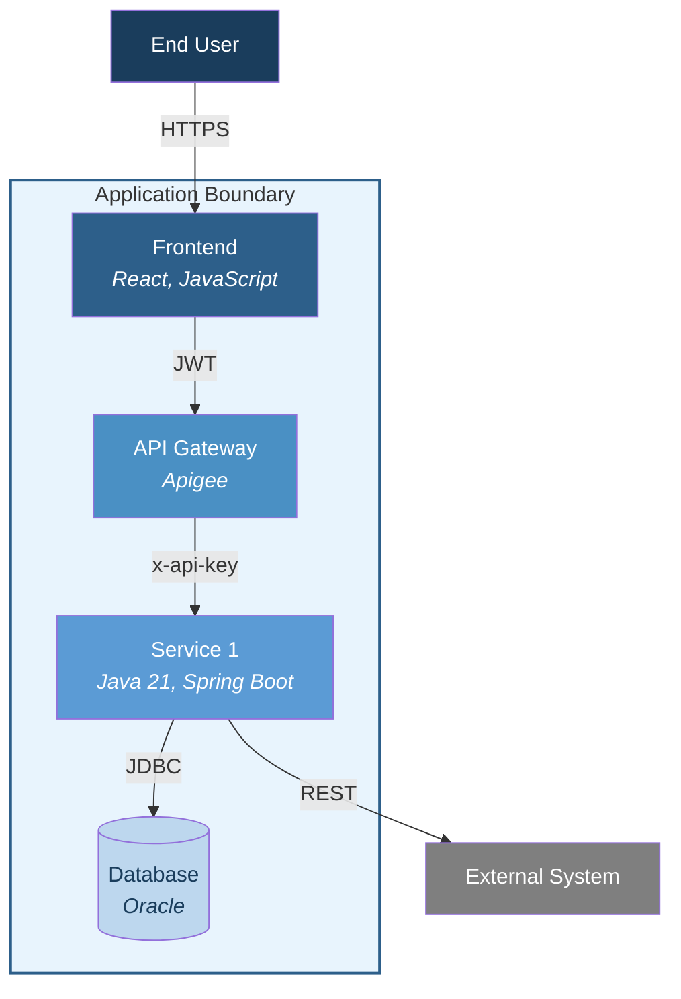
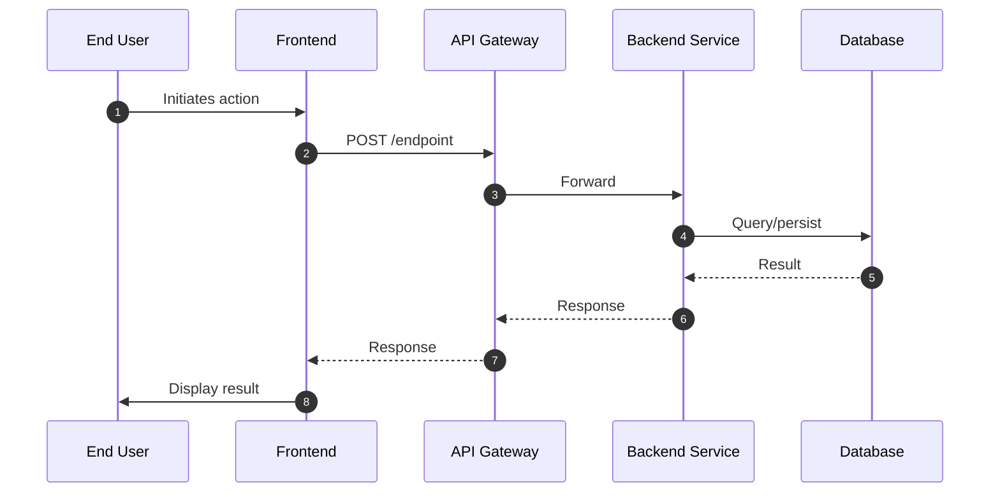
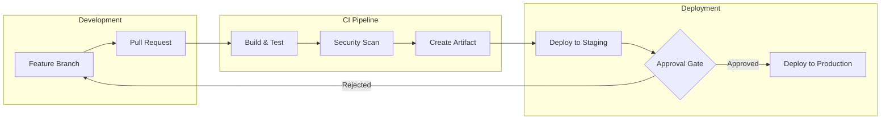

# Ops Runbook Create Mode — Diagram Standards

## Mermaid Conventions

All diagrams use Mermaid syntax (`.mmd` files) rendered via `mmdc` (Mermaid CLI). Every diagram must be syntactically valid and render without errors.

---

## Rendering Command

```bash
mmdc -i {file}.mmd -o {file}.svg --width 1400
```

- Do NOT use `-t` flag — theme is embedded via `%%{init:}%%` directive in each file
- Width: 1400px (provides good readability without scrolling)

---

## Color Palette (Professional — Consistent Across All Diagrams)

### Flowchart Diagrams (Architecture — C4-style)

Use `%%{init:}%%` at the top of every `.mmd` file:

```
%%{init: {"theme": "base", "themeVariables": {"primaryColor": "#2D5F8A", "primaryTextColor": "#FFFFFF", "primaryBorderColor": "#1A3D5C", "lineColor": "#4A4A4A", "secondaryColor": "#5B9BD5", "tertiaryColor": "#BDD7EE", "background": "#FFFFFF"}}}%%
```

Apply explicit `style` per node:

| Element | Style | Use |
|---------|-------|-----|
| Internal system / service | `fill:#2D5F8A,color:#FFFFFF,stroke:#1A3D5C` | Backend services, frontend apps |
| External system | `fill:#7F7F7F,color:#FFFFFF,stroke:#595959` | Third-party APIs, payment vendors |
| Database | `fill:#BDD7EE,color:#1A3D5C,stroke:#5B9BD5` | Data stores |
| API Gateway / Proxy | `fill:#4A90C4,color:#FFFFFF,stroke:#2D5F8A` | Apigee, load balancers |
| User / Actor | `fill:#1A3D5C,color:#FFFFFF,stroke:#0D2137` | End users, admin roles |
| Subgraph boundary | `fill:#E8F4FD,stroke:#2D5F8A,stroke-width:2px` | System boundaries |
| Background | White (default) | All diagram backgrounds |

### Sequence Diagrams

Use `%%{init:}%%` at the top:

```
%%{init: {"theme": "base", "themeVariables": {"primaryColor": "#2D5F8A", "primaryTextColor": "#fff", "primaryBorderColor": "#1A3D5C", "lineColor": "#4A4A4A", "secondaryColor": "#5B9BD5", "tertiaryColor": "#BDD7EE", "actorBkg": "#2D5F8A", "actorTextColor": "#FFFFFF", "actorBorder": "#1A3D5C", "activationBorderColor": "#2D5F8A", "activationBkgColor": "#E8F4FD", "noteBkgColor": "#FFF3CD", "noteBorderColor": "#FFCA2C", "noteTextColor": "#1A3D5C", "signalColor": "#4A4A4A", "signalTextColor": "#2D5F8A", "labelBoxBkgColor": "#E8F4FD", "labelTextColor": "#1A3D5C"}}}%%
```

---

## Critical Rules

1. **DO NOT use C4Context/C4Container Mermaid syntax.** It renders inconsistently across viewers. Use `graph TB` with `style` statements instead.
2. **NO emojis in diagram nodes.** They render inconsistently in SVG. Use plain text with `<br/>` and `<i>` for emphasis.
3. **NO `\n` or `━` separators in node labels.** Use `<br/>` for line breaks.
4. **Short arrow labels only.** No multi-line labels on arrows. Just the protocol name (e.g., "HTTPS", "JDBC", "REST").
5. **Dashed arrows for async.** Use `-. "label" .->` for asynchronous/optional flows.
6. **Chunking rule:** If a sequence diagram exceeds 15 interactions, split into Part 1 / Part 2 by logical phase (8-15 interactions each).

---

## C4 Context Diagram (as styled flowchart)

Shows the system as a single box, surrounded by actors and external systems.



**Rules:**
- One styled box for the entire application (not per-service)
- Actor nodes for each distinct user role discovered
- External system nodes for each integration discovered from source/KB
- Arrow labels: protocol only (HTTPS, REST, JDBC, etc.)
- Maximum 8-10 nodes — if more external systems, group related ones

---

## C4 Container Diagram (as styled flowchart)

Shows all containers (services) within the system boundary.



**Rules:**
- One styled box per discovered service repo
- `[("...")]` cylinder shape for databases
- Include tech stack in `<i>` tags
- Subgraph for system boundary
- External systems outside the boundary

---

## Sequence Diagrams

One per major user workflow + one per external integration.



**Rules:**
- Use `autonumber` for easy reference
- Short participant aliases (U, FE, GW, SVC, DB)
- Use `Note over` for important context
- Use `alt`/`else` blocks for success/failure paths
- Participants named by role (NOT class name): "Backend Service" not "OrderDetailsServiceImpl"
- Include error paths ONLY where evidence exists (exception handlers, retry logic)
- One diagram per workflow — don't combine multiple flows
- Maximum 12-15 interactions per diagram — split complex flows if needed
- Show async operations with `-->>` (dashed return arrows)

---

## Deployment / Infrastructure Flowchart



**Rules:**
- Use `flowchart LR` (left-to-right) for deployment pipelines
- Use `flowchart TD` (top-down) for decision trees or error handling flows
- Subgraphs for logical groupings (environments, pipeline stages)
- Decision nodes (`{}`) for approval gates, conditional logic
- Only include stages confirmed from CI config or KB deployment docs

---

## File Naming Convention

| Diagram Type | Filename Pattern |
|-------------|-----------------|
| C4 Context | `c4-context.mmd` |
| C4 Container | `c4-container.mmd` |
| Sequence (per workflow) | `seq-{workflow-kebab-case}.mmd` |
| Deployment flowchart | `deploy-flow.mmd` |
| Error handling flow | `error-{topic-kebab-case}.mmd` |

---

## Embedding in Runbook

```markdown


*Figure {N}: {Caption describing what the diagram shows}*
```

- Alt text must be descriptive (accessibility)
- Caption (italic) describes what the diagram shows in plain language
- Diagram path includes version subdirectory (`diagrams/v1/`, `diagrams/v2/`, etc.)
- Figure numbers are sequential within the runbook
